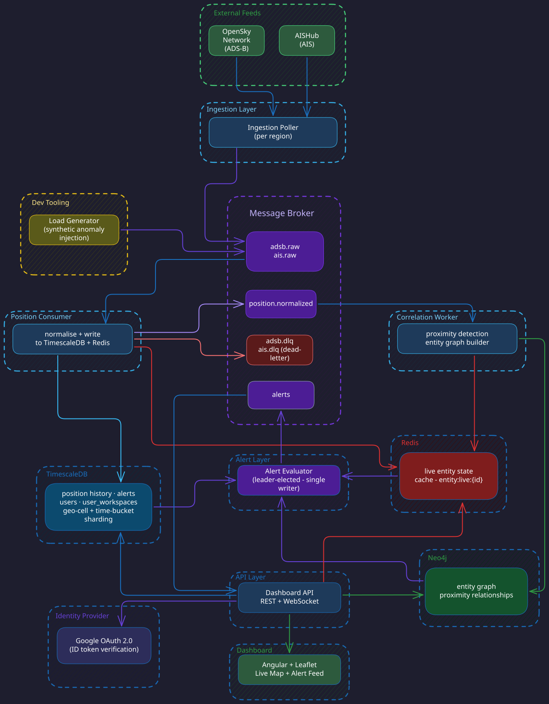

# Architecture

This document defines the service boundaries, component contracts, data flow, and persistence ownership for Sentinel. It is the authoritative reference for which service reads from and writes to which store, which Kafka topics each service produces and consumes, and what each service is explicitly not allowed to do.



---

## Services

### Ingestion Poller

**Runtime:** Node.js (ADR-013)
**Concern:** Fetch raw positional telemetry from external feeds and forward it to Kafka without any parsing or business logic.

| Direction | What |
| --- | --- |
| Reads from | OpenSky Network REST API (ADS-B), AISHub (AIS) |
| Publishes to | `adsb.raw`, `ais.raw` |
| Writes to stores | — |

**Contract:**
- Publishes raw event bytes as received. No parsing, no field extraction, no DLQ routing.
- Does not know about downstream consumers. The Kafka topic is the only coupling point.
- Polls on a fixed interval. Rate limit compliance is the poller's responsibility.

---

### Position Consumer

**Runtime:** Node.js
**Concern:** Normalise raw positional events, write to the persistence layer, and broadcast to the API layer via Redis pub/sub.

| Direction | What |
| --- | --- |
| Consumes | `adsb.raw`, `ais.raw` (consumer group: `position-consumer`) |
| Publishes to | `position.normalized`, `adsb.dlq`, `ais.dlq` |
| Writes to TimescaleDB | `position_history` (INSERT ON CONFLICT DO NOTHING) |
| Writes to Redis | `entity:live:{entity_id}` hash (HSET with `last_seen_ms`, lat, lon; TTL = 24h safety-net) |
| Writes to Redis | `geo-cell:{h3_cell_id}` set — SREM old cell, SADD new cell on each position update; enables O(cell-density) proximity scoping in the Correlation Worker |
| Publishes to Redis | `position-updates` pub/sub channel (every normalised event) |
| Deletes from Redis | `alert-state:{entity_id}` — when entity resumes broadcasting after a signal loss |

**Contract:**
- Every write uses the idempotency key `{entity_id}:{timestamp_ms}`. Replay is safe by construction.
- Malformed or unparseable events go to the appropriate DLQ (`adsb.dlq` or `ais.dlq`) — never dropped, never crash the consumer.
- `last_seen_ms` must be written on every Redis hash update. The alert evaluator depends on this field for signal loss detection.
- Deletes `alert-state:{entity_id}` on first successful write for an entity that was previously dark. This is the only service that deletes this key.
- Does not evaluate anomaly rules. Does not write to Neo4j.

---

### Correlation Worker

**Runtime:** Node.js
**Concern:** Detect entity proximity from the normalised position stream, maintain the entity relationship graph in Neo4j, and publish unscheduled proximity candidates to Kafka.

| Direction | What |
| --- | --- |
| Consumes | `position.normalized` (consumer group: `correlation-worker`) |
| Reads from Redis | `geo-cell:{h3_cell_id}` sets — entity_ids in the incoming entity's H3 cell + k-ring(1) neighbours (7 cells); scopes proximity candidates without scanning all live entities |
| Reads from Redis | `entity:live:{entity_id}` hashes — positions of the candidate entities identified via geo-cell lookup |
| Writes to Neo4j | `PROXIMITY_EVENT` edges via MERGE (idempotent) |
| Publishes to | `proximity.candidates` — unscheduled proximity pairs, pre-filtered to exclude known associates |

**Contract:**

- Does not write to TimescaleDB or Redis.
- Proximity candidates are scoped using H3: on each `position.normalized` event, reads `geo-cell:{geo_cell}` and its k-ring(1) neighbours (7 cells total at resolution 5, covering ~1764 km²) to get candidate entity_ids, then fetches their positions from `entity:live:{entity_id}`. This replaces a full `entity:live:*` keyspace scan — comparison is O(cell density) rather than O(total entities).
- On detecting an unscheduled proximity pair: writes a `PROXIMITY_EVENT` edge to Neo4j AND publishes to `proximity.candidates`. Both happen on the same event — the Neo4j write is the durable record; the Kafka publish is the real-time signal to the Alert Evaluator.
- On detecting a pair with a `KNOWN_ASSOCIATE` edge: writes the Neo4j edge only, does not publish to `proximity.candidates`.
- Edge writes use MERGE with an idempotency key to ensure replay does not create duplicate edges.
- Does not emit alerts. Does not evaluate composite anomaly rules.

---

### Deviation Detector

**Runtime:** Node.js
**Concern:** Compare each normalised position against the route baseline and publish deviation status events to Kafka. Does not evaluate alert rules.

| Direction | What |
| --- | --- |
| Consumes | `position.normalized` (consumer group: `deviation-detector`) |
| Reads from TimescaleDB | `route_baseline` — current time bucket baseline for the incoming entity |
| Publishes to | `deviation.candidates` — `OUT_OF_RANGE` and `BACK_IN_RANGE` status events per entity |

**Contract:**

- Publishes `OUT_OF_RANGE` when a position exceeds the baseline threshold.
- Publishes `BACK_IN_RANGE` on the first position that falls back within threshold after an out-of-range sequence. The Alert Evaluator depends on this event to `DEL deviation-counter:{entity_id}` and reset the sustained-ping count.
- Does not apply the `DEVIATION_SUSTAINED_PINGS` filter — that logic belongs to the Alert Evaluator.
- Does not write to Redis, Neo4j, or the `alerts` topic.
- Does not emit alerts.

---

### Alert Evaluator

**Runtime:** Node.js
**Concern:** Evaluate anomaly rules against live state and the entity graph, and emit alerts exactly once.

| Direction | What |
| --- | --- |
| Consumes | `deviation.candidates` (consumer group: `alert-evaluator`) — `OUT_OF_RANGE` / `BACK_IN_RANGE` events from Deviation Detector |
| Consumes | `proximity.candidates` (consumer group: `alert-evaluator`) — unscheduled proximity pairs from Correlation Worker |
| Reads from Redis | `entity:live:*` (scheduled scan — `last_seen_ms` for signal loss detection) |
| Reads from Redis | `alert-state:{entity_id}`, `deviation-counter:{entity_id}`, `alert-evaluator:leader` |
| Reads from TimescaleDB | `position_history` — last known position before signal loss, included in alert payload |
| Reads from Neo4j | `KNOWN_ASSOCIATE` and `PROXIMITY_EVENT` edges — composite alert context only (targeted lookup per entity pair, not a scan) |
| Publishes to | `alerts` |
| Writes to Redis | `alert-state:{entity_id}` (on first signal loss emission; value = `dark_since_ms`; no TTL) |
| Writes to Redis | `deviation-counter:{entity_id}` (INCR on `OUT_OF_RANGE` event; DEL on `BACK_IN_RANGE` event) |
| Holds Redis lease | `alert-evaluator:leader` (SET NX PX pattern; renewed on each heartbeat) |

**Contract:**

- Only one instance is the active writer at any time — enforced by leader election on `alert-evaluator:leader` (ADR-005). Follower instances remain warm and ready to take over within one TTL window.
- Signal loss detection is a scheduled Redis scan — the evaluator reads `last_seen_ms` from `entity:live:*` directly. This is intentional: signal loss is an absence of events and cannot be driven by a Kafka stream (ADR-014).
- Route deviation inputs arrive via `deviation.candidates`. The evaluator increments `deviation-counter:{entity_id}` on each `OUT_OF_RANGE` event and emits an alert only after `DEVIATION_SUSTAINED_PINGS` consecutive events. It deletes the counter on `BACK_IN_RANGE`.
- Proximity inputs arrive via `proximity.candidates`. The evaluator checks `alert-state:{entity_id}` to determine whether a composite condition exists before emitting an individual `UNSCHEDULED_PROXIMITY` alert.
- Neo4j is queried only when assembling composite alert context — a targeted lookup on a specific entity pair, not a scan for recent edges. The evaluator does not write to Neo4j.
- Reads `position_history` from TimescaleDB only to fetch last known position when building the signal loss alert payload. Does not read `route_baseline` — route baseline comparison is the Deviation Detector's responsibility (ADR-014).
- Does not delete `alert-state:{entity_id}`. That is the position consumer's responsibility.
- Alert payload must include `alert_id` in the format `{entity_id}:{alert_type}:{window_start_ms}` for downstream idempotency (ADR-010).

---

### API

**Runtime:** Node.js / Express (ADR-008)
**Concern:** Serve the dashboard over REST and WebSocket, consuming alerts from Kafka, authenticating operators, and fanning live updates to scoped connections.

| Direction | What |
| --- | --- |
| Consumes | `alerts` (consumer group: `api`) |
| Reads from Redis | `entity:live:{entity_id}` hash (initial map load, investigation panel) |
| Subscribes to Redis | `position-updates` pub/sub channel (live WebSocket fan-out) |
| Reads from TimescaleDB | `position_history`, `alerts`, `user_workspaces`, `users` |
| Reads from Neo4j | `PROXIMITY_EVENT`, `KNOWN_ASSOCIATE` edges (investigation pivot) |
| Writes to TimescaleDB | `alerts` (INSERT ON CONFLICT DO NOTHING on Kafka consume), `users`, `user_workspaces` |
| Authenticates via | Google OAuth 2.0 ID token verification (ADR-011) |

**Contract:**

- Sole consumer of the `alerts` Kafka topic. Writes initial alert records to the `alerts` table with status `NEW`.
- All routes and WebSocket upgrades require a valid JWT. `POST /auth/google` is the only unauthenticated endpoint.
- Subscribes to `position-updates` on startup. Fans each event to all WebSocket connections whose saved scope matches the event's entity and position.
- Scope filtering is applied server-side per connection — the dashboard receives only events matching its configured geo region and entity type filter.
- Does not write to Neo4j or Redis (reads only, except for `position-updates` subscription management).
- In-memory WebSocket connection map is rebuilt on restart — scope is reloaded from `user_workspaces` on each new WebSocket upgrade.

---

### Dashboard

**Runtime:** Angular (ADR-009)
**Concern:** Render the live map, alert feed, and investigation panel.

| Direction | What |
| --- | --- |
| Connects to | API via WebSocket (live position and alert push) |
| Calls | API REST endpoints (investigation, alert lifecycle, workspace management) |

**Contract:**

- Communicates only with the API. Never reads from persistence stores directly.
- Scope is configured in the workspace and applied server-side. The dashboard renders what it receives.

---

## Kafka Topics

| Topic | Producer | Consumer(s) | Purpose |
| --- | --- | --- | --- |
| `adsb.raw` | Ingestion Poller | Position Consumer | Raw ADS-B events, unmodified bytes |
| `ais.raw` | Ingestion Poller | Position Consumer | Raw AIS events, unmodified bytes |
| `adsb.dlq` | Position Consumer | Operator (manual inspection) | Malformed ADS-B events with rejection reason |
| `ais.dlq` | Position Consumer | Operator (manual inspection) | Malformed AIS events with rejection reason |
| `position.normalized` | Position Consumer | Correlation Worker, Deviation Detector | Parsed, normalised position events |
| `deviation.candidates` | Deviation Detector | Alert Evaluator | `OUT_OF_RANGE` / `BACK_IN_RANGE` status per entity; short retention (1h) |
| `proximity.candidates` | Correlation Worker | Alert Evaluator | Unscheduled proximity pairs, pre-filtered to exclude known associates; short retention (1h) |
| `alerts` | Alert Evaluator | API | Alert events with `alert_id`, type, entity, payload |

**Consumer groups:**

| Consumer group | Service | Topic(s) |
| --- | --- | --- |
| `position-consumer` | Position Consumer | `adsb.raw`, `ais.raw` |
| `correlation-worker` | Correlation Worker | `position.normalized` |
| `deviation-detector` | Deviation Detector | `position.normalized` |
| `alert-evaluator` | Alert Evaluator | `deviation.candidates`, `proximity.candidates` |
| `api` | API | `alerts` |

---

## Persistence Ownership

### TimescaleDB

| Table / Object | Owner (writes) | Readers |
| --- | --- | --- |
| `position_history` | Position Consumer | Alert Evaluator (last known position for signal loss payload), API |
| `route_baseline` | TimescaleDB (continuous aggregate over `position_history`) | Deviation Detector |
| `alerts` | API (on Kafka consume) | API |
| `users` | API | API |
| `user_workspaces` | API | API |

`route_baseline` is a TimescaleDB continuous aggregate — no service writes to it directly. It is derived from `position_history` and refreshed automatically in the background. See ADR-002.

### Neo4j

| Object | Owner (writes) | Readers |
| --- | --- | --- |
| `Entity` nodes | Correlation Worker | Alert Evaluator, API |
| `PROXIMITY_EVENT` edges | Correlation Worker | Alert Evaluator, API |
| `KNOWN_ASSOCIATE` edges | Manual / future import | Alert Evaluator, API |

### Redis

| Key / Channel | Writer | Reader | Notes |
| --- | --- | --- | --- |
| `entity:live:{entity_id}` | Position Consumer | Alert Evaluator, Correlation Worker, API | Hash: lat, lon, `last_seen_ms`; TTL = 24h (safety-net only — key must outlive `SIGNAL_LOSS_THRESHOLD_MS` so the evaluator can scan it; dashboard cleanup is client-side) |
| `geo-cell:{h3_cell_id}` | Position Consumer | Correlation Worker | Set of entity_ids in that H3 cell; updated on every position write (SREM old cell, SADD new cell); no TTL — membership is current as long as positions arrive |
| `alert-state:{entity_id}` | Alert Evaluator | Alert Evaluator | Value = `dark_since_ms`; no TTL; deleted by Position Consumer on entity resume |
| `deviation-counter:{entity_id}` | Alert Evaluator | Alert Evaluator | INCR/DEL per evaluation cycle |
| `alert-evaluator:leader` | Alert Evaluator | Alert Evaluator | SET NX PX lease; renewed on each heartbeat |
| `position-updates` (pub/sub) | Position Consumer | API | Broadcast channel; every normalised position event |

---

## Data Flow Summary

```text
External Feeds
  └─ Ingestion Poller ──► adsb.raw / ais.raw
                                │
                         Position Consumer
                          ├─► TimescaleDB (position_history)
                          ├─► Redis (entity:live:{id}, last_seen_ms; TTL=24h)
                          ├─► Redis (geo-cell:{h3_cell_id} sets — SREM old, SADD new)
                          ├─► Redis pub/sub (position-updates) ──► API ──► WebSocket (scoped)
                          ├─► adsb.dlq / ais.dlq (malformed)
                          └─► position.normalized
                                    ├─► Correlation Worker
                                    │     ├─ reads Redis geo-cell:{id} + entity:live:{id} (H3 cell scoped)
                                    │     ├─► Neo4j (PROXIMITY_EVENT edges)
                                    │     └─► proximity.candidates
                                    └─► Deviation Detector
                                          ├─ reads TimescaleDB (route_baseline)
                                          └─► deviation.candidates

Alert Evaluator (leader-elected)
  ├─ consumes deviation.candidates
  ├─ consumes proximity.candidates
  ├─ reads Redis (entity:live:* scan → signal loss detection)
  ├─ reads TimescaleDB (position_history → last known position for signal loss payload)
  ├─ reads Neo4j (composite alert context — targeted lookup only)
  └─► alerts ──► API ──► TimescaleDB (alerts table) + WebSocket (scoped)

Dashboard ◄──► API (REST + WebSocket)
               ├─ reads Redis (entity:live:* for initial map load)
               ├─ reads TimescaleDB (alerts, position_history, workspaces)
               └─ reads Neo4j (investigation pivot)
```

---

## ADR Index

| ADR | Scope |
| --- | --- |
| [ADR-001](adr/ADR-001-kafka-over-http-ingestion.md) | Kafka over direct HTTP ingestion |
| [ADR-002](adr/ADR-002-timescaledb-over-cassandra.md) | TimescaleDB for position history and route baseline |
| [ADR-003](adr/ADR-003-neo4j-entity-graph.md) | Neo4j for entity relationship graph |
| [ADR-004](adr/ADR-004-redis-live-state.md) | Redis for live entity state, pub/sub, and leader election |
| [ADR-005](adr/ADR-005-leader-election-alert-evaluator.md) | Leader election for alert evaluator |
| [ADR-006](adr/ADR-006-geo-cell-sharding-key.md) | Geo-cell sharding key design |
| [ADR-007](adr/ADR-007-idempotency-key-schema.md) | Idempotency key schema |
| [ADR-008](adr/ADR-008-express-api-layer.md) | Express (Node.js) for the API layer |
| [ADR-009](adr/ADR-009-angular-dashboard.md) | Angular + Leaflet for the dashboard |
| [ADR-010](adr/ADR-010-alert-state-store.md) | Alert lifecycle state in TimescaleDB |
| [ADR-011](adr/ADR-011-google-oauth-operator-auth.md) | Google OAuth 2.0 for operator authentication |
| [ADR-012](adr/ADR-012-workspace-scope-alert-filtering.md) | Workspace scope and server-side alert filtering |
| [ADR-013](adr/ADR-013-nodejs-ingestion-poller.md) | Node.js for the ingestion poller |
| [ADR-014](adr/ADR-014-alert-evaluator-hybrid-input-model.md) | Hybrid input model for the Alert Evaluator |
