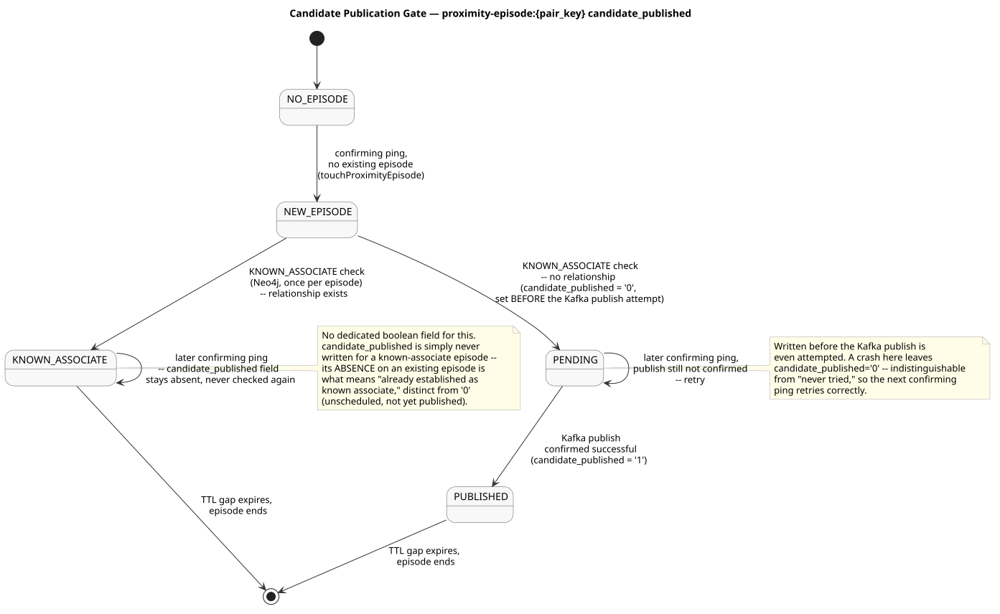

# Candidate Publication Gate — Design and Learning Reference

---

## What this solves

Every piece so far (candidate lookup, distance filter, pair key, Neo4j evidence, episode timing) runs on *every* qualifying ping. Publishing an alert candidate must not: it happens at most once per unscheduled episode. This stage is the decision layer that ties the earlier pieces together and answers "does this specific call need to publish `proximity.candidates`?"

---

## Concepts

### Evidence is unconditional; the alert path is filtered

`touchProximityEpisode` and `mergeProximityEvent` run for every qualifying pair, known associate or not — a pair's proximity history is never lost just because it turns out to be an expected relationship. Only the decision to publish a candidate is filtered by `KNOWN_ASSOCIATE`. This matches the documented contract directly: known associates "retain graph/episode evidence" but never produce a candidate.

### Checking `KNOWN_ASSOCIATE` only on a new episode

The check is a Neo4j read, so it costs a round trip. Doing it on every confirming ping for an ongoing encounter would be wasted repeated work for a fact that doesn't change mid-episode. Checking it once, when the episode starts, and remembering the answer in Redis is enough.

### How the answer is "remembered" without an extra field

A known associate's episode never gets a `candidate_published` field — it's deliberately omitted, not set to some third value. So on a later ping for an *existing* episode, a missing field means "this was already established as a known associate" and a present field (`'0'` or `'1'`) means "this is an unscheduled pair, already publishing or already published." No dedicated boolean field is needed; the existing field's presence already carries that information.

### The retry condition

`candidate_published` starts at `'0'` the moment a new unscheduled episode is recognized, before any Kafka publish is attempted, and only becomes `'1'` after the caller confirms the publish succeeded. If the process crashes or the publish fails in between, the field is left at `'0'`. The next qualifying ping for the *same* episode (arriving before the episode's TTL gap expires) sees `isNewEpisode = false` and `candidate_published = '0'`, and is told to publish again — this is the retry the documented contract describes, and it falls out of the state machine rather than needing separate retry bookkeeping.

---

## Failure modes

**Checking `KNOWN_ASSOCIATE` on every ping instead of once per episode.** Not incorrect, just wasteful — a real cost multiplied by ping frequency for a fact that's static for the life of the episode.

**Treating a missing `candidate_published` field as "not yet published" instead of "known associate."** Would cause a known-associate episode to be treated as retry-eligible on a later ping and incorrectly attempt to publish a candidate for a pair that should never produce one.

**Setting `candidate_published = '0'` after the Kafka publish instead of before.** Would reopen exactly the crash window this design closes: a crash between "publish succeeded" and "write the pending flag" would leave no record that a publish was ever attempted, and a retry could double-publish.

---

## Map to code

| Concept | Where |
| --- | --- |
| Orchestration | `evaluateProximityEncounter` — `services/correlation-worker/src/proximityDecision.ts` |
| Known-associate check | `isKnownAssociate` — `services/correlation-worker/src/knownAssociate.ts` |
| Publish-state field | `getCandidatePublishState` / `markCandidatePending` / `markCandidatePublished` — `services/correlation-worker/src/episode.ts` |

---

## What this stage does not do

It does not call Kafka. `shouldPublishCandidate: true` is a decision, not an action — building the candidate payload and sending it is the caller's job, and `markCandidatePublished` must be called only after that send actually succeeds. Wiring this into the live `position.normalized` consumer loop is separate follow-up work.

---

## Retention questions

1. Why do `touchProximityEpisode` and `mergeProximityEvent` run unconditionally, before the known-associate check, instead of only for unscheduled pairs?
2. Why is `KNOWN_ASSOCIATE` checked only when `isNewEpisode` is true?
3. How does a later ping distinguish "this episode is a known associate" from "this episode's candidate hasn't published yet," given both can show up on an existing episode?
4. Why does `markCandidatePending` have to run before the Kafka publish attempt, not after?

---

## Completion checklist

- [ ] I can explain why evidence-writing and candidate-publishing are on separate, differently-gated paths
- [ ] I can explain how a missing vs. present `candidate_published` field is interpreted on an existing episode
- [ ] I can explain the exact crash scenario the pending-before-publish ordering protects against
- [ ] I ran the integration suite against real Redis and Neo4j together and can interpret each test
