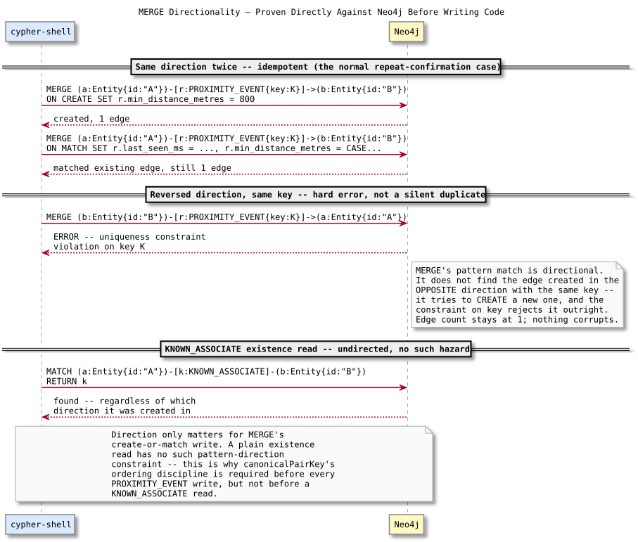

# Neo4j Proximity Event — Design and Learning Reference

---

## What this stage does

Writes one durable, replay-safe graph edge per proximity episode: `(Entity)-[:PROXIMITY_EVENT]->(Entity)`. This is evidence, not the alert itself — it exists so an operator can later ask "has this pair ever been close before?" as a graph traversal, and so the encounter has a persistent identity (`idempotency_key`) that survives Kafka redelivery.

---

## Concepts

### MERGE's pattern match is directional, the uniqueness constraint isn't

Proved directly against Neo4j before writing any code: `MERGE (a)-[r:TYPE {key: K}]->(b)` looks for a relationship in that exact direction. If the same key already exists but as `(b)-[:TYPE {key: K}]->(a)`, MERGE doesn't find it — it tries to create a new one, and the database's uniqueness constraint on `key` rejects it as a hard error (`Relationship already exists...`), not a silent no-op. So node order has to be fixed by the application, every time, regardless of which entity's ping triggered the write — which is exactly what `canonicalPairKey`'s ordering already gives us.

### Why `KNOWN_ASSOCIATE` reads don't need the same discipline

Also proved directly: querying with an *undirected* pattern (`-[k:KNOWN_ASSOCIATE]-`, no arrow) finds the relationship regardless of which direction it was created in or which order the query names the two entities. Direction only matters for the write side of `PROXIMITY_EVENT`, because MERGE is create-or-match against one specific pattern; a plain existence read has no such constraint.

### Episode identity vs episode content

`idempotency_key` (`{pair_key}:{episode_start_ms}`) is what MERGE matches on — it's the episode's identity. Everything else on the edge (`last_seen_ms`, `min_distance_metres`, detection location) is content that gets refined on repeat calls for the *same* episode: `last_seen_ms` always advances to the latest observation, `min_distance_metres` only ever decreases, and `distance_at_detection`/`lat`/`lon` are set once, at creation, and never touched again — they describe the moment the episode started, not its current state.

### What this function does *not* decide

Given a ping showing entities close together, is it still the same encounter as five seconds ago, or a new one? That's an episode-boundary question — Redis proximity-episode state (with its TTL-based gap detection) decides it. This function just writes whatever `episode_start_ms` it's told to write; it has no opinion on when episodes start or end.

---

## Failure modes

**Not canonicalizing node order before MERGE.** Confirmed directly: throws a uniqueness-constraint violation on the second write of the same episode if the two entities are passed in the opposite order from the first write.

**Letting `min_distance_metres` be overwritten instead of tightened.** Would make "closest observed distance" meaningless — a farther confirmation ping would erase evidence of how close the entities actually got.

---

## Map to code

| Concept | Where |
| --- | --- |
| Proximity edge write | `mergeProximityEvent` — `services/correlation-worker/src/proximityEvent.ts` |
| Canonical node ordering | Reuses `canonicalPairKey` — `services/correlation-worker/src/pair.ts` |
| Neo4j connection config | `NEO4J_URI`/`NEO4J_USER`/`NEO4J_PASSWORD` — `services/correlation-worker/src/config.ts` |
| Schema constraints (pre-existing) | `infra/neo4j/schema.cypher` |

---

## Neo4j lab (already run — see debrief for full output)

Direct `cypher-shell` experiments, without writing any application code first:

- `MERGE` on the same directed pattern twice: one edge, `ON MATCH` fires on the second call.
- `MERGE` on the reversed direction with the same `idempotency_key`: constraint violation, edge count stays at 1 (no corruption from the failed attempt).
- Undirected `KNOWN_ASSOCIATE` match: finds the relationship regardless of query order or creation direction.

---

## Retention questions

1. Why does reversing the two entities between calls risk a hard error rather than silently finding the existing edge?
2. Why doesn't the `KNOWN_ASSOCIATE` existence check need the same canonicalization?
3. Why does `min_distance_metres` use a `CASE` comparison instead of always being overwritten?
4. Why does this function have no logic for deciding whether a ping belongs to an existing episode or starts a new one?

---

## Completion checklist

- [ ] I can explain why MERGE's directionality is a real hazard here, with the exact error it produces
- [ ] I can explain why undirected reads don't share that hazard
- [ ] I can explain the difference between episode identity and episode content on the edge
- [ ] I can explain what this function deliberately does not decide, and what will decide it
- [ ] I ran the integration suite against real Neo4j and can interpret each test
