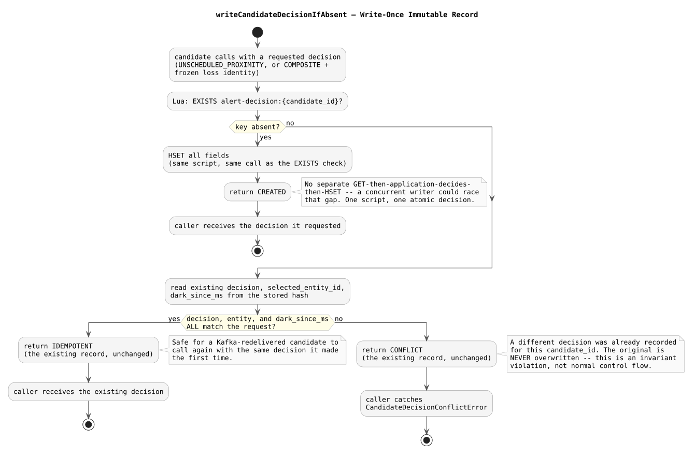

# Candidate Decision Record — Design and Learning Reference

Plain language first, then technical depth, then the code. Use this to understand, inspect, and defend CP3C.

---

## The one question this record answers, and the four it deliberately doesn't

`alert-decision:{pair_key}:{episode_start_ms}` answers exactly: *for this exact proximity candidate, what alert-type decision was already made?* It does not resolve eligibility (that's CP2), claim a loss episode (CP3B), publish anything to Kafka, or finalize anything. It has no deletion logic yet — that depends on the input-offset lifecycle CP5 wires up.

This narrowness is deliberate, not an oversight: CP3B's loss-episode claim and CP3C's candidate decision solve two genuinely different problems, established in Pre-CP3A's design (`composite-claim-protocol`) and worth restating precisely:

| | Loss-episode claim (CP3B) | Candidate decision (CP3C) |
| --- | --- | --- |
| Answers | Which candidate, if any, owns this signal-loss episode | What did we decide for this exact candidate |
| Protects against | A different candidate stealing the same loss episode | Kafka redelivery flipping a candidate's own decision |
| Keyed by | `entity_id` + `expected_dark_since_ms` | `candidate_id` alone |

A claim alone only protects one direction of the redelivery bug (a published `COMPOSITE` downgrading on replay); the decision record closes both directions, because it doesn't re-derive anything from mutable loss state at all on replay — it just plays back what was already decided.

---

## Concepts in plain language

### Why "check absent, then write" has to be one atomic step

The obvious-looking implementation — `GET`, let application code decide whether to write, then `HSET` — has the same shape as CP1's original handoff bug: a gap between the read and the write that a concurrent writer can land in. Two processes (or two redeliveries racing during a leader failover window) could both see "absent," both decide to write, and one would silently clobber the other's decision. `WRITE_CANDIDATE_DECISION_IF_ABSENT_LUA` does the existence check and the write inside one script, so there is no such gap — Redis's own script execution is what makes "check absent + establish decision" indivisible, the same reasoning CP1 and CP3B already apply to their own atomic operations.

### Why conflicting writes throw rather than silently picking a winner

`writeCandidateDecisionIfAbsent` treats a genuine conflict — two different decisions recorded for the *same* `candidate_id` — as a thrown `CandidateDecisionConflictError`, not a quiet no-op or a silent overwrite. This is deliberately not normal control flow: under correct operation (Kafka's own partitioning, Pre-CP2A's leader-scoped consumption), a single `candidate_id` should only ever be decided once. A conflict means something upstream is broken. Surfacing it loudly, with both the requested and existing decision attached to the error, is the "fail closed" instinct applied to a genuine invariant violation rather than a routine outcome a caller should quietly route around.

### Why idempotent success and conflict use almost the same comparison

Both check `decision` + `selected_entity_id` + `dark_since_ms` (for `COMPOSITE`) against what's already stored. An exact match on those three is "the same logical decision, just asked again" — success, returning the existing record. Anything else — a different decision type, a different entity, a different loss episode entirely — is a conflict. `signal_loss_alert_id` and `resumed_at_ms` aren't part of the comparison because they're fully determined once `selected_entity_id` + `dark_since_ms` match (the same entity going dark at the same moment has exactly one `signal_loss_alert_id` and, if resumed, exactly one `resumed_at_ms`) — comparing them too would be redundant, not additional safety.

### Why `readCandidateDecision` throws on a malformed record instead of returning `null`

`null` means "no decision has been made for this candidate yet" — a caller receiving `null` is expected to go run CP2 and decide fresh. If a stored record is corrupted (an unrecognized `decision` value, or a `COMPOSITE` record missing `selected_entity_id`), treating that the same as "nothing decided yet" would silently invite a *second*, possibly *different* decision for a candidate that may have already had one — precisely the bug this whole mechanism exists to prevent. Throwing instead makes the corruption visible rather than papering over it with a fresh re-decision.

### Why CP4, not CP3C, owns the actual alert payload

The record freezes exactly what CP2's eligibility resolution and CP3B's tie-break already determined — which entity, which representation, which `dark_since_ms`, which `signal_loss_alert_id`, which `resumed_at_ms` if applicable. It does not freeze a constructed Kafka message. The candidate's own proximity evidence (`pair_key`, `lat`, `lon`, `distance_at_detection`) is already durable in the original `proximity.candidates` message a redelivery replays verbatim — freezing it again here would be redundant. What genuinely needed freezing was the *loss* side of the decision, since that's read from mutable Redis state that can change between the original decision and a replay.

---

## Write-once decision logic

---

## Map to code

| Concept | Where |
| --- | --- |
| Record types | `CompositeCandidateDecision` / `UnscheduledCandidateDecision` / `CandidateDecision` — `services/alert-evaluator/src/composite.ts` |
| Conflict error | `CandidateDecisionConflictError` — same file |
| Read | `readCandidateDecision` — same file |
| Atomic write-once | `writeCandidateDecisionIfAbsent` / `WRITE_CANDIDATE_DECISION_IF_ABSENT_LUA` — same file |

---

## Retention questions

1. Why do CP3B's loss-episode claim and CP3C's candidate decision have to be two separate mechanisms rather than one?
2. Walk through why "GET, decide in application code, HSET" is unsafe here, in the same terms CP1's original handoff bug was unsafe.
3. Why does a write conflict throw an error rather than silently keeping whichever decision arrived first?
4. Why are `signal_loss_alert_id` and `resumed_at_ms` excluded from the idempotency/conflict comparison?
5. Why does `readCandidateDecision` throw on a malformed record instead of treating it as "no decision yet"?

---

## Completion checklist

- [ ] I can explain the exact difference in responsibility between CP3B's claim and CP3C's decision record
- [ ] I can explain why the existence check and the write must be one atomic Lua script, not two separate calls
- [ ] I can explain why a conflict is a thrown error, not a return value the caller can casually ignore
- [ ] I can explain why the candidate's own proximity evidence isn't frozen into this record, only the loss-side identity
- [ ] I ran the real-Redis test suite and the separate manual concurrent-write inspection myself and can interpret both
