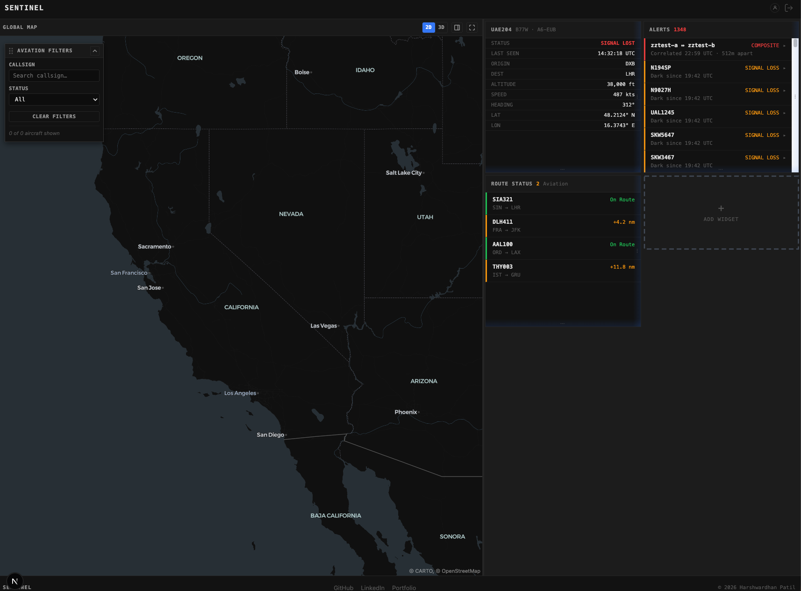

# Composite Alert Presentation — What We Actually Tested

Commit: `954d688` — "feat(dashboard): render COMPOSITE alerts with nested superseded evidence"

This covers proving out both **CP5C** (the dashboard rendering) and **CP6** (checking the tricky ordering cases actually hold up, plus a UI sanity pass), since CP6 was always meant to be "go verify what CP5C built" rather than its own separate piece of work.

---

## Part 1: does the backend actually hold up? (CP6's failure experiments)

The API already had a full automated test suite (`services/api/src/sink/alertSink.integration.test.ts`) covering exactly the scenarios CP6 asks for. Running it against the real local Postgres/Redis/Kafka:

```text
Test Files  5 passed (5)
     Tests  54 passed (54)
```

| What was tested | What it proves |
| --- | --- |
| Signal-loss alert arrives, then the combined alert arrives | Normal order: the old alert correctly flips to "replaced" |
| Combined alert arrives *before* the signal-loss alert even exists | The harder, out-of-order case Pre-CP5B exists to handle — the signal-loss alert has to land already-replaced, never briefly "active" |
| An already-acknowledged alert gets combined | `ACKNOWLEDGED → SUPERSEDED` still works |
| An already-resolved alert gets referenced by a later combined alert | It stays resolved — never un-resolved or overwritten |
| An alert already replaced by one combined alert gets referenced by a *different* combined alert | Rejected as a conflict and rolled back, not silently allowed |
| Two processes race to claim the same episode at once | Exactly one wins, proven with a real concurrent test, not assumed |
| A publish to connected dashboards fails partway through, then retries | Every alert gets republished on retry, even the ones that didn't change |

**A real methodology snag worth recording:** the first time we ran this suite, 2 tests failed — both checking "did exactly one alert-update message get sent," and both saw 2 instead of 1. That looked alarming, but it turned out to be nothing wrong with the code: the local dev stack's own `api` service happened to be running at the same time, listening on that exact same message channel, so the test picked up an extra real message that wasn't part of its own test. We stopped the live `api` process, reran, and got a clean 54/54. **Lesson: never run this integration suite while the dev stack's own API service is also running** — they'll collide on the shared Redis channel.

---

## Part 2: does the dashboard actually show it correctly? (CP5C's UI sanity pass)

For this we didn't just trust the automated tests — we forced the *harder* ordering by hand through the real running system and watched it happen live, end to end.


We invented two fake aircraft (`zztest-a`, `zztest-b`) so nothing here touched real flight data, and deliberately sent the combined alert message first, before the "went dark" alert it was supposed to replace even existed yet.

**Step 1 — sent the combined alert only.** Checked Postgres directly:

```text
alert_id: zztest-a:zztest-b:COMPOSITE:1789252789762
status:   NEW

pending_alert_supersessions:
  referenced_alert_id: zztest-a:SIGNAL_LOSS:1789252789762
  composite_alert_id:  zztest-a:zztest-b:COMPOSITE:1789252789762
```

A row appeared in `pending_alert_supersessions` — the system's way of remembering "something is going to replace this alert, but it hasn't shown up yet." On screen, the combined alert card appeared by itself, with nothing nested under it — correct, since the dashboard didn't know about anything to nest yet.



This screenshot is from right after that first message — the nested child isn't visible in this particular frame since the card is shown collapsed, but the database check confirms it landed correctly a moment later.

**Step 2 — sent the late "went dark" alert.** Checked Postgres again:

```text
alert_id: zztest-a:SIGNAL_LOSS:1789252789762
status:   SUPERSEDED
superseded_by: zztest-a:zztest-b:COMPOSITE:1789252789762

pending_alert_supersessions: (empty — the waiting row got consumed)
```

The signal-loss alert never sat there as a plain active alert, not even briefly — it landed directly as "replaced." On screen, it appeared nested underneath the combined alert, grayed out, tagged "superseded," exactly as the mockup intended.

| Check | Expected | Observed |
| --- | --- | --- |
| Late alert never observably active | Lands straight into "replaced" | PASS |
| Waiting row gets consumed | Deleted once the late alert arrives | PASS |
| Combined alert shows alone before its child is known | No fabricated placeholder | PASS |
| Combined alert gains its nested child once the child arrives | Grouping driven by the combined alert's own data, not the child's own status | PASS |

### A real problem we hit while setting this up

Our first attempt to send that test message used a quick command-line tool (`rpk`) to publish it directly onto the queue. That tool compresses messages in a format the real API service's code can't read — and it didn't just ignore our message, it crashed the API's alert-processing loop outright, and kept crashing on every restart because the bad message sat at the front of what it needed to read next. We fixed it by skipping past that one message, then switched to sending test messages using the same library the real services already use, so there's no chance of a format mismatch. **Lesson: never hand-craft a test message with `rpk` for a queue the real services also read from — use the same library they use.**

---

## Bottom line

Both checkpoints are done. The backend converges correctly no matter which of the two alerts arrives first (54/54 automated tests, plus a real hand-run of the harder order), and the dashboard reflects that correctly on screen (watched live, not just trusted from tests). The one known gap — plain proximity alerts being hard to read on their own — is separate, already-noted follow-up work, not part of what these two checkpoints covered.

## If you want to reproduce this yourself

```bash
cd services/api
pnpm run test -- alertSink.integration.test.ts   # do this with the live api service stopped
```

To redo the manual arrival-order check: send the combined alert first, look at `pending_alert_supersessions` in Postgres (you should see a row waiting), then send the "went dark" alert and check `alerts` again (the waiting row should be gone, and that alert should already say "superseded").

## Worth trying yourself

Do the same experiment in the normal order instead (send the "went dark" alert first, combined alert second) and confirm the combined alert already shows its nested child the moment it appears, instead of gaining one a beat later.

## Key observations

| What we checked | Result |
| --- | --- |
| Automated backend suite | 54/54 passing (both arrival orders, acknowledged/resolved handling, concurrency, conflict rejection) |
| Manual arrival-order proof | Combined-alert-first converges correctly in Postgres and renders correctly on screen |
| Real problems found along the way | Test-suite/live-stack collision on a shared message channel; a compressed test message crashing the API — both documented above so they aren't rediscovered the same way twice |
