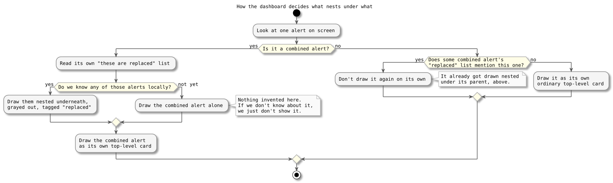
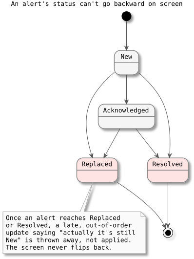

# Composite Alert Presentation (CP5C)

The backend already does the hard part: when a dark aircraft and an unexpected close pass line up, it combines them into one "composite" alert and marks the original alert as replaced. CP5C is just about showing that correctly on the dashboard, so it reads as one incident, not three unrelated red boxes. Nothing backend-side changed here, no new database or queue work, just the screen.

We sketched a rough mockup first and got it approved before writing any code. The approach: the composite shows as a card, and whatever it replaced shows nested underneath it, grayed out and tagged.

## The big picture, before the details

Here's the whole journey, start to finish, in plain terms:

An aircraft stops reporting its position, and separately, something unexpected happens nearby (an unplanned close pass with another aircraft). The backend notices both facts line up in time and decides they're really one incident, not two. It writes a single combined alert, along with a note that the earlier alert is now replaced. Both of those things get saved together, as one all-or-nothing step, so you never end up with the combined alert existing but the "replaced" marker missing, or vice versa. Every dashboard that's currently open gets told about both changes, and the alert list redraws itself: one combined card at the top, the alert it replaced tucked underneath.

Everything below is about that very last step: how the dashboard decides what to draw, and why a couple of small decisions in that drawing logic matter more than they look like they should.

## How the dashboard decides what nests under what

The dashboard decides what to nest under a composite by reading the composite's own data (what it says it replaced), not by checking the replaced alert's own status. That's deliberate: the composite and the alert it replaces get saved to the database as two separate operations, so the two updates can arrive at the browser in either order, and trusting the child's own status would make the grouping flicker depending on timing. Trusting the parent's own list instead keeps it stable either way.

Also, a composite doesn't always replace two things, usually just one (the dark-aircraft alert) — the system never raises a separate proximity alert alongside a composite, so there's nothing else to nest. The dashboard shows however many things it actually replaced instead of assuming a fixed number.

And if a composite's replaced alert isn't known to the browser yet (say, the page loaded after the fact), the composite still shows fine, it just doesn't nest anything it hasn't actually seen, rather than inventing a placeholder.

## Once it's over, it's over

Once the dashboard has seen an alert reach a final state (superseded or resolved), it never lets a late, out-of-order update move it backward to "still active" on screen. This matters because those two separately-saved updates from earlier can genuinely arrive out of order at the browser, so without this rule, a perfectly correct "replaced" alert could briefly flicker back to looking active again just because of a stale message showing up late, even though the database itself never wavered.

## One real gap we noticed but didn't fix here

Plain proximity alerts (ones that never get combined into a composite) are hard to read on their own, no real flight number, no useful summary. That's separate follow-up work, not part of what this checkpoint covers.
