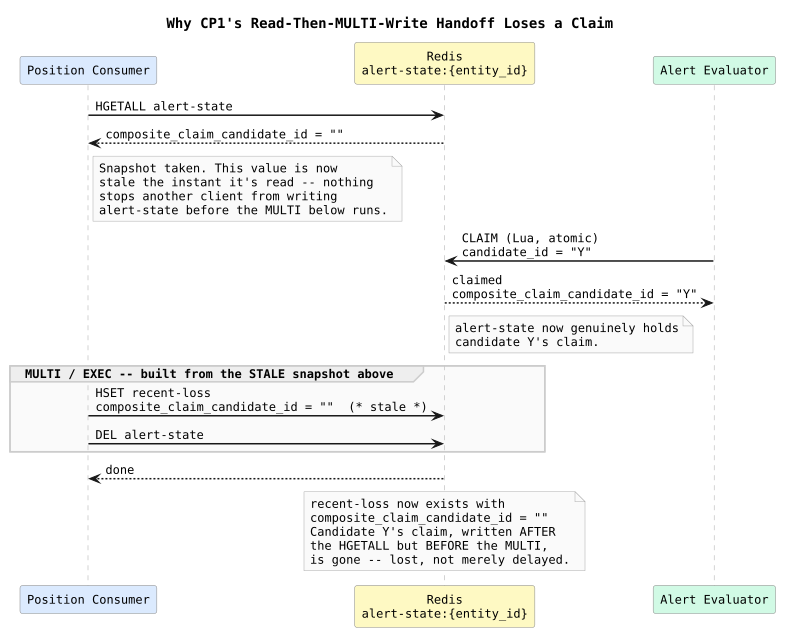
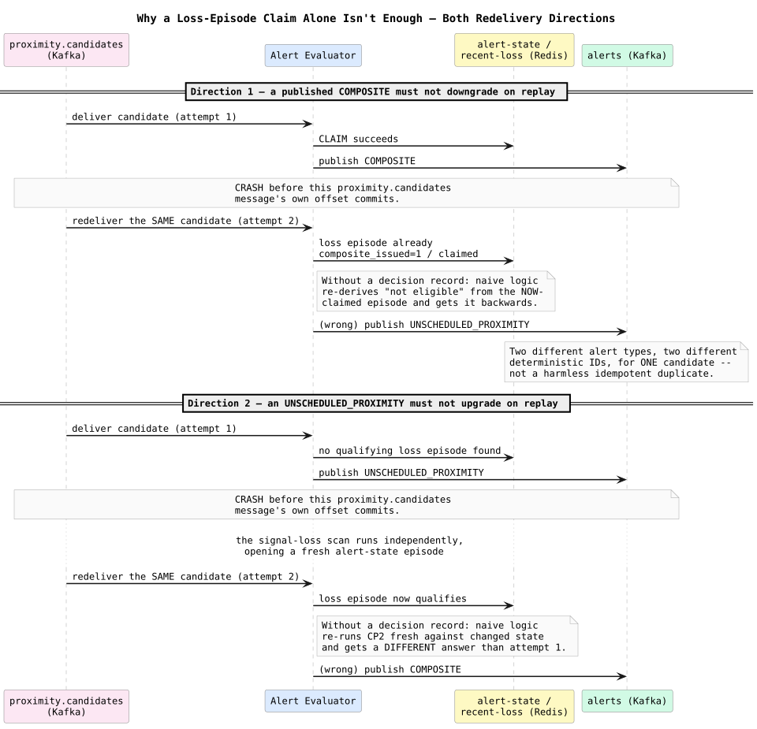
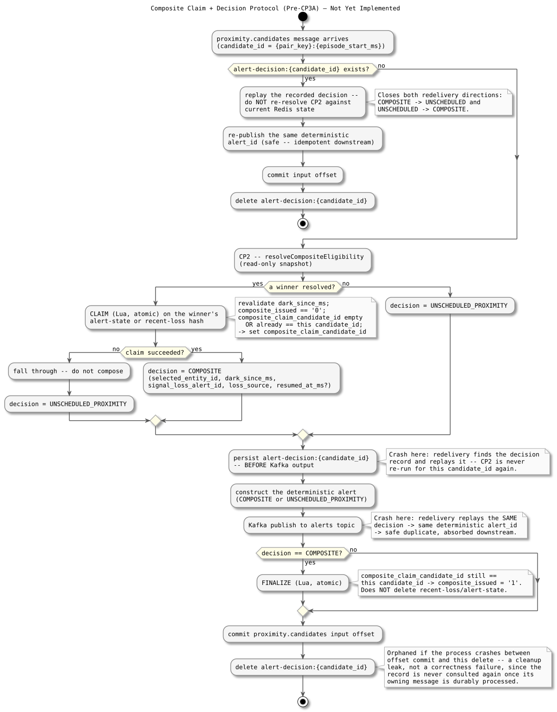

# Composite Claim + Decision Protocol — Design and Learning Reference

Plain language first, then the resolved protocol, then the code map. This is a **design resolution only** — nothing described here is implemented yet. Use this to understand and defend the Pre-CP3A decision before CP3 writes any code against it.

---

## Why CP2 alone isn't enough

CP2 (`composite-eligibility-resolution`) answers "does either pair member currently look eligible?" with a read-only Redis snapshot. Turning that snapshot into a durably claimed, published `COMPOSITE` — without losing it on crash, without a concurrent claimant racing it, and without Kafka redelivery silently changing the answer — needs more state than CP2 alone provides. Working through the crash scenarios by hand surfaced three distinct problems, not one.

---

## Concepts in plain language

### Why `pair_key` alone cannot identify a claim

A `pair_key` names two entities, not one encounter. The same two entities can have several distinct proximity episodes over time — Sentinel already treats `{pair_key}:{episode_start_ms}` as the real identity of a proximity episode (it's the Neo4j `PROXIMITY_EVENT` idempotency key and the Correlation Worker's own episode identity). If a loss-episode claim were keyed by `pair_key` alone, a second, later, genuinely *different* encounter between the same pair would look indistinguishable from a Kafka redelivery of the first — the claim logic could not tell "this is a retry" from "this is a new, unrelated candidate arriving for the same pair." Every claim in this protocol uses the full `candidate_id = {pair_key}:{episode_start_ms}`.

### Why CLAIM must happen before publish, but can't be a one-shot gate

If claiming were a plain "flip `composite_issued` to `1`" before publishing, a crash between the claim and the publish permanently loses the composite — the claim already burned the episode's only chance, and there's no retry path, because a signal-loss episode gets exactly one `proximity.candidates` delivery (unlike proximity's own `candidate_published` pattern, which gets a fresh retry on every subsequent ping in an ongoing episode). The fix is that CLAIM is **resumable by its own candidate**: it fences a *different* `candidate_id` from claiming the same episode, but a redelivery of the *same* `candidate_id` can re-run CLAIM and find it already holds the claim — safe to proceed.

### Why adding claim fields breaks CP1's existing handoff

This was the least obvious finding. CP1's `alert-state` → `recent-loss` handoff was `HGETALL` (read current fields) then a separate `MULTI` (write those fields into `recent-loss`, delete `alert-state`). That was safe when the hash held only static evidence — nothing external could change it between the read and the write in a way that mattered. Once `composite_claim_candidate_id` is a live, mutable coordination field, that gap becomes a real race: an Alert Evaluator CLAIM landing between the Position Consumer's `HGETALL` and its `MULTI`/`EXEC` gets silently overwritten by the handoff's stale snapshot.

Once *any* code adds mutable coordination fields to a hash another process also reads-then-writes non-atomically, that other process's read-then-write becomes wrong — not by coincidence, but by construction. The fix is a single Lua script that reads and transfers the current field values inside the same atomic step that deletes the source key, so Redis's own serialization (not apart-in-time application code) decides whether a concurrent CLAIM lands before or after the handoff. **Implemented as of CP3A** — see [`atomic-signal-loss-handoff`](../atomic-signal-loss-handoff/atomic-signal-loss-handoff.md).

### Why a candidate needs its own decision record, separate from the loss-episode claim

The loss-episode claim alone only protects one direction of a redelivery bug. Tracing both directions:

Direction 1 is the one the loss-episode claim alone fixes: a `COMPOSITE` already published, redelivered, must not downgrade to `UNSCHEDULED_PROXIMITY`. Direction 2 is the one it does **not** fix: an `UNSCHEDULED_PROXIMITY` already published, redelivered after the signal-loss scan happens to open a qualifying episode in between, must not upgrade to `COMPOSITE`.

Both produce two different alert types with two different deterministic IDs for one proximity candidate — not a harmless idempotent duplicate the API can absorb, since `UNSCHEDULED_PROXIMITY` and `COMPOSITE` IDs are deliberately distinct and nothing links them. The fix has to operate at the level of "what did we decide for *this* candidate," independent of whatever the loss episode's state happens to be *now*. That's `alert-decision:{candidate_id}` — checked first, before CP2 ever runs, on every delivery of a given candidate.

### Why the decision record has no TTL

`COMPOSITE_CORRELATION_WINDOW_MS` answers a domain question: how long can a *new* candidate still correlate with an old loss? The decision record answers a completely different question: how long must we remember a Kafka processing decision so redelivery can replay it? Those lifetimes have no reason to match. Tying the decision record to the correlation window would mean any outage longer than ~2 minutes silently reintroduces the exact redelivery bug this record exists to close. Instead, the record's lifecycle is tied to the thing that actually determines whether redelivery can occur: whether the input offset has committed. Its deletion happens *after* that commit — so a crash before commit is always replay-safe, and the only failure mode left is a rare orphaned record after a crash between commit and delete, which is a cleanup leak, not a correctness bug, since nothing consults it again.

---

## Two separated concerns, on purpose

| | Loss-episode claim | Candidate decision record |
| --- | --- | --- |
| Answers | "Which candidate, if any, won this signal-loss episode?" | "What did we decide for this exact candidate?" |
| Lives on | `alert-state`/`recent-loss` (`composite_claim_candidate_id`, `composite_issued`) | its own key, `alert-decision:{candidate_id}` |
| Governs | Exclusivity — one episode, one winning candidate | Replay stability — one candidate, one sticky decision |
| Lifetime | `composite_issued=1` persists until the hash's own TTL retires it (retention, not deletion-on-consumption) | Deleted right after the owning message's input offset commits |

Fresh eligibility (CP2) and replay (the decision record) are deliberately different code paths — CP2 is never re-run for a candidate that already has a decision record.

---

## Invariants (design-accepted, implementation pending)

1. One loss episode can be claimed by at most one canonical proximity candidate, identified by `{pair_key}:{episode_start_ms}` — never a bare `pair_key`.
2. A candidate's alert-type decision is sticky across Kafka redelivery, in both directions.
3. The `alert-state` → `recent-loss` handoff must preserve claim/finalize state atomically — a single Lua transfer, not the current read-then-`MULTI`-write.
4. `recent-loss`'s TTL governs eligibility retention only, never Kafka replay memory; the decision record's lifecycle is independent, tied to input-offset commit.
5. The same candidate may resume its own pending claim; a different candidate may never steal it.

---

## Map to code (none yet — this is the design CP3 implements against)

| Concept | Where it will live |
| --- | --- |
| Canonical rule text | `docs/DATA_MODEL.md` — "Composite claim and decision protocol" |
| CLAIM / FINALIZE Lua scripts | `services/alert-evaluator/src/composite.ts` (CP3, not yet written) |
| Revised atomic handoff | `services/position-consumer/src/consumer.ts` — `clearSignalLossEpisode` (CP3, not yet revised) |
| Decision-record read/write | `services/alert-evaluator/src/composite.ts` (CP3, not yet written) |

---

## Retention questions

1. Give a concrete scenario where keying a claim by `pair_key` alone would misclassify a genuinely new candidate as a redelivery.
2. Walk through, step by step, how a CLAIM landing between a `HGETALL` and a `MULTI`/`EXEC` in the current CP1 handoff silently erases the claim.
3. Describe both directions of the redelivery bug the decision record closes, and explain why the loss-episode claim alone only closes one of them.
4. Why does the decision record deliberately have no TTL, and what would go wrong if it reused `COMPOSITE_CORRELATION_WINDOW_MS`?
5. What's the difference between "a claim is fenced" and "a claim is a one-shot gate," and why does this protocol need the former, not the latter?

---

## Completion checklist

- [ ] I can explain, from memory, why `pair_key` alone is insufficient as a claim identity
- [ ] I can trace the exact race that breaks CP1's current handoff once claim fields are added, and why it wasn't a problem before
- [ ] I can describe both directions of the decision-flip bug and why they need a mechanism beyond loss-episode claiming alone
- [ ] I can explain why the decision record's lifetime is deliberately decoupled from `COMPOSITE_CORRELATION_WINDOW_MS`
- [ ] I understand this document describes an accepted design, not implemented behavior, and I know exactly what CP3 still has to build
