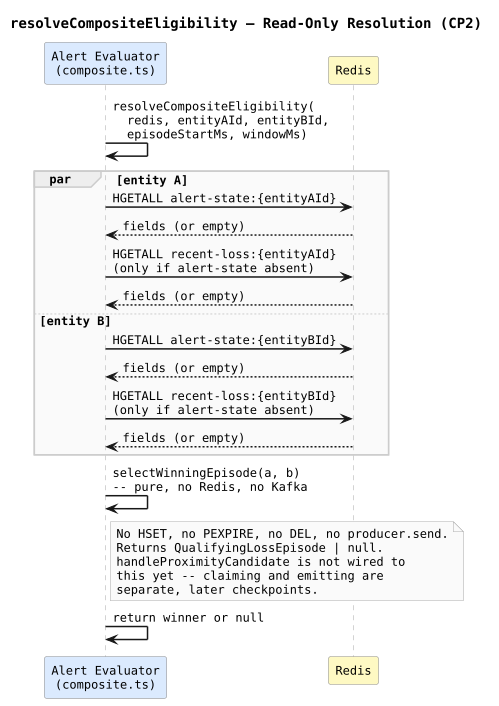
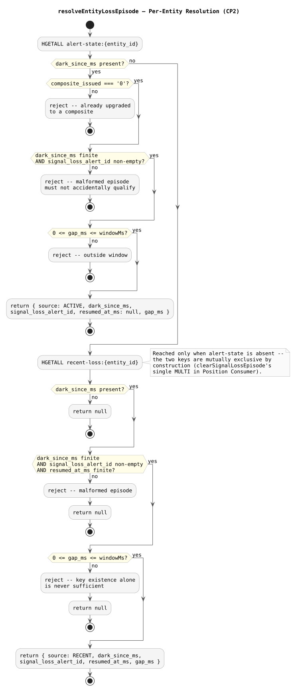

# Composite Eligibility Resolution — Design and Learning Reference

Plain language first, then technical depth, then the code. Use this to understand, inspect, and defend CP2 (commit `1efa70c`).

---

## What this checkpoint is, and deliberately isn't

CP2 implements the `correlation-window-semantics` rule as real code, against real Redis — and stops. It answers "does either pair member have a qualifying signal-loss episode, and if both do, who wins?" It does **not** claim the episode, does not mutate any Redis state, does not publish to Kafka, and is not wired into `handleProximityCandidate`. Those are separate, later checkpoints, because a resolved winner here is a **snapshot**, not a **lock** — Redis state can change between CP2 resolving eligibility and any later checkpoint acting on it, and that gap has to be handled deliberately, not accidentally.

---

## Concepts in plain language

### `redis` as an explicit parameter, not a module import

Every function in `composite.ts` takes `redis: Redis` as its first argument, rather than importing a shared client the way `evaluator.ts`'s own functions do. This isn't stylistic — importing `redis` (or the `ProximityCandidateMessage` type) from `evaluator.ts` would create a circular import once a later checkpoint wires `composite.ts` back into `evaluator.ts`. Taking `redis` as a parameter, matching `correlation-worker`'s existing convention for similar stateful helpers, sidesteps the cycle entirely.

### Why `alert-state` is checked before `recent-loss`, not both

`resolveEntityLossEpisode` reads `alert-state:{entity_id}` first; it only falls back to `recent-loss:{entity_id}` if `alert-state` is absent. This relies on an invariant established in CP1: `clearSignalLossEpisode` replaces `alert-state` with `recent-loss` atomically, inside one `MULTI`. The two keys are mutually exclusive by construction — an entity is never simultaneously "still dark" and "recently resumed." Checking both unconditionally would be redundant work defending against a state that structurally cannot occur.

### Required fields, not merely carried-through fields

An early draft of this code defaulted `signal_loss_alert_id` to `''` if the Redis hash didn't have it — "carry it through if present." Review caught that this was wrong: a later checkpoint needs `signal_loss_alert_id` for `supersedes_alert_ids` when it constructs the actual `COMPOSITE` alert. If a half-corrupt Redis hash were allowed to "qualify" here with an empty `signal_loss_alert_id`, the failure would surface downstream, in a checkpoint that has no way to tell "this was always missing" from "something went wrong just now." CP2 rejects malformed episodes at the source instead — for `recent-loss`, that means `resumed_at_ms` is required too, since `DATA_MODEL.md` defines all three fields as one hash contract.

### Why the tie-break lives in its own pure function

`selectWinningEpisode(a, b)` takes two already-resolved episodes (or `null`) and returns the winner with no Redis access at all. Splitting it out from `resolveCompositeEligibility` means the tie-break logic — smaller `gap_ms` wins, exact ties go to the lexicographically smaller `entity_id` (plain `<=`, not `localeCompare`, matching the Correlation Worker's own `entityA.id <= entityB.id` canonicalization) — is testable with plain objects, no `make up` required.

---

## Read-only, proven, not just asserted

"No mutation" is easy to claim and easy to accidentally violate later. This checkpoint proves it two ways: an automated test that snapshots both entities' Redis hashes before and after a full `resolveCompositeEligibility` call and asserts they're `toEqual`, and a separate manual `redis-cli` inspection outside the test suite entirely — see the debrief for both.

---

## Map to code

| Concept | Where |
| --- | --- |
| Per-entity resolution | `resolveEntityLossEpisode` — `services/alert-evaluator/src/composite.ts` |
| Pure tie-break | `selectWinningEpisode` — same file |
| Two-entity orchestration | `resolveCompositeEligibility` — same file |
| Gap/window check | `qualifyingGap` — same file |
| Real-Redis test coverage | `services/alert-evaluator/src/composite.integration.test.ts` |

---

## Retention questions

1. Why does `resolveEntityLossEpisode` take `redis` as a parameter instead of importing a shared client, the way the rest of `evaluator.ts` does?
2. What invariant, established in a different checkpoint, justifies checking `recent-loss` only when `alert-state` is absent, rather than checking both unconditionally?
3. Why does a missing `signal_loss_alert_id` reject the episode here, rather than defaulting to an empty string and letting a later checkpoint fail?
4. Why is `selectWinningEpisode` a separate, pure function instead of inline logic inside `resolveCompositeEligibility`?
5. What does "a resolved winner is a snapshot, not a lock" actually mean for whatever checkpoint claims it next?

---

## Completion checklist

- [ ] I can explain why this function takes `redis` as a parameter and what problem that avoids
- [ ] I can explain the mutual-exclusivity invariant this code relies on and which earlier checkpoint established it
- [ ] I can explain why required-field validation was added after review, not present in the first draft
- [ ] I can state the tie-break rule from memory and explain the comparator choice
- [ ] I can explain, precisely, what "snapshot, not a lock" means and why it matters for whatever comes next
- [ ] I ran the real-Redis test suite and the separate manual inspection myself and can interpret both
