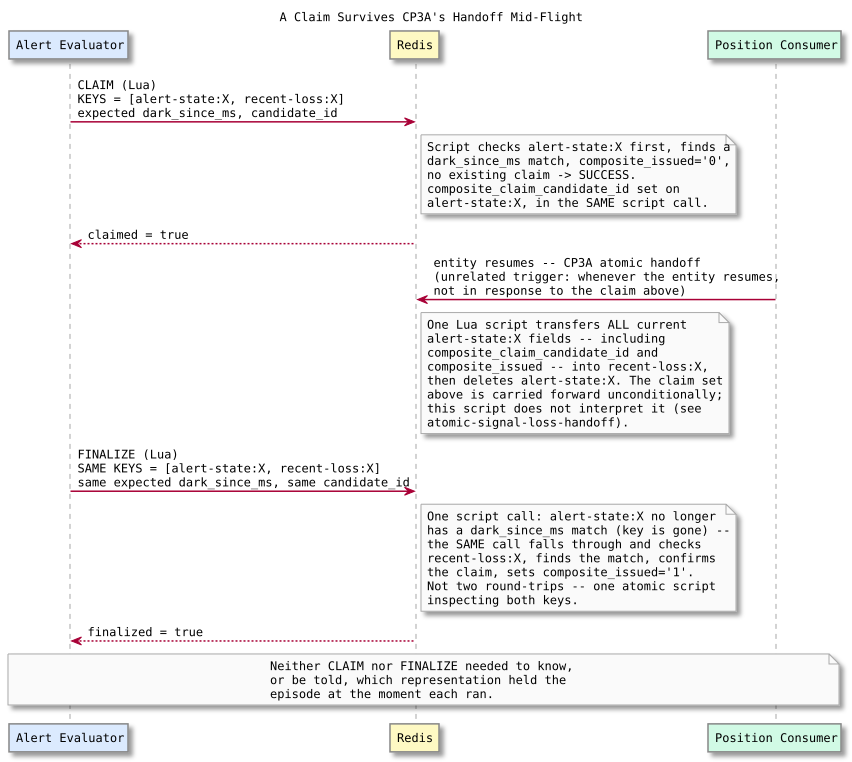

# Composite Episode Claim — Design and Learning Reference

Plain language first, then technical depth, then the code. Use this to understand, inspect, and defend CP3B.

---

## What this checkpoint is, and deliberately isn't

CP3B implements the two primitives Pre-CP3A's design named but didn't build: `claimCompositeEpisode` and `finalizeCompositeEpisode`. They answer "which candidate, if any, owns this signal-loss episode" and "has that candidate's composite actually reached the finalized state." Nothing here touches Kafka, constructs a `COMPOSITE` alert, reads or writes `alert-decision` records, or changes `handleProximityCandidate`'s behavior. A `proximity.candidates` message today still unconditionally becomes `UNSCHEDULED_PROXIMITY` — these primitives exist and are fully tested, but nothing calls them yet.

---

## Concepts in plain language

### Why identity is `entity_id` + `expected_dark_since_ms`, not "wherever CP2 found it"

CP2's `resolveCompositeEligibility` returns a snapshot that includes `source: 'ACTIVE' | 'RECENT'` — which Redis key it happened to find the episode in *at read time*. That source is stale information the instant it's read: CP3A's handoff can move the episode from `alert-state` to `recent-loss` between CP2's snapshot and any later CLAIM or FINALIZE call. If CLAIM/FINALIZE trusted the snapshot's `source` field, a claim attempt on an episode that moved would look for it in the wrong place and wrongly report "no episode." Identity has to be something that survives the move: `entity_id` (which representation doesn't change) plus `expected_dark_since_ms` (the episode's own anchor, also unchanged by the handoff — CP3A's script carries `dark_since_ms` forward exactly). Both primitives search *both* `alert-state:{entity_id}` and `recent-loss:{entity_id}` inside one Lua script and use whichever one currently has a matching `dark_since_ms`.

### Why `candidate_id` and not a bare `pair_key`

Already established in Pre-CP3A: the same pair can produce multiple distinct proximity episodes over time. `candidate_id = {pair_key}:{episode_start_ms}` is the caller's own episode identity, matching Neo4j's `PROXIMITY_EVENT` idempotency key and the Correlation Worker's episode identity — never a bare `pair_key`, which would make a genuinely new encounter indistinguishable from a redelivery of an old one.

### Why CLAIM has to accept its own candidate twice

If CLAIM were a one-shot gate — succeed once, reject everyone including a retry — a crash between a successful CLAIM and the eventual Kafka publish would permanently strand the episode: the same candidate's own redelivery would find the episode already claimed by *itself* and fail, with no way back in. CLAIM's actual rule is a fence against *other* candidates, not a lock against retry: succeed when the existing claim is empty **or already equals this candidate_id**. This is what makes Kafka's at-least-once redelivery a safe retry path instead of a dead end.

### Why FINALIZE is idempotent the same way

The exact scenario this exists for: publish `COMPOSITE` succeeds, FINALIZE succeeds, the process crashes before the `proximity.candidates` message's own input offset commits, Kafka redelivers. The redelivered candidate re-runs FINALIZE. If FINALIZE only succeeded on a `'0' → '1'` transition, this second call would find `composite_issued` already `'1'` and report failure — even though the *same* candidate is asking, and the operation genuinely already completed correctly. FINALIZE checks "does the claim belong to you" first; if so, `composite_issued` already being `'1'` is success, not failure. A *different* candidate is always rejected, even one that happens to match the episode's `dark_since_ms` — ownership, not episode identity alone, gates FINALIZE.

### The one thing both scripts deliberately never do

Neither script calls `PEXPIRE`, `EXPIRE`, or anything else that touches a TTL. `recent-loss`'s TTL is eligibility retention (Pre-CP2B); CLAIM/FINALIZE are coordination, a completely different concern. Refreshing the TTL here would silently extend how long a candidate can correlate against a loss — a real behavior change smuggled into what should be a pure coordination checkpoint. Tested explicitly: `PTTL` is captured before and after each operation and asserted not to have increased.

---

## Claim surviving a real cross-checkpoint interaction

This is the one interaction genuinely worth its own diagram: a claim recorded by CP3B on `alert-state`, then CP3A's independently-triggered handoff (the entity resumes, unrelated to anything the Alert Evaluator is doing) moves it to `recent-loss` mid-flight, and a later FINALIZE call — using the same `entity_id` + `expected_dark_since_ms` it started with — finds it there without needing to know it moved. Two checkpoints, built independently, composing correctly because both were designed against the same representation-independent identity from the start.

---

## Map to code

| Concept | Where |
| --- | --- |
| CLAIM primitive | `claimCompositeEpisode` — `services/alert-evaluator/src/composite.ts` |
| FINALIZE primitive | `finalizeCompositeEpisode` — same file |
| Representation search (both scripts) | `CLAIM_COMPOSITE_EPISODE_LUA` / `FINALIZE_COMPOSITE_EPISODE_LUA`'s `find_match` |

---

## Retention questions

1. Why is `source: ACTIVE | RECENT` from CP2's snapshot unsafe to use as the lookup key for CLAIM/FINALIZE?
2. Walk through why a one-shot CLAIM (reject all retries, including the original claimant) would permanently strand an episode on crash.
3. Why does FINALIZE treat "already `composite_issued=1` under my own claim" as success rather than failure?
4. What's the difference between what fences a *different* candidate and what allows the *same* candidate to retry, in both CLAIM and FINALIZE?
5. Why must neither script touch any TTL, and what would silently break if one did?

---

## Completion checklist

- [ ] I can explain why episode identity is `entity_id` + `expected_dark_since_ms`, not "whichever Redis key CP2 happened to read"
- [ ] I can explain why CLAIM's same-candidate retry is not a security hole but the actual crash-safety mechanism
- [ ] I can explain FINALIZE's idempotency in terms of the specific crash scenario it protects
- [ ] I can trace the claim-survives-handoff diagram and explain why it required no coordination between CP3A and CP3B beyond a shared identity convention
- [ ] I ran the real-Redis test suite and the separate manual concurrent-claim inspection myself and can interpret both
