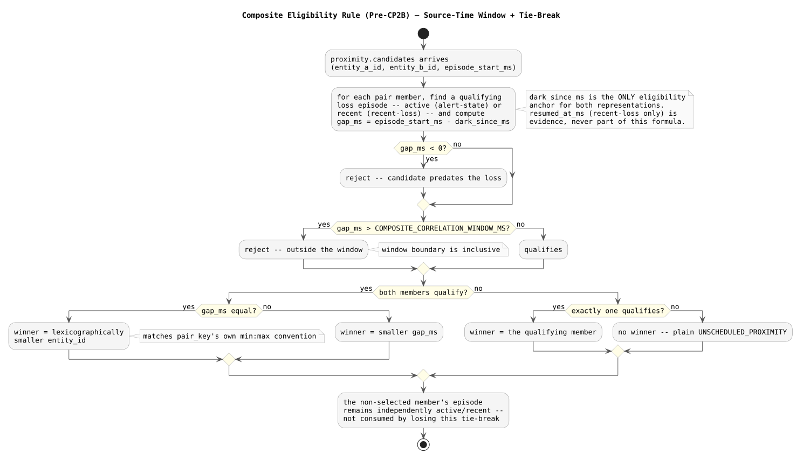

# Correlation Window Semantics — Design and Learning Reference

Plain language first, then the resolved rule, then the code. Use this to understand, inspect, and defend Pre-CP2B (commit `4952e95`).

---

## The gap this fills

The accepted contracts (`ADR-014`, `US-06`) said a proximity candidate arriving within `COMPOSITE_CORRELATION_WINDOW_MS` of an active or recent signal-loss episode qualifies for `COMPOSITE`. They never specified the actual formula, and `recent-loss`'s Redis TTL read ambiguously — as if the key's mere existence *were* the eligibility boundary. This checkpoint is a documentation-only resolution: it defines the formula and the both-entities-qualify tie-break, and updates `DATA_MODEL.md` and `US-06` accordingly, **before** CP2 implemented anything against it.

---

## Concepts in plain language

### One formula, not two

An entity's signal-loss episode can be represented two ways in Redis: still active (`alert-state:{entity_id}`) or recently closed (`recent-loss:{entity_id}`). It would be easy to write two different eligibility rules — one for each representation. The resolved rule is deliberately the same formula for both, anchored to the one field both hashes share:

```text
gap_ms = candidate.episode_start_ms - loss.dark_since_ms

qualifies iff:
0 <= gap_ms <= COMPOSITE_CORRELATION_WINDOW_MS
```

This isn't just simpler — it's the only formula the *active* case can even support, since `alert-state` has no `resumed_at_ms` at all. Using a different anchor for the recent case would mean maintaining two rules for no principled reason.

### Why `dark_since_ms`, not `resumed_at_ms`

The tempting alternative is to measure the recent-loss case from `resumed_at_ms` instead — "how long ago did the entity come back," giving it a fresh full window on resume regardless of how long it was dark beforehand. That's a materially different signal than what `US-06` actually describes: correlating a proximity encounter with *the loss event itself*, not with the resume. `dark_since_ms` is also already the anchor CLAUDE.md and the `COMPOSITE` alert_id commit to (`{pair_key}:COMPOSITE:{dark_since_ms}`) — anchoring eligibility to anything else would be inconsistent with the alert identity built from the same episode.

### Why the Redis TTL is not the eligibility check

`recent-loss`'s TTL (`COMPOSITE_CORRELATION_WINDOW_MS`, counted from `resumed_at_ms`) is retention, not authority. The proof is a direct inequality: because `resumed_at_ms >= dark_since_ms` always (an entity must go dark before it can resume), the key's expiry (`resumed_at_ms + WINDOW`) is always **at or after** the true eligibility deadline (`dark_since_ms + WINDOW`). A genuinely eligible candidate can therefore never find the key already expired — the TTL is a safe superset. The reverse isn't guaranteed: after a long dark interval, `recent-loss` can still be alive well past its true gap-based deadline. Key existence alone is necessary but not sufficient; the explicit `dark_since_ms` comparison is the sole authority.

### The both-entities-qualify tie-break

A signal-loss episode can exist on either pair member. One `COMPOSITE` anchors to exactly one `dark_since_ms`, so when both members independently qualify, the resolved rule picks exactly one:

```text
winner = the qualifying episode with the smallest gap_ms;
         ties broken by the lexicographically smaller entity_id
```

The tie-break wasn't previously specified anywhere — this is a genuine specification gap being filled, not a restatement of existing text. The losing member's episode is **not** consumed by losing the tie-break; it remains independently active/recent and can still qualify for a separate incident later.



---

## Map to code

| Concept | Where |
| --- | --- |
| Canonical rule | `docs/DATA_MODEL.md` — "Composite eligibility rule" (Redis section, after `recent-loss:{entity_id}`) |
| Global-rules cross-reference | `docs/DATA_MODEL.md` — "Global Time and Replay Rules" |
| Use-case wording alignment | `docs/use-cases/US-06-composite-alert/composite-alert.md` |
| First real implementation of this rule | `resolveEntityLossEpisode` / `selectWinningEpisode` — CP2, see `composite-eligibility-resolution/` |

---

## Retention questions

1. Why can't the active-dark case use a `resumed_at_ms`-based formula even if the recent-loss case did?
2. What is the exact inequality that proves `recent-loss`'s TTL can never expire before a genuinely eligible candidate arrives?
3. Give a concrete scenario where `recent-loss` is still alive (`PTTL > 0`) but the candidate does **not** qualify.
4. Why does the tie-break use `gap_ms` first and `entity_id` only as a fallback, rather than always preferring the canonically smaller `entity_id`?
5. What happens to the losing member's signal-loss episode after a tie-break decision?

---

## Completion checklist

- [ ] I can state the eligibility formula from memory and explain why it's the same for both Redis representations
- [ ] I can explain, with the actual inequality, why `recent-loss`'s TTL is provably a superset of the true eligibility window
- [ ] I can construct a concrete example where a live `recent-loss` key does not imply eligibility
- [ ] I can state the tie-break rule and explain why it wasn't just "prefer the smaller `entity_id`" outright
- [ ] I can explain why this was resolved and documented *before* any code depended on it, rather than left implicit in CP2's implementation
