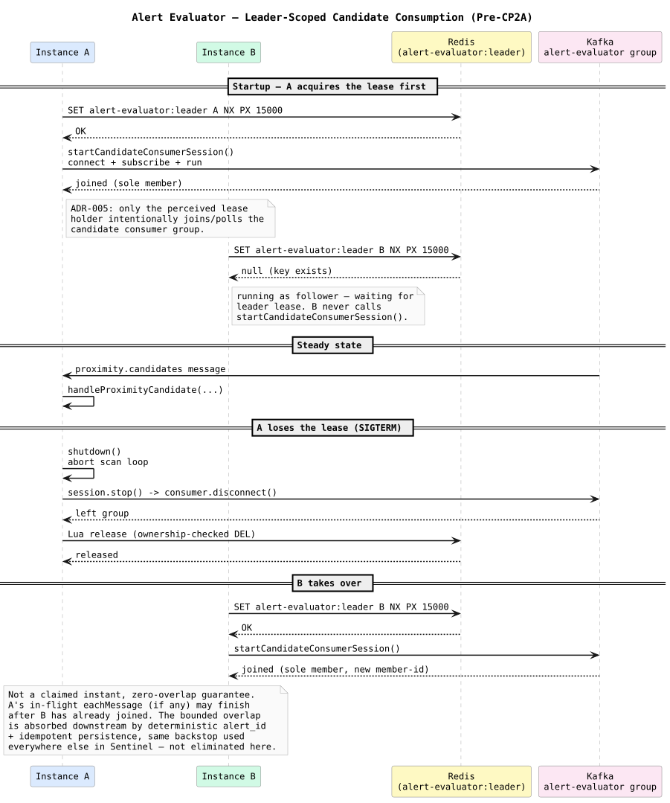
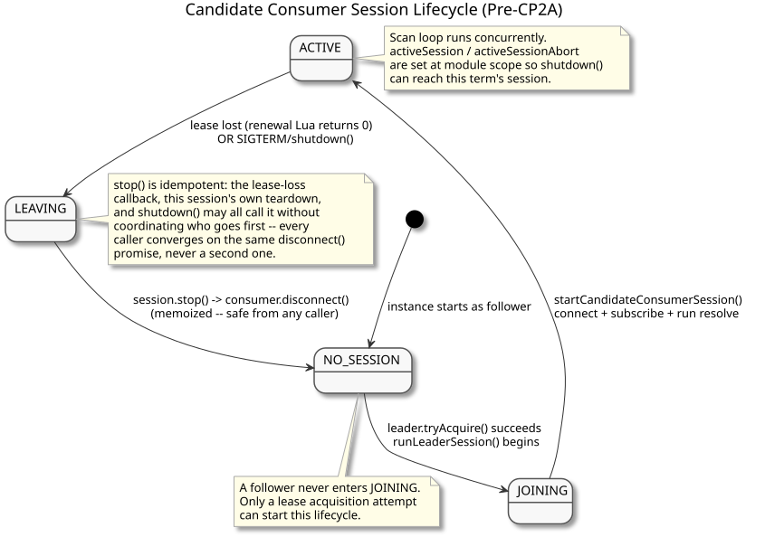

# Leader-Scoped Candidate Consumption — Design and Learning Reference

Plain language first, then technical depth, then the code. Use this to understand, inspect, and defend Pre-CP2A (commit `9e67ad7`).

---

## The drift this fixes

ADR-005 is explicit: "Followers remain alive but do not join/poll the `alert-evaluator` Kafka consumer group until they acquire the lease," and prescribes a full join-on-acquire / leave-on-loss lifecycle. `ARCHITECTURE.md` repeats it: "Only the current lease holder joins/polls the `alert-evaluator` Kafka consumer group."

The Phase 05 implementation of `handleProximityCandidate`'s consumer drifted from this: every evaluator instance, leader or follower, joined the `proximity.candidates` consumer group unconditionally at startup, with a comment arguing Kafka's own partition assignment was coordination enough. It isn't — once composite correlation depends on single-writer reasoning over `alert-state`/`recent-loss`, two instances independently reading and writing that state is exactly the concurrent-writer hazard ADR-005 exists to prevent.

This was found and confirmed by re-reading ADR-005 directly, not inferred — the ADR names `proximity.candidates` explicitly as one of the two topics the lease holder subscribes to on acquisition.

---

## Concepts in plain language

### Kafka consumer group membership is itself distributed state

Joining a Kafka consumer group isn't a local, in-process concept — it's a real network exchange with the broker's group coordinator, which tracks membership and assigns partitions. "Joining" (`connect` + `subscribe` + `run`) and "leaving" (`disconnect`) have real, observable effects on the broker, visible to `rpk group describe`.

### Why a fresh consumer per leadership term, not one reused instance

`startCandidateConsumerSession(groupId)` creates a brand-new `kafka.consumer({ groupId })` every time a lease is acquired, rather than reusing a module-level singleton across terms. This avoids relying on kafkajs's own reconnect semantics after a `disconnect()`, and it mirrors the existing pattern of a fresh `AbortController` per leadership session (`runLeaderSession` in `evaluator.ts`) — nothing from a previous leadership term leaks into a new one.

### Why teardown must be memoized (idempotent), not just correctly ordered

Three different code paths can all decide "this session needs to stop": the lease-loss callback (fired by `LeaderElection`'s renewal timer), the session's own `while` loop exiting normally, and `shutdown()` on `SIGINT`/`SIGTERM`. Rather than reasoning about which one is allowed to call `consumer.disconnect()`, `session.stop()` memoizes a single promise:

```text
let stopPromise: Promise<void> | null = null;
const stop = (): Promise<void> => {
  if (!stopPromise) stopPromise = consumer.disconnect();
  return stopPromise;
};
```

Every caller converges on the *same* in-flight `disconnect()` — there is no way to trigger a second, racing disconnect, and no need to coordinate which caller "owns" teardown.

### Why the lease-loss callback triggers teardown immediately, not on the scan loop's next tick

The original design only aborted the scan loop's `AbortController` on lease loss; the Kafka consumer kept fetching until the scan loop happened to notice on its next iteration. That's a real gap — the consumer could keep pulling and processing new batches after this instance no longer believes it's the leader. The fix: the lease-loss callback both aborts the controller *and* calls `session.stop()` in the same synchronous callback, so teardown starts the moment lease loss is detected.

---

## The honest guarantee (not a stronger one)

It would be tempting to claim "at most one process is ever a member of the group at any instant." That's **not what this guarantee is**, and claiming it would be wrong. During failover:

```text
Leader A stops renewing / becomes partitioned
  -> Redis lease expires
  -> Leader B acquires the lease and joins the Kafka group
  -> A has not yet detected lease loss, or is finishing an in-flight eachMessage
```

For a brief window, Kafka may see both consumers. The actual guarantee:

> Only a process that believes it currently owns the Redis lease intentionally joins/polls the candidate consumer group. Followers never participate. On detected lease loss, the former leader begins leaving immediately, not on some later tick.

This matters for CP2 and beyond: **do not** design Redis-side exclusivity (e.g. `composite_issued`) as a plain read-then-write on the assumption that leader election alone makes races impossible. Leader election reduces concurrency; deterministic alert identity plus idempotent downstream persistence remains the correctness backstop during the bounded overlap — same pattern used everywhere else in Sentinel (signal-loss, proximity candidates).





---

## Map to code

| Concept | Where |
| --- | --- |
| Session factory | `startCandidateConsumerSession(groupId)` — `services/alert-evaluator/src/evaluator.ts` |
| Memoized teardown | `session.stop()` inside `startCandidateConsumerSession` |
| Immediate teardown on lease loss | the `leader.startRenewal(() => { ac.abort(); void session.stop(); })` callback in `runLeaderSession` |
| Module-level session tracking for `shutdown()` | `activeSession` / `activeSessionAbort` |
| No consumer join at startup | `main()` no longer connects/subscribes/runs a consumer before the leader loop |

---

## Retention questions

1. Why can't this checkpoint honestly claim "at most one Kafka group member at any instant"?
2. Why does teardown need to be idempotent/memoized instead of just correctly sequenced?
3. Why does the lease-loss callback call `session.stop()` directly instead of relying on the scan loop to notice on its next tick?
4. Why does every leadership term get a brand-new `Consumer` instance instead of reusing one across terms?
5. What test would catch a regression back to "every instance joins the group unconditionally"?

---

## Completion checklist

- [ ] I can explain what ADR-005 actually requires, in my own words, and point to the exact line that was violated
- [ ] I can explain why "one Kafka group member at any instant" is a stronger claim than this checkpoint makes, and what the honest guarantee is instead
- [ ] I can explain why `session.stop()` is memoized rather than guarded by a boolean flag
- [ ] I can trace what happens, step by step, from lease loss to the Kafka group actually reflecting the departure
- [ ] I ran the real two-process failover experiment myself and can interpret `rpk group describe` output at each stage
