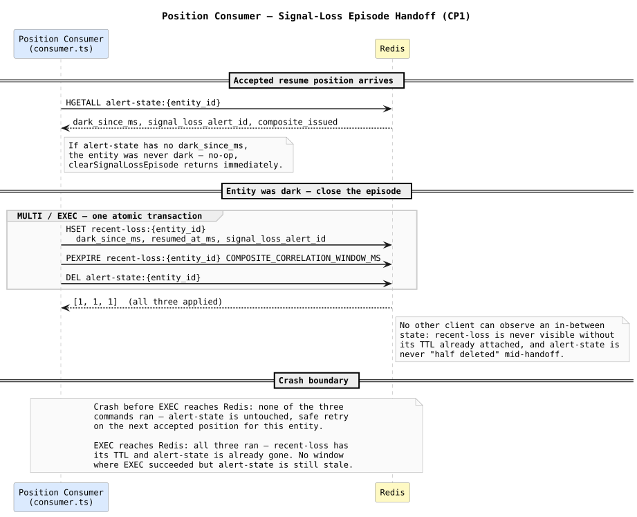
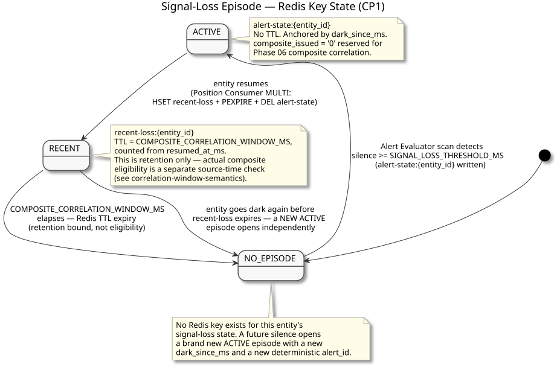

# Recent-Loss Handoff — Design and Learning Reference

Plain language first, then technical depth, then the code. Use this to understand, inspect, and defend the CP1 implementation (commit `7e67457`).

---

## Why this exists

Phase 03 already had Position Consumer clear a signal-loss episode on resume: write `recent-loss:{entity_id}`, then delete `alert-state:{entity_id}`. That code shipped in Phase 03 specifically so the data would be present when Phase 06 needed it — but it had a real gap. `recent-loss` was written with a plain `HSET` and **no TTL**. `DATA_MODEL.md` had always said the key's TTL should equal `COMPOSITE_CORRELATION_WINDOW_MS`; the code just never did it. Left as-is, `recent-loss` would live forever (until the next resume overwrote it), which breaks the entire "recent" half of "recent-loss" — a proximity candidate arriving days later could still correlate against an ancient signal-loss episode.

CP1 closes that gap, and does it atomically.

---

## Concepts in plain language

### TTL — a Redis-native expiry, not application code

`PEXPIRE key ms` tells Redis to delete the key itself after `ms` milliseconds elapse — no polling, no cron job, no application code has to notice or act. This is different from the freshness-filter pattern used elsewhere in Sentinel (e.g. `geo-cell:*` sorted sets, which never expire and are filtered by comparing a stored timestamp). Here, the key's *existence* is meaningful: `recent-loss` should eventually just not be there.

### Why the write must be atomic (`MULTI`/`EXEC`)

`HSET` and `PEXPIRE` are two separate Redis commands. If they were issued as two separate round-trips, there's a real window between them where `recent-loss` exists **without** a TTL attached — visible to any other client, immortal until the next resume overwrites it. That's precisely the bug being fixed, just reintroduced non-atomically. `MULTI`/`EXEC` queues commands and runs them back-to-back with no other client able to observe or act on an in-between state. It isn't a SQL-style rollback-on-failure transaction — but no interleaving is exactly the guarantee needed here, since there's no conditional logic (no read-then-branch) that would call for Lua instead.

### Why `DEL alert-state` joined the same `MULTI`

The first version of this fix put `HSET` + `PEXPIRE` in one `MULTI`, then called `DEL alert-state:{entity_id}` as a separate step afterward. That has three possible crash states, not two: nothing happened, `EXEC` succeeded but the `DEL` never ran (stale `alert-state` sitting alongside a fresh `recent-loss`), or everything happened. The final version folds the `DEL` into the *same* `MULTI`, collapsing this to a clean binary boundary — see the crash boundary section below.

### Why this differs from every other atomic op in this codebase

Every other atomic Redis operation in Sentinel — the leader lease renew/release scripts, the live-state monotonic guard, the proximity-episode touch script — uses Lua `eval`, because each of those is a **compare-and-swap**: read a value, branch on it, conditionally write. This checkpoint has no branch — it's three unconditional writes that must become visible together. `MULTI`/`EXEC` is the right, simpler primitive for that; reaching for Lua here would be over-engineering, not extra safety.

---

## Crash boundary

```text
crash before EXEC reaches Redis
  -> none of the three commands ran
  -> alert-state is untouched
  -> safe retry on the next accepted position for this entity

EXEC reaches Redis
  -> all three commands ran
  -> recent-loss has its TTL already attached
  -> alert-state is already gone
```

There is no window where `EXEC` succeeded but `alert-state` is still stale, and no window where `recent-loss` exists without a bound.



---

## TTL is retention, not eligibility

This distinction matters enough that it became its own documented rule (Pre-CP2B, `DATA_MODEL.md`'s "Composite eligibility rule"): the TTL set here bounds how long `recent-loss` is *retained* in Redis. It is **not** what later checkpoints use to decide whether a candidate is eligible for composite correlation — that's a separate, explicit `dark_since_ms`-based source-time comparison. A live `recent-loss` key is necessary but not sufficient for eligibility. See `correlation-window-semantics/`.



---

## Map to code

| Concept | Where |
| --- | --- |
| Atomic handoff | `clearSignalLossEpisode` — `services/position-consumer/src/consumer.ts` |
| `MULTI`/`EXEC` chain | `redis.multi().hset(...).pexpire(...).del(...).exec()` in the same function |
| TTL configuration | `COMPOSITE_CORRELATION_WINDOW_MS` — `services/position-consumer/src/config.ts` (same setting also in `services/alert-evaluator/src/config.ts`, for later checkpoints) |
| Call site | Step 7 of `handleMessage`, `consumer.ts` |

---

## Retention questions

1. Why does `HSET` + `PEXPIRE` in two separate round-trips reintroduce the exact bug this checkpoint fixes?
2. Why is `MULTI`/`EXEC` the right primitive here instead of a Lua script, given every other atomic op in this codebase uses Lua?
3. What are the two possible states after a crash, and why is there no third, partial state?
4. Why is `recent-loss`'s TTL described as "retention," and what does that imply for anything reading the key later?

---

## Completion checklist

- [ ] I can explain why the original two-step write (`HSET` then separate `PEXPIRE`) was a real bug, not just untidy
- [ ] I can explain why folding `DEL alert-state` into the same `MULTI` produces a strictly binary crash boundary
- [ ] I can explain why this uses `MULTI` and not Lua, unlike every other atomic operation in this codebase
- [ ] I can state the difference between "TTL as retention" and "TTL as eligibility," and why that distinction was made explicit
- [ ] I ran the integration suite and the manual `redis-cli` inspection myself and can interpret both
