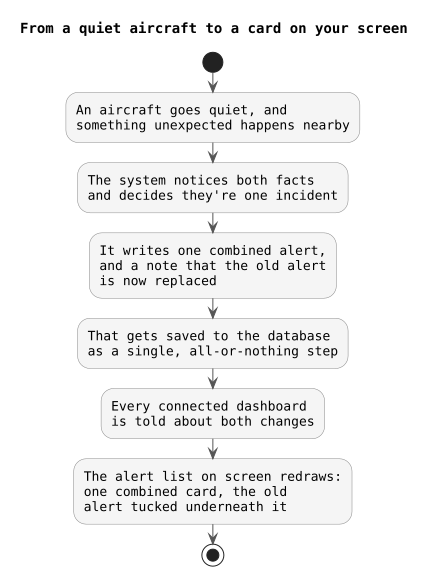
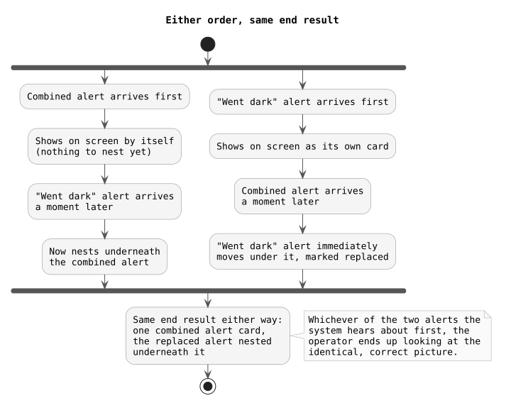

# Phase 06 Exit Check

Before closing Phase 06 (combining "aircraft went dark" and "unexpected close pass" into one alert), here's what got checked, on 2026-09-13, against the real local dev stack. Evidence for each checkpoint lives in its own concept debrief under `concepts/`; this document is the consolidated pass, not a restatement from memory.

---

## 1. Is everything actually running?

| Container | Status |
| --- | --- |
| sentinel-redpanda (message queue) | healthy |
| sentinel-timescaledb (position history + alerts) | healthy |
| sentinel-redis (live state, episode coordination) | healthy |
| sentinel-neo4j (entity graph) | healthy |

| Service | What Phase 06 added to it | Test result |
| --- | --- | --- |
| alert-evaluator | Composite eligibility check, claim/finalize protocol, decision record, wiring into the live proximity-candidate path | 87/87 automated tests pass against real Redis/Kafka |
| api | Atomic combined-alert insert + supersession that converges no matter which alert arrives first, plus the `pending_alert_supersessions` table backing it | 54/54 automated tests pass against real Postgres/Redis/Kafka |
| dashboard | Combined alerts render as a parent card with replaced alerts nested underneath | 20/20 automated tests pass, plus a real hand-run confirmed live in the browser |

---

## 2. Does the core feature actually work?

Yes. When an aircraft goes dark and an unexpected close pass happens nearby while it's still dark, the system correctly produces one combined alert instead of two, and correctly marks the original alert as replaced.

The part most worth being careful about — making sure this works no matter which of the two underlying events the system happens to hear about first — was proven two separate ways: the automated suite covers both orders, and we additionally forced the harder order by hand through the real running system and watched it converge correctly, both in the database and on the dashboard screen (see `concepts/composite-alert-presentation/composite-alert-presentation-debrief.md` for the full walkthrough with real command output and a screenshot).

We also checked the edge cases you'd actually worry about:

| Edge case | Result |
| --- | --- |
| An already-acknowledged alert gets combined | Still correctly flips to "replaced" |
| An already-resolved alert gets referenced by a later combined alert | Stays resolved, never un-resolved |
| An alert already replaced by one combined alert gets claimed by a *different* one | Rejected as a conflict, rolled back, not silently allowed |
| Two processes race to claim the same episode | Exactly one wins, proven with a real concurrent test |
| A publish to connected dashboards fails partway through, then retries | Every alert republishes on retry, not just the one that failed |

---

## 3. Does the dashboard show it correctly?

Yes, and this was checked live, not just trusted from unit tests. A combined alert renders as a card, with whatever it replaced nested underneath it, grayed out and tagged. We watched a real combined alert appear on screen alone first (since it didn't know about anything to nest yet), then watched it gain its nested replaced-alert a moment later once that second piece of data arrived.

---

## 4. What's still genuinely left over, not part of this phase

Plain proximity alerts (the ones that never get combined into a composite) are hard to read on their own right now — no real flight number shown, and the one-line summary doesn't show distance or which aircraft it's near. That's a real, separate problem, noted for later, not something Phase 06 was meant to fix.

---

## 5. Two things worth remembering if you ever redo this kind of check

1. **Don't run the API's test suite while the real dev API service is also running.** Both listen on the same message channel, so the test suite will see an extra message that isn't its own and report a false failure. Stop the live API service first, run the tests, then start it back up.
2. **Running tests locally leaves fake alerts behind.** Every time the API restarts, it picks up wherever its queue left off — including test messages written during a test run. So after running tests and restarting the API, a handful of obviously-fake alerts (named `test-...`) show up in the real alerts table. That's expected, not a bug, just clean them out afterward.

---

## Exit criteria (from the original phase plan)

| Criterion | Result |
| --- | --- |
| Active-dark, recent-loss, and expiry paths all pass deterministic tests | PASS |
| One combined alert is produced per qualifying signal-loss episode | PASS |
| The existing alert delivery path persists and exposes it | PASS |
| The API's atomic insert + supersession converges regardless of arrival order | PASS |
| The dashboard mockup was approved before implementation, and renders whatever a combined alert actually replaced, not a hardcoded shape | PASS |
| Acknowledged/resolved supersession behavior is verified as backend tests, not required in the UI | PASS |

**Phase 06 exit: COMPLETE.** Every checkpoint (CP1 through CP6) is done and verified.
