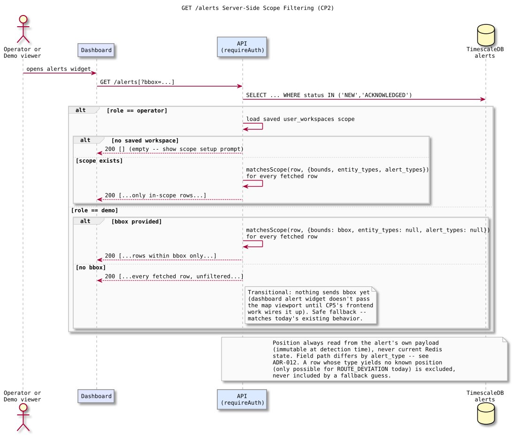
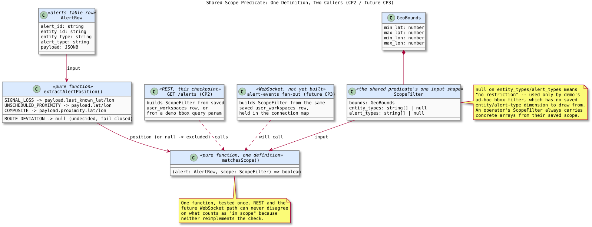

# Alert Scope Filtering — Design and Learning Reference

Plain language first, then technical depth, then the code. Use this to understand, inspect, and defend CP2.

---

## What this checkpoint is, and deliberately isn't

CP2 makes `GET /alerts` actually apply the scope CP1 made persistable. An operator with a saved workspace only sees alerts inside their bounds, entity types, and alert types; an operator with no saved workspace sees nothing (the dashboard is expected to show the scope prompt instead); a demo session — which can never save a workspace — gets an ad-hoc geography-only filter from an optional `bbox` query parameter, falling back to today's fully unfiltered list if none is given. Nothing here touches the WebSocket `alert-events` fan-out; that's CP3, reusing the exact predicate this checkpoint introduces.

---

## Concepts in plain language

### Why this checkpoint started by correcting an ADR, not writing code

ADR-012 named `payload.last_lat`/`payload.last_lon` for `SIGNAL_LOSS` and a flat `payload.lat`/`payload.lon` for composite. Checking the actual payload builders (`evaluator.ts`, `composite.ts`) before writing any filter code found neither is real: `SIGNAL_LOSS` uses `last_known_lat`/`last_known_lon`, and `COMPOSITE`'s position lives nested under `payload.proximity.lat`/`lon`, never flattened. ADR-012 was written before Phase 06 actually built the composite payload shape, so it went stale on this one point without anyone noticing, because nothing had read the position back out of it yet. Filtering is the first consumer that actually needs these field paths to be correct — a bug here wouldn't crash, it would just silently drop or silently leak alerts, which is worse. Caught and corrected in the ADR before any filter code was written against it.

### Why demo doesn't just get "empty" or "everything"

ADR-012's existing rule — no saved workspace, no alerts — is designed around an operator who is expected to eventually save one. A demo session structurally cannot: it has no `users` row (CP1) and never will. Applying the rule literally would mean the demo experience, whose entire purpose is a no-setup live preview, permanently shows nothing. Giving it "everything" instead loses the a point of having scope at all for a demo walkthrough of many aircraft. The resolution: demo reuses the same bounding box the map widget already sends to `GET /entities/live?bbox=...` — "show me alerts for what's currently on screen" is a real, meaningful scope, it's just ephemeral (recomputed each request from the current viewport) instead of persisted.

### Why demo's bbox and an operator's saved bounds are the same code path

Both are, in the end, just a `GeoBounds` value handed to one predicate function. The only difference is where the bounds come from — a `user_workspaces` row for an operator, a query parameter for demo — and whether entity/alert-type restriction applies at all (an operator's saved scope always has concrete lists; demo's ad-hoc filter has none, represented as `null` meaning "no restriction" rather than an empty list meaning "restrict to nothing"). Modeling "no restriction" as `null` and "restrict to this exact set" as an array keeps those two states from being confused with each other.

### Why one shared predicate function, not a SQL WHERE clause

The bounds/entity-type/alert-type check could be pushed into the SQL query as JSONB path expressions per `alert_type`. That's viable for CP2 alone, but CP3 has to evaluate the identical rule in-process against a Redis pub/sub message, where there is no SQL query to attach a `WHERE` to. Writing the rule twice — once in SQL, once in JavaScript — creates exactly the kind of two-definitions-of-the-same-thing risk this project avoids elsewhere (see the composite claim/decision protocol's insistence on one identity, checked one way). Fetching the already-small `NEW`/`ACKNOWLEDGED` row set and filtering in JS with one `matchesScope` function means CP2 and CP3 share a single, once-tested definition of "in scope."

### Why an unrecognized position means exclude, not include

`ROUTE_DEVIATION` alerts don't exist in practice yet (Phase 04 is deferred), and its payload shape was never decided. If one somehow appeared, `extractAlertPosition` returns `null` for it, and `matchesScope` treats "no known position" as "not in scope" — never as "can't check, so let it through." An alert a caller can't actually place on a map should never leak past a geographic filter by default; the failure mode of over-including is worse than the failure mode of under-including here, since over-including is a data leak across an operator's declared scope boundary.

---

## The flow this checkpoint builds

Four branches matter: operator-with-scope (filtered), operator-without-scope (empty, not unfiltered), demo-with-bbox (geography-only filter), and demo-without-bbox (the transitional unfiltered fallback, since no caller sends `bbox` yet — that's CP5's job).

## The shared predicate this checkpoint introduces

Worth a diagram specifically to make the reuse concrete: `matchesScope` has exactly one definition, and both `GET /alerts` (this checkpoint) and the WebSocket fan-out (CP3, not yet built) call into it rather than each carrying their own copy of "what counts as in scope."

---

## Invariants (design-accepted, implementation pending)

1. Position is always read from the alert's own `payload` (immutable at detection time), never current Redis state — unchanged from ADR-012's original reasoning, only the field paths were wrong.
2. `extractAlertPosition` returns `null`, never a guess, for any `alert_type` whose payload shape doesn't yield a real position; `matchesScope` treats `null` as excluded.
3. An operator's `ScopeFilter` always carries concrete `entity_types`/`alert_types` arrays from their saved scope; `null` in either field is reserved for demo's ad-hoc, dimension-less bbox filter and must never appear for an operator.
4. An operator with no saved workspace gets an empty array from `GET /alerts`, identical in spirit to ADR-012's existing WebSocket rule, not a distinct behavior invented for REST.
5. A demo session with no `bbox` query parameter gets the fully unfiltered list — a deliberate, temporary fallback, not a permanent design goal.

---

## Map to code (none yet — this is the design CP2 implements against)

| Concept | Where it will live |
| --- | --- |
| Corrected position field paths | `docs/adr/ADR-012-workspace-scope-alert-filtering.md` |
| Canonical `GET /alerts` contract | `docs/DATA_MODEL.md` — "API / WebSocket Client Contracts" |
| `extractAlertPosition` / `matchesScope` | New `services/api/src/shared/alertScopeFilter.ts` (CP2, not yet written) — deliberately in `shared/`, not `routes/`, since CP3 imports it too |
| `GET /alerts` route changes | `services/api/src/routes/alerts.ts` (CP2, not yet written) |

---

## Retention questions

1. Walk through exactly how ADR-012's original field names would have failed silently for `SIGNAL_LOSS` and `COMPOSITE` if nobody had checked the real payload builders first.
2. Why can't demo simply be treated as "an operator whose workspace happens to be empty"?
3. What's the difference between `entity_types: null` and `entity_types: []` in `ScopeFilter`, and why does conflating them matter?
4. Give a concrete scenario where pushing this filter into raw SQL instead of a shared JS predicate would let CP2 and CP3 quietly disagree about what's in scope.
5. Why does an alert with an unrecognized position get excluded rather than included, and what's the actual harm of choosing the opposite default?

---

## Completion checklist

- [ ] I can explain why the ADR was wrong about payload field names and where that would have shown up as a real bug, not just a documentation nit
- [ ] I can justify demo's bbox-based scoping as a real design choice, not a workaround
- [ ] I can trace all four branches (operator scoped / operator empty / demo bbox / demo unfiltered) on the flow diagram without looking at the code
- [ ] I can explain why one shared predicate function matters specifically because of CP3, not just as general code hygiene
- [ ] I understand this document describes an accepted design, not implemented behavior, and I know exactly what CP2 still has to build
