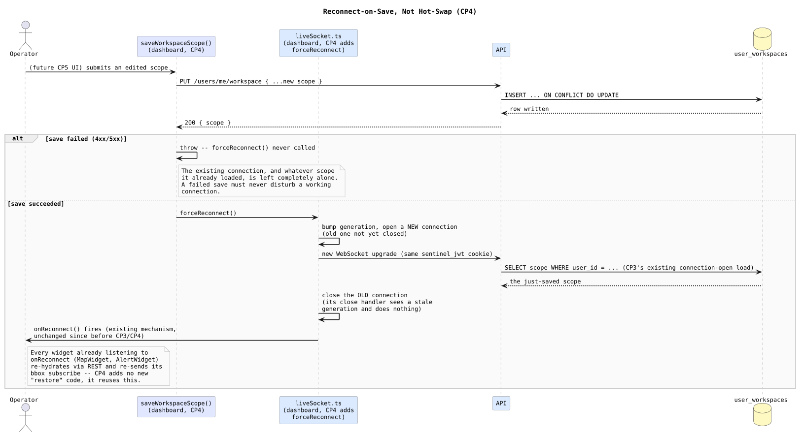

# Workspace Reconnect Flow — Design and Learning Reference

Plain language first, then technical depth, then the code. Use this to understand, inspect, and defend CP4.

---

## What this checkpoint is, and deliberately isn't

CP4 makes a saved scope change actually take effect on a live connection. ADR-012 already decided *how*: not a hot-swap, a reconnect. CP1 already built `PUT /users/me/workspace`. CP3 already made a new connection load scope fresh at open. The only genuinely missing piece is the trigger: something has to close the old connection and open a new one right after a successful save, so CP3's existing connection-open load actually runs again with the new row.

This checkpoint does not build any UI. There is no scope editor yet — that's CP5. What CP4 delivers is the plumbing CP5's eventual save button will call, console-testable today the same way CP1 through CP3 were.

---

## Concepts in plain language

### Why the client needs a new `forceReconnect`, when it already reconnects automatically

`liveSocket.ts` already reconnects after an *unexpected* close, on a 5-second delay, because that's the right response to a dropped connection: wait a moment, try again. A scope save is the opposite situation — the client knows exactly why the connection is now stale and wants the new one immediately, not after an arbitrary delay built for a different failure mode. Reusing the drop-and-wait path for a deliberate save would mean an operator staring at up to 5 seconds of stale scope after clicking save for no real reason.

### Why forcing a reconnect needs a generation guard, not just "close then open"

The naive version — close the old socket, then open a new one — has a real race. Closing a `WebSocket` doesn't finish synchronously; the browser fires its `close` event later. `liveSocket.ts`'s existing close handler *already* schedules an auto-reconnect after any close, since from its point of view it can't tell "the app meant to do this" from "the connection just dropped." Without something to distinguish them, the old connection's own close handler would schedule a second, redundant reconnect a few seconds after the deliberate one already succeeded — two reconnect attempts for one save. The fix is a `generation` counter: every `connect()` call bumps it, and a close handler only acts if its own connection is still the current generation. `forceReconnect` bumps the generation (starting the new connection) *before* closing the old one, so the old handler always sees a stale generation and does nothing.

### Why demo and operator don't need different reconnect logic

Nothing about `forceReconnect` itself knows or cares about roles. It closes a socket and opens another one against the same URL; whatever the new connection turns out to be (operator or demo) is entirely CP3's connection-open logic to work out, exactly as it already does for the very first connection of a page load. CP4 doesn't special-case anything — it just makes "open a fresh connection" callable on demand instead of only in response to a drop.

### Why "workspace restore on reconnect" isn't new code

`onReconnect` already exists, and already means "the connection just reopened after having been open before — re-hydrate and re-subscribe." Every widget that cares about live data already listens to it. A forced reconnect fires the exact same `onOpen` path a dropped-and-recovered connection does, so `onReconnect` fires the same way, for the same reason, with no changes needed to it or its listeners. CP4's contribution here is realizing this already covers the requirement, not building a second, save-specific "restore" mechanism.

### Why a failed save must never call `forceReconnect`

If `PUT /users/me/workspace` is rejected — invalid body, network failure, anything — the operator's existing connection is still valid, still scoped correctly by whatever they last successfully saved. Reconnecting anyway would briefly interrupt a working connection to reload... the exact same row it already had. `saveWorkspaceScope` only calls `forceReconnect` after a confirmed `2xx` response; any other status throws before reaching it.

---

## The flow this checkpoint builds

The failed-save branch is short on purpose — there's genuinely nothing else to do there. The succeeded branch is where the actual mechanism lives: the generation bump happens before the old socket is told to close, and everything from CP3 (scope load) and pre-CP4 (`onReconnect` listeners) just runs again, unmodified.

---

## Invariants (design-accepted, implementation pending)

1. `forceReconnect` opens the new connection before closing the old one, so the old connection's close handler always observes a stale generation.
2. A close handler never schedules an auto-reconnect for a generation that isn't the current one.
3. `saveWorkspaceScope` calls `forceReconnect` if and only if the save response was `2xx`.
4. No new "restore" mechanism is introduced; the existing `onReconnect` contract is the entire restore path.
5. `forceReconnect` and the scope-save flow contain no role-specific branching — CP3's connection-open logic is the only place that matters.

---

## Map to code (none yet — this is the design CP4 implements against)

| Concept | Where it will live |
| --- | --- |
| `forceReconnect`, generation guard | `services/dashboard/src/shared/realtime/liveSocket.ts` (CP4, not yet written) |
| `getWorkspaceScope` / `saveWorkspaceScope` | New `services/dashboard/src/features/workspace/workspaceApi.ts` (CP4, not yet written) |
| Connection-open scope load (reused, unchanged) | `services/api/src/ws/wsServer.ts` (CP3, already built) |
| `onReconnect` re-hydration contract (reused, unchanged) | `services/dashboard/src/features/live-feed/useLiveFeed.ts` (pre-existing) |

---

## Retention questions

1. Walk through, step by step, why closing the old socket before opening the new one would create a duplicate reconnect a few seconds later.
2. Why is a fixed 5-second delay right for a dropped connection but wrong for a deliberate scope save?
3. What would have to change in `forceReconnect` to make it role-aware, and why doesn't it need to be?
4. Why does a failed `PUT` leave the WebSocket connection completely untouched instead of, say, reconnecting to "be safe"?
5. If `onReconnect` didn't already exist, what would CP4 have had to build instead, and why is reusing it better than a save-specific alternative?

---

## Completion checklist

- [ ] I can explain the exact race the generation counter prevents, not just that it "avoids a race"
- [ ] I can justify why an immediate reconnect and a delayed auto-reconnect are different behaviors for different situations, not redundant code paths
- [ ] I can explain why `onReconnect` already satisfies "workspace restore on reconnect" without new code
- [ ] I can trace both branches (save failed / save succeeded) on the flow diagram and say exactly what state each leaves the connection in
- [ ] I understand this document describes an accepted design, not implemented behavior, and I know exactly what CP4 still has to build
