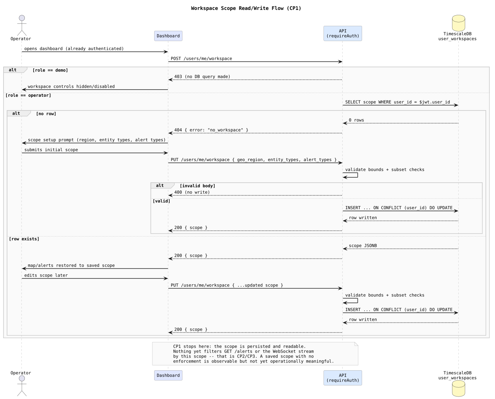
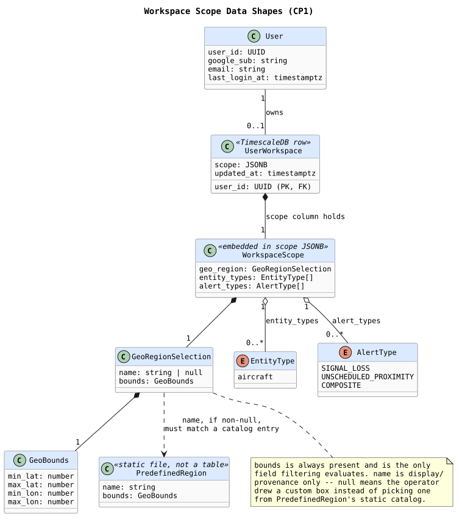

# Workspace Scope Contract — Design and Learning Reference

Plain language first, then technical depth, then the code. Use this to understand, inspect, and defend CP1.

---

## What this checkpoint is, and deliberately isn't

CP1 makes the already-existing `user_workspaces` table (migration 004, per ADR-012) actually reachable: a predefined region list, and `POST`/`PUT /users/me/workspace` to read and write an operator's saved scope. Nothing here filters anything yet. `GET /alerts` and the WebSocket stream keep behaving exactly as they do today — a saved scope is persisted and readable, but not yet operationally meaningful. That's CP2 (REST filtering) and CP3 (WebSocket filtering).

Auth itself (Google OAuth, JWT, the `users` table) is not part of this checkpoint — it already exists, built under ADR-011 before Phase 07 started.

---

## Concepts in plain language

### Why this table already existed with nothing pointing at it

`user_workspaces` was created in migration 004, alongside `users` in migration 003 — both landed as part of standing up auth infrastructure, ahead of the phase that actually uses the second table. That's normal: the schema was accepted (ADR-012) before Phase 07 was scheduled to build against it. CP1's job is to connect code to a contract that was already decided, not to design the table itself.

### Why the read endpoint is `POST`, not `GET`

Every new read endpoint from here forward uses `POST` with the params (if any) in the body, not a `GET` with query string. The concrete reason: query strings force a flat, stringly-typed shape, and any future filter this endpoint might need (there isn't one today — it always returns the caller's own single row) would mean a breaking URL change later. `PUT /users/me/workspace` was never a `GET`, so it's unaffected. This convention applies going forward only; `GET /alerts` and `GET /entities/live` (Phase 03/05, already shipped and tested) are not touched.

### Why demo sessions get a flat `403`, not a workaround

A demo JWT carries `user_id: 'demo'` — a literal string, not a UUID, and no corresponding `users` row exists for it. `user_workspaces.user_id` is `UUID PK REFERENCES users(user_id)`: a demo session's `PUT` would fail the foreign key outright if it ever reached the database. Rather than special-casing the schema or fabricating a demo `users` row, both endpoints check `role !== 'operator'` and return `403` before any query runs. The dashboard mirrors this by hiding/disabling workspace controls for demo sessions entirely — the backend guard is the actual enforcement; the UI treatment is just not offering a control that would immediately fail.

### Why `entity_types` only ever contains `"aircraft"` right now

ADR-012's original example JSON included `"vessel"` alongside `"aircraft"` — written as an illustrative "this is what the shape generalizes to" example, not a claim that vessels exist. Sentinel tracks exactly one entity type today. Allowing `"vessel"` as a real selectable value now would mean building a UI control and validation branch for an entity type nothing in the system ever produces — exactly what CLAUDE.md's "do not implement future domains early" guardrail exists to prevent. `entity_types` is restricted to `["aircraft"]` in v1; the JSONB shape stays generic so a real second entity type (a future maritime vertical) extends it later without a migration.

### Why `geo_region` carries both a `name` and always-present `bounds`

Two ways an operator picks a region: choosing one from the predefined list, or drawing a custom box on the map. Filtering (CP2/CP3) only ever needs to evaluate a bounding box — it doesn't care how the box was chosen. So `bounds` is always populated and is the only field filtering reads; `name` is provenance for the UI (which predefined entry, if any, is currently selected) and is `null` for a custom draw. This keeps the filter-evaluation code path single-shaped regardless of how the scope was set.

### Why "no saved workspace" is a `404`, not a `200` with an empty scope

ADR-012 is explicit: an operator with no saved workspace sees a scope-setup prompt and receives no alerts until they save one. The dashboard needs to distinguish "you have no workspace yet" from "here is your workspace, and it happens to be empty" — those are different UI states. A `200` with `{ scope: null }` would conflate "no row" with "a row that failed to deserialize," which is a real failure the dashboard should treat differently. `404 { error: "no_workspace" }` makes the no-workspace case an explicit, unambiguous branch.

### Why `PUT` validates before writing, not after

`bounds` describing a real box (`min_lat < max_lat`, `min_lon < max_lon`) and `entity_types`/`alert_types` being subsets of known values are checked before the `INSERT ... ON CONFLICT DO UPDATE` runs. A single-row upsert has no partial-write state to roll back, but validating first means an invalid request never touches the database at all — the row an operator was relying on for filtering (once CP2/CP3 exist) is never silently replaced with something malformed.

---

## The flow this checkpoint builds

Every branch that matters is here: the demo-role short-circuit (no DB touched), first-login with no row (`404` → setup prompt → `PUT` creates it), and the ordinary read/edit cycle for an operator who already has a saved scope. The note at the bottom is deliberate — CP1 stops at persistence. Nothing downstream reads this scope yet.

## The data shapes this checkpoint introduces

Worth a diagram specifically because the JSONB nesting (`scope` → `geo_region` → `bounds`) is easy to get wrong in prose: `WorkspaceScope` is not a table, it's the shape of one JSONB column, and `PredefinedRegion` is a static catalog file, not something `GeoRegionSelection` has a hard foreign-key relationship to — it's a validation-time lookup, shown as a dependency, not a composition.

---

## Invariants (design-accepted, implementation pending)

1. `entity_types` accepts only `["aircraft"]` in v1 — not because the schema can't hold more, but because nothing else exists to filter.
2. `geo_region.bounds` is always present and is the sole input to filtering; `geo_region.name` is display-only and may be `null`.
3. Demo sessions (`role !== 'operator'`) never reach the `user_workspaces` table — checked and rejected before any query, not caught as a downstream FK failure.
4. No saved workspace is a distinct `404`, never conflated with an empty-but-present scope.
5. `PUT` validates the entire body before any write; an invalid request leaves the existing row (or absence of one) untouched.

---

## Map to code (none yet — this is the design CP1 implements against)

| Concept | Where it will live |
| --- | --- |
| Canonical scope contract | `docs/DATA_MODEL.md` — "API / WebSocket Client Contracts" (`POST`/`PUT /users/me/workspace`) |
| Predefined region list | New static file in `services/api/src` (CP1, not yet written) |
| Route handlers | New `services/api/src/routes/workspace.ts` (CP1, not yet written) |
| Demo-role gate | Reuses `requireAuth` (`services/api/src/middleware/auth.ts`) plus a role check in the new route, not a schema change |
| Validation | CP1, not yet written — bounds ordering + subset checks against known `entity_types`/`alert_types` |

---

## Retention questions

1. Why can't a demo session's workspace request simply be allowed to hit the database and fail on the foreign key?
2. Walk through why `entity_types` is restricted to `["aircraft"]` even though the JSONB column could technically hold `"vessel"` today.
3. Why does `geo_region` need both `name` and `bounds`, when filtering only ever reads one of them?
4. What's the concrete difference in dashboard behavior between a `404 no_workspace` and a `200` with an empty scope, and why does that difference matter?
5. Why validate the entire `PUT` body before writing anything, given this is a single-row upsert with no partial-write risk?

---

## Completion checklist

- [ ] I can explain why `user_workspaces` already existed before Phase 07 started, and what CP1 actually adds on top of it
- [ ] I can explain the demo-role guard as a deliberate rejection-before-query, not a gap to patch later
- [ ] I can justify restricting `entity_types` to `["aircraft"]` by name-checking it against CLAUDE.md's guardrails, not just "because that's what was decided"
- [ ] I can trace both branches of the read flow (no workspace / existing workspace) and both branches of the write flow (invalid / valid) on the flow diagram without looking at the code
- [ ] I understand this document describes an accepted design, not implemented behavior, and I know exactly what CP1 still has to build
