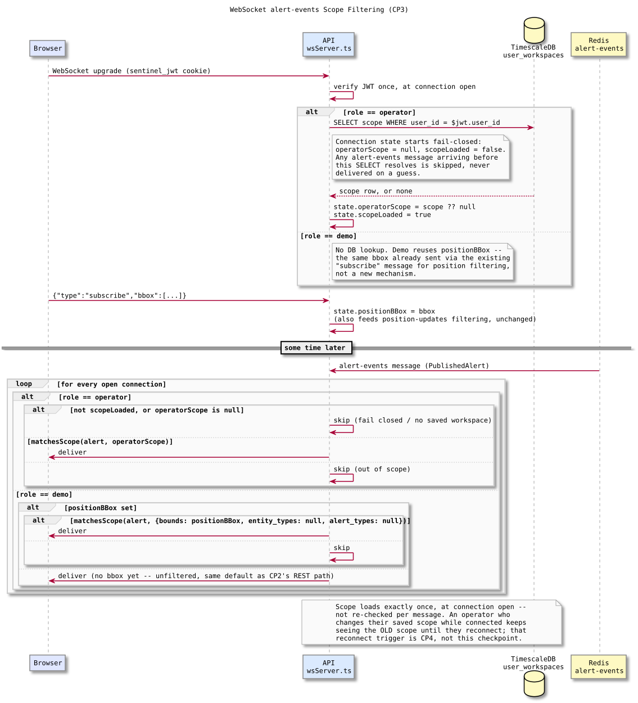
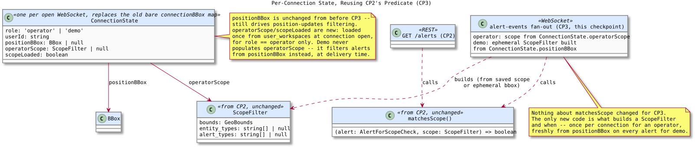

# WebSocket Alert Scope Filtering — Design and Learning Reference

Plain language first, then technical depth, then the code. Use this to understand, inspect, and defend CP3.

---

## What this checkpoint is, and deliberately isn't

CP3 makes the live `alert-events` WebSocket push obey the same scope CP2 already made `GET /alerts` obey. Right now `wsServer.ts` sends every alert event to every connected client, no filter at all. After this checkpoint, an operator only receives alert events inside their saved scope, and a demo session only receives alert events inside its current map viewport (or everything, if it hasn't sent one yet) — exactly CP2's rules, applied to a push stream instead of a pull request.

This checkpoint does **not** handle what happens when an operator changes their saved scope while connected. Per ADR-012, that's handled by a reconnect, not a live in-place update — CP4's job, not this one. CP3 loads scope once, at connection open, and holds it for the connection's whole lifetime.

---

## Concepts in plain language

### Why scope loads once, at connection open, not per message

An alert event and a scope check both need a value from `user_workspaces`, but checking it fresh on every single alert event would mean a database round trip per push, for every connected client, for every alert. ADR-012 already settled this: "the server validates the JWT once at connection open and loads the operator's saved workspace." One lookup per connection, held for its lifetime, is the only shape that scales — and it's also the reason a live scope change needs a reconnect (CP4) rather than an in-place update: there's no mechanism here to notice the underlying row changed.

### Why a connection starts fail-closed, not fail-open

The scope lookup for an operator is asynchronous — it can't finish before the WebSocket connection itself is already open and receiving messages. If an alert event arrived in that gap and got delivered by default, an operator could briefly see something outside their scope, or before their scope is even known. The connection state starts as "no scope, not loaded yet," and the fan-out logic treats "not loaded yet" identically to "no saved workspace" — skip, don't deliver. This is the same fail-closed instinct CP2's `matchesScope` already applies to an alert with no extractable position: when in doubt, exclude, never guess.

### Why demo doesn't get its own lookup at all

Demo sessions can't have a saved workspace (CP1), so there's nothing in `user_workspaces` to load for them. But `wsServer.ts` already tracks a per-connection bounding box for a completely different reason — filtering the `position-updates` stream to whatever the map's current viewport is, via the client's existing `{"type":"subscribe","bbox":[...]}` message. That's the exact same shape CP2's REST design already chose for demo's ad-hoc alert filter. CP3 doesn't invent a second bbox mechanism for alerts; it reads the one already being maintained for positions.

### Why the per-connection state became a small object instead of staying a bare bbox map

Before this checkpoint, `connectionBBox: Map<WebSocket, BBox | null>` was the only per-connection state `wsServer.ts` kept. CP3 needs to track more per connection — role, the operator's loaded scope (or lack of one), and whether that load has even finished yet — none of which fit in a bare bbox. `ConnectionState` replaces the single-purpose map with one record per connection, so the position-filtering bbox and the new alert-scope fields live and get cleaned up together, instead of two parallel maps that could drift out of sync (e.g. one cleaned up on disconnect, the other forgotten).

### Why this checkpoint changes nothing about `matchesScope`

`matchesScope` and `extractAlertPosition` (CP2) are already exactly what this checkpoint needs: a pure function from `(alert, ScopeFilter)` to a yes/no. The only new work is *building* a `ScopeFilter` in a new place (from a loaded `user_workspaces` row for an operator, or from a live bbox for demo) and *calling* the same function at fan-out time instead of at REST-response time. This is the payoff the CP2 concept doc's class diagram called out in advance: one predicate, reused, not reimplemented.

---

## The flow this checkpoint builds

Two timelines matter: connection setup (JWT verified once, operator scope loaded asynchronously and fail-closed until it resolves, demo needs no lookup at all) and the ongoing fan-out loop (every `alert-events` message evaluated per connection using whatever state that connection currently holds).

## The state this checkpoint introduces

`ScopeFilter` and `matchesScope` cross unchanged from CP2's diagram — this one shows what's actually new: `ConnectionState`, and the fact that an operator's `ScopeFilter` is built once and cached, while demo's is rebuilt fresh from `positionBBox` on every single alert event (since the map viewport can change mid-connection, unlike an operator's saved scope which is fixed until reconnect).

---

## Invariants (design-accepted, implementation pending)

1. Scope (or its absence) is loaded exactly once, at connection open, for an operator — never re-queried per message.
2. Before that load resolves, and permanently if an operator has no saved workspace, no alert event is delivered to that connection.
3. A demo connection never performs a `user_workspaces` lookup; its alert scope is always derived from `positionBBox`, the same field already driving position filtering.
4. A demo connection with no `positionBBox` set yet receives every alert event unfiltered — the identical default CP2 chose for `GET /alerts`.
5. `matchesScope` and `extractAlertPosition` are not modified, extended, or duplicated by this checkpoint.

---

## Map to code (none yet — this is the design CP3 implements against)

| Concept | Where it will live |
| --- | --- |
| Canonical WS alert event contract (scope-filtered) | `docs/DATA_MODEL.md` — "WebSocket — alert event message" |
| `ConnectionState`, scope load at connection open, fan-out filtering | `services/api/src/ws/wsServer.ts` (CP3, not yet written) |
| `ScopeFilter` / `matchesScope` / `extractAlertPosition` | `services/api/src/shared/alertScopeFilter.ts` (CP2, already built — reused, not changed) |

---

## Retention questions

1. Why would checking `user_workspaces` on every alert event, instead of once per connection, actually break at scale, not just be slower?
2. Walk through the exact race a fail-open default would create for an operator's first few milliseconds of connection.
3. Why doesn't demo get a second bbox mechanism specifically for alerts, when it already has one for positions?
4. What would silently break if `positionBBox` and the new operator-scope fields were kept in two separate maps instead of one `ConnectionState`?
5. Why is a live scope change handled by reconnecting the WebSocket instead of pushing the new scope into the existing connection's state?

---

## Completion checklist

- [ ] I can explain why scope loading is a one-time, connection-open operation, and tie that directly to why CP4 needs a reconnect at all
- [ ] I can trace the fail-closed window between connection open and an operator's scope finishing its load
- [ ] I can explain why demo's alert filter reuses `positionBBox` instead of needing its own subscribe message
- [ ] I can justify consolidating per-connection state into one object instead of a second parallel map
- [ ] I understand this document describes an accepted design, not implemented behavior, and I know exactly what CP3 still has to build
