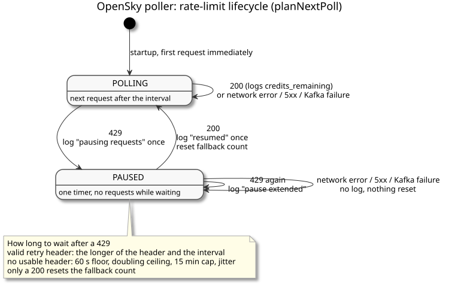

# OpenSky Fallback Hardening: Design and Learning Reference

---

## What this checkpoint does

ADR-020 made adsb.fi the primary regional source and kept OpenSky as the fallback that takes over when adsb.fi is down. Before this checkpoint, the OpenSky poller could not do that job. With its defaults it spent about 26,000 credits a day against a budget of 4,000. When OpenSky refused it, the poller retried every cycle, so it kept asking even though no request could succeed until the next day.

This checkpoint makes the OpenSky poller safe to leave running. It now:

- uses defaults that fit inside the daily budget;
- works out its own daily spend at startup;
- reads OpenSky's rate-limit headers;
- stops completely when OpenSky says the budget is spent, and starts again at the time OpenSky gives.

Only the OpenSky poller changed. The Position Consumer, the Alert Evaluator and everything downstream are untouched. Switching between adsb.fi and OpenSky automatically is CP3.

---

## In plain language

OpenSky gives each account a daily allowance, like a prepaid card. Each request costs a little, and bigger areas cost more. Every successful answer tells you how much is left. Once the allowance runs out, OpenSky says no and tells you how many seconds until it refills.

Asking again before then is pointless: the answer will still be no. So when the allowance is gone, the poller now goes quiet until the refill time, says once why it is waiting, and says once when it starts again. When OpenSky says no without saying how long to wait, the poller waits a minute, then longer each time, up to 15 minutes. It never asks in a tight loop.

---

## Concepts

### A daily credit budget, not a request rate

OpenSky does not limit how often you ask. It limits how much you spend in a day. The `/states` endpoints have their own daily budget:

| Account | Credits a day |
| --- | ---: |
| Anonymous | 400 |
| Logged in (OAuth2 client credentials) | 4,000 |

An active feeder account gets 8,000, but the poller cannot tell a feeder account from an ordinary one, so it assumes 4,000 whenever it is logged in.

The 10 second (anonymous) and 5 second (logged in) figures OpenSky publishes are how fresh the data is, not how often you may ask. The old config comment read the 10 second figure as a request limit. That misreading is how the old defaults came to overspend.

### Box size sets the price of each call

Each `/states/all` call costs credits based on the bounding box area in square degrees:

| Box area | Credits per call |
| --- | ---: |
| 25 or less | 1 |
| Over 25, up to 100 | 2 |
| Over 100, up to 400 | 3 |
| Over 400, or global | 4 |

The old default box covered the UK and Western Europe: 12 by 18 degrees, 216 square degrees, 3 credits per call.

### The new defaults: SF Bay box, 25 seconds

The default box is now latitude 36.9 to 38.1 and longitude -122.8 to -121.5, the same SF Bay box the adsb.fi poller monitors. It is 1.2 by 1.3 degrees, 1.56 square degrees, so each call costs 1 credit. Using the same box as adsb.fi means that when CP3 switches providers, Sentinel keeps watching the same area.

The default interval is now 25 seconds. That is 3,456 calls a day at 1 credit each: inside the 4,000 logged-in budget, with some room left for manual checks. The shortest interval this box can sustain all day on 4,000 credits is 21.6 seconds.

Anonymous access cannot sustain 25 seconds. 400 credits a day over this box allows one call every 216 seconds. Sentinel's normal configuration is logged in, and anonymous mode is still allowed for short runs and tests.

Both values can still be overridden (`OPENSKY_LAMIN`, `OPENSKY_LOMIN`, `OPENSKY_LAMAX`, `OPENSKY_LOMAX`, `POLL_INTERVAL_MS`).

### Startup budget projection

At startup the poller works out what its configuration will cost and adds it to the `poller starting` log line:

- whether it is logged in;
- the box area and the credits per call;
- how many calls a day the interval makes;
- the projected daily spend;
- the daily budget that applies;
- whether the spend fits the budget;
- the shortest interval that would fit.

When the projection is over budget, it logs one warning. It warns rather than refusing to start, because a short over-budget run is legitimate, and the pause described below stops even a long one from hammering OpenSky.

The projection assumes a full fresh day. If the account has already spent credits that day, the real budget is smaller, and the `429` pause is what protects it.

### Reading `X-Rate-Limit-Remaining`

Every successful OpenSky response includes `X-Rate-Limit-Remaining`: the credits left in the current budget. The poller adds it to each `poll cycle complete` line, and to `opensky returned no state vectors`, as `credits_remaining`. Watching it fall by one per cycle is the simplest proof that the box really costs 1 credit.

A `429` does not include this header, as the experiment showed. The field is logged as `null` when the header is missing, never guessed.

### Reading `X-Rate-Limit-Retry-After-Seconds`

When the budget is spent, OpenSky answers `429` with `X-Rate-Limit-Retry-After-Seconds`, a whole number of seconds until the budget refills. It is a countdown to a fixed moment, not a fresh wait from each request. Three separate `429`s on 2026-09-23, received at 20:43:04, 20:43:18 and 21:30:35 UTC, all pointed to the same refill moment of about 05:35:36 UTC the next day. Why OpenSky refills at that time was not observed.

Both headers are accepted only as plain whole numbers. A missing, empty, negative, fractional or text value counts as absent rather than being guessed. The raw retry value is still logged, so an unusable header can be diagnosed.

### Provider-directed pause

When a `429` arrives with a usable retry time, the poller waits the longer of that time and the normal interval, then tries again. A retry time of 0 still waits one interval. It sets a single timer for the whole wait and makes no requests in between. In the live check that meant one timer of about 8 hours.

One technical limit applies. Node's `setTimeout` cannot wait longer than 2^31 - 1 milliseconds, about 24.8 days. A longer value makes it fire almost immediately. The wait is capped at that limit so that a nonsensical header can never turn a pause into a request flood. OpenSky's real retry times are under a day, so the cap never applies to them.

### Fallback backoff when the retry time is missing

A `429` with no usable retry time still means the budget is probably spent. The poller then backs off exponentially with jitter:

| Consecutive `429`s without a usable header | Wait |
| --- | --- |
| 1st | 60 seconds |
| 2nd | random between 60 and 120 seconds |
| 3rd | random between 60 and 240 seconds |
| 4th | random between 60 and 480 seconds |
| 5th and later | random between 60 seconds and 15 minutes |

The random part keeps several pollers from retrying at the same instant. Unlike the adsb.fi backoff, the random range starts at 60 seconds rather than 0, because each retry spends a request on a budget that is probably still empty. Fallback retries are never less than 60 seconds or more than 15 minutes apart. A valid retry header is not bound by the 15 minute limit: it can legitimately pause for hours.

The count resets only after a successful response. A `429` with a valid header does not add to the count, because OpenSky gave an exact wait and nothing needed guessing. Both limits can be overridden with `OPENSKY_BACKOFF_BASE_MS` and `OPENSKY_BACKOFF_MAX_MS`.

### Pause, extension and resume

The poller is always in one of two states: polling or paused.

- **Pause.** The first `429` pauses the poller and logs one warning, `opensky rate limited, pausing requests`. The warning includes the wait's source (retry header or fallback), the raw header value, the delay and `resume_at`, the time of the next request. An operator reading an 8-hour gap in the logs can see that it is deliberate and when it ends.
- **Extension.** A `429` while already paused logs `opensky still rate limited, pause extended` with the new wait. It is not a new pause, and the pause keeps its original start time.
- **Other failures.** A network error, a `5xx` or a Kafka publish failure during a pause changes nothing. It says nothing about the budget, so it neither ends the pause nor resets the fallback count. The next attempt happens after the normal interval.
- **Resume.** The first successful response after a pause logs `opensky resumed after rate limit` once, with how long the pause lasted. The poller then returns to its normal interval. Only a successful response ends a pause.

Only one timer is pending at any moment. The next request is scheduled only after the current cycle's outcome is known, so requests never overlap. For the same reason the real spacing is the interval plus the time the request takes.

### `.env` loading for both pollers

`npm run poll` (OpenSky) and `npm run poll:adsbfi` (adsb.fi) now start with Node's `--env-file-if-exists=.env`, so each loads `services/ingestion-poller/.env` if it exists. A missing file only prints a note. A value already set in the shell wins over the file, so `OPENSKY_CLIENT_ID= OPENSKY_CLIENT_SECRET= npm run poll` forces anonymous mode even when `.env` has credentials.

Before this, which configuration actually ran depended on how the poller was started. The `authenticated` field in the startup log now shows which one did.

### What a pause means downstream

While the poller is paused it publishes nothing, so every aircraft OpenSky was tracking goes silent. After the signal-loss timeout, the Alert Evaluator treats them as lost. Telling "the provider stopped" apart from "the aircraft went dark" is provider health, which is CP3. This checkpoint only makes sure the poller itself behaves well while it waits.

---

## Ownership

| Part | Owner | Reads | Writes |
| --- | --- | --- | --- |
| Budget projection | Ingestion Poller (OpenSky) | Its own configuration | The startup log |
| Rate-limit handling | Ingestion Poller (OpenSky) | OpenSky response status and headers | Its own in-memory pause state, the pause, extension and resume logs |
| Publishing | Ingestion Poller (OpenSky) | OpenSky state vectors | `adsb.raw`, unchanged from CP1 |

The pause state lives only in the running process. A restart during a pause makes one request, gets a `429` with the current retry time, and pauses again. That costs one refused request, and a refused request costs no credits.

---

## Failure modes

**Budget spent.** OpenSky answers `429` with a retry time. The poller pauses once for that time and makes no requests. OpenSky positions stop until the refill. This was observed live.

**A `429` with no usable retry time.** The poller backs off from 60 seconds up to 15 minutes, with jitter, until a request succeeds. This is covered by unit tests only. OpenSky always sent the header in practice, so no live requests were made just to recreate this case.

**Refused before the balance reaches zero.** ADR-020 requires this to be handled. The poller does not use the balance to decide anything. It reacts only to the `429`, so an early refusal behaves exactly like a normal one. In the one run observed, OpenSky refused only after the balance reached 0.

**A restart during a pause.** It costs one refused request, as described under Ownership.

**Over-budget configuration.** Logged as a warning at startup. The poller still runs, and the `429` pause limits the damage.

**The account already spent credits today.** The projection does not know about them. The `429` pause is the backstop.

**Network error or `5xx` during a pause.** Retried at the normal interval without ending the pause or resetting the backoff.

**OpenSky's token endpoint fails.** Unchanged by this checkpoint: it counts as an ordinary failed cycle and is retried at the normal interval.

---

## Map to code

| Concept | Where |
| --- | --- |
| Defaults: box, interval, backoff limits | `services/ingestion-poller/src/config.ts` |
| Credit bands and daily projection | `creditsPerCall`, `projectDailyBudget`, `services/ingestion-poller/src/poller.ts` |
| Header parsing | `parseCreditsRemaining`, `parseRetryAfterSeconds`, same file |
| Fallback backoff | `fallbackBackoffMs`, same file |
| Pause, extension and resume decisions | `planNextPoll`, same file |
| The pause, extension and resume log lines | `rateLimitLogLine`, same file |
| `429` detection and header reading | `fetchStateVectors`, same file |
| Single-timer poll loop | `scheduleNextPoll`, same file |
| Startup projection and warning | `run`, same file |
| `.env` loading | `poll` and `poll:adsbfi` scripts, `services/ingestion-poller/package.json` |
| Tests | `services/ingestion-poller/src/poller.test.ts` |
| Decision | ADR-020 |

---

## Retention questions

1. Why is "one request every 10 seconds" the wrong way to think about OpenSky's limit, and what does 10 seconds actually mean?
2. Where does 3,456 credits a day come from, and why does anonymous mode fail at the same settings?
3. Why does the poller wait for OpenSky's retry time in one timer instead of checking every cycle?
4. Why does the fallback backoff have a 60 second floor, when the adsb.fi backoff starts from 0?
5. Why does a network error during a pause not end the pause?
6. Three `429`s at different times pointed to the same refill moment. What does that tell you about the retry header?
7. What happens to signal-loss alerts while the poller is paused, and which checkpoint deals with it?

---

## Completion checklist

- [ ] I can explain OpenSky's credit budget and work out the daily spend for a box and interval
- [ ] I can read the startup log and say whether a configuration fits the budget
- [ ] I can explain the pause, extension and resume lifecycle and what ends a pause
- [ ] I can explain when the retry header is used and when the fallback backoff is used
- [ ] I can force anonymous mode and explain why that works with `.env`
- [ ] I can explain what a pause does to signal loss, and why that is CP3's problem
