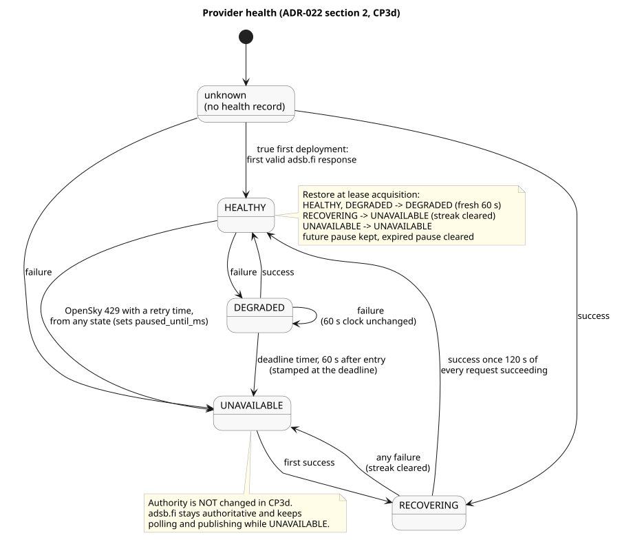

# Provider Health State Machines: Design and Learning Reference

---

## What this checkpoint does

Failover needs to know when a provider has actually stopped working, and when it has recovered steadily enough to trust again. This checkpoint gives the ingestion coordinator that judgment for both providers, and writes it to Redis:

- a health state for adsb.fi and for OpenSky: `HEALTHY`, `DEGRADED`, `UNAVAILABLE` or `RECOVERING`;
- the evidence behind it: last success, last failure, how many failures in a row, the last error;
- standby checks of OpenSky at ADR-022's rates, which never publish anything;
- restoring all of this at every lease acquisition, so a restart never makes a provider look better than it was.

Nothing acts on health yet. adsb.fi can become `UNAVAILABLE` and still stay the authoritative provider, still be polled every 2 s, and still have its data published. Switching to OpenSky belongs to CP3e.

The same work fixed one CP3b writer bug: a coverage segment with no length (opened and closed at the same instant) is no longer written to the coverage set.

---

## In plain language

Think of a doctor's chart for each data provider. Every time the coordinator asks a provider for data, it notes whether the answer came back and made sense. One bad answer moves the chart to "under observation" (`DEGRADED`). If a good answer arrives within a minute, the chart goes back to "fine". If a whole minute passes with no good answer, the chart says "down" (`UNAVAILABLE`). A provider that comes back has to answer well for two minutes straight before it is "fine" again (`RECOVERING`), and a single bad answer during those two minutes sends it back to "down".

The chart only records the provider's own behaviour. If Sentinel's own message broker is broken, that is not the provider's fault, so it never goes on the provider's chart.

---

## Three separate ideas

It helps to keep three things apart, because the coordinator now tracks all three:

- **Provider health** describes the upstream provider: is adsb.fi (or OpenSky) answering correctly?
- **Coverage** describes successful authoritative delivery: which periods were actually fetched, validated and published to Kafka (CP3b), which the evaluator uses for signal loss (CP3c).
- **Authority** decides who may publish: today always adsb.fi once committed.

CP3d changes only the first. A broker outage closes coverage but leaves health untouched; a provider outage marks health down but leaves authority untouched.

---

## Concepts

### What counts as health evidence

Every request to a provider counts, whether it is adsb.fi's active cycle or an OpenSky standby check. Its outcome is recorded the moment the request and its validation finish, before anything is published.

| Outcome | Health |
| --- | --- |
| A valid response, including one with zero aircraft | Success |
| adsb.fi's first response after acquiring the lease, or a repeated `now` within 10 s | Success. Only coverage refuses to credit these |
| Network error or timeout | Failure (`timeout`, `network:<code>`) |
| Error status, or an adsb.fi `429` | Failure (`http_<status>`, `rate_limited`) |
| A response that fails validation | Failure (`validation: <message>`) |
| adsb.fi's `now` not advancing for 10 s | Failure (`frozen_feed`) |
| OpenSky token request fails | Failure (`auth: <message>`) |
| OpenSky `429` with a retry time | Straight to `UNAVAILABLE`, paused until the retry time |
| OpenSky `429` without a retry time | Ordinary failure |
| Kafka publish fails afterwards | Nothing. The success already recorded stands |

Validation is provider-specific. adsb.fi's `now` must be epoch milliseconds (the CP1 check). OpenSky's `time` must be a finite number in epoch **seconds**, and `states` must be an array or `null`.

### The four states

| From | Event | To |
| --- | --- | --- |
| `HEALTHY` | failure | `DEGRADED` |
| `DEGRADED` | success | `HEALTHY` |
| `DEGRADED` | failure | stays `DEGRADED`; the 60 s clock does not move |
| `DEGRADED` | 60 s after entering it, with no success | `UNAVAILABLE` |
| `UNAVAILABLE` | first success | `RECOVERING` |
| `RECOVERING` | a success once 120 s of successes have passed | `HEALTHY` |
| `RECOVERING` | any failure | `UNAVAILABLE`, streak cleared |
| any | OpenSky `429` with a retry time | `UNAVAILABLE`, paused |
| unknown | success / failure | `RECOVERING` / `UNAVAILABLE` |

**The 60 s clock runs from entering `DEGRADED`.** It is `state_since_ms`, and repeated failures never reset it, so a provider that keeps failing cannot stay "under observation" forever.

**The 60 s deadline is a timer, not only a check when a request finishes.** adsb.fi's backoff after failures is random and grows to 60 s, so the next request can land well after the deadline. Simulating the real backoff showed the first request after the deadline landing a median of 16 to 19 s late and up to 68 s late. The timer changes the state on time, and stamps `state_since_ms` with the deadline itself, not the moment the timer happened to run.

**`RECOVERING` needs no timer.** It needs every request to succeed, so it is simply checked on each success.

### Unknown health and the true first deployment

A provider with no health record has unknown health. Its first success means `RECOVERING`: it has to prove itself for 120 s like any recovering provider. Its first failure means `UNAVAILABLE`. That is the case when health tracking first runs on an existing authority record, as it did here.

The one exception is a true first deployment, decided when the lease is acquired: no initialized authority record, and no health record for any provider. Then adsb.fi's first valid response makes it `HEALTHY` straight away. This happens right after validation and before publishing, so it does not depend on Kafka. Committing authority stays the separate CP3b step after a successful publish.

### Races between a timer and a request

A request outcome and a deadline timer can arrive at almost the same moment. Two protections stop an old timer from undoing newer health:

- **One at a time.** Health changes for a provider are applied one after another, never interleaved.
- **Same term only.** The timer remembers the `state_since_ms` of the `DEGRADED` period that armed it. When it runs, it does nothing unless the provider is still in that same `DEGRADED` period. A success that arrived just before it wins.

Every lease acquisition also starts a new term, so a request or timer left over from a lost lease can never change the new holder's health.

### OpenSky standby checks

While adsb.fi is authoritative, OpenSky is only checked, never used: a check fetches and validates, updates OpenSky's health, and publishes nothing. The rate depends on its health:

| OpenSky health | Next check |
| --- | --- |
| unknown | at once |
| `HEALTHY` | 15 min (96 credits a day on the 1-credit SF Bay box) |
| `DEGRADED` | 30 s, so one check lands inside the 60 s before `UNAVAILABLE` |
| `RECOVERING` | 25 s |
| `UNAVAILABLE`, not paused | 60 s, doubling to 15 min |
| paused | nothing until `paused_until_ms`, then at once |

The 30 s `DEGRADED` recheck is a clarification made in this checkpoint: a recheck at 60 s would always land after the 60 s deadline, so OpenSky could never go straight back to `HEALTHY`.

### Persistence and restore

Each provider's health is one Redis hash, written by one lease-checked script that replaces the whole record. The fields and their meanings are in `DATA_MODEL.md`. A write that is refused, fails or times out means the coordinator no longer trusts its lease and gives it up, the same rule as the coverage timeline.

At every lease acquisition, before any request, stored health is restored so that downtime never counts toward recovery:

| Stored | Restored as |
| --- | --- |
| `HEALTHY` or `DEGRADED` | `DEGRADED`, with a fresh 60 s from acquisition |
| `RECOVERING` | `UNAVAILABLE`, streak cleared |
| `UNAVAILABLE` | `UNAVAILABLE`, unchanged |
| OpenSky paused until a future time | kept exactly, no request before it |
| OpenSky paused until a time already past | pause cleared, checked at once |

An `UNAVAILABLE` OpenSky that is not paused waits 60 s after acquisition for its first check. ADR-022 also says that authority becomes `none` if the authoritative provider is restored `UNAVAILABLE`; that is failover, so CP3d only logs it.

### The zero-length coverage fix

The CP3d experiments produced two coverage members whose start and end were equal: coverage opened on one credited cycle and a shutdown closed it before another. They hold no coverage, and CP3c's evaluator rightly refuses them as malformed. The close script now handles three cases: a segment with length closes as before; a segment with no length closes (one revision, open marker cleared) without writing a member; and a last success before the open time, which the credit script can never produce, is refused as an invariant error so the coordinator fails closed.

---

## Ownership

| Part | Owner | Reads | Writes |
| --- | --- | --- | --- |
| Health state machine | Ingestion coordinator, pure logic | request outcomes, the clock | nothing itself |
| Health persistence and restore | Ingestion coordinator | `{live-provider}:authority` (`provider`, `epoch`), both health hashes | `{live-provider}:health:adsbfi`, `{live-provider}:health:opensky` |
| Deadline timers, OpenSky check timer | Ingestion coordinator, per lease acquisition | | |
| OpenSky standby checks | Ingestion coordinator | OpenSky `/states/all` | OpenSky health only |

Readers of health: the coordinator when it restores, and operators. The evaluator does not read health, and nothing reads it to choose authority until CP3e.

---

## Failure modes

**adsb.fi fails.** One failure means `DEGRADED`. If no success comes within 60 s, the timer makes it `UNAVAILABLE`. Coverage closes at the first failed cycle as before, and adsb.fi stays authoritative and keeps being polled.

**The broker fails.** Requests to adsb.fi keep succeeding and are recorded as successes before each publish. The publish fails, coverage closes (CP3b), and health does not change.

**A coordinator restarts, or another takes over.** Health is restored before any request, so recovery streaks are lost and `DEGRADED` starts a fresh minute. A restart can delay a provider's return to `HEALTHY`, never speed it up.

**Redis is uncertain.** A health read or write that is refused, errors or times out makes the coordinator give up the lease and return to follower mode. It stops polling, checking and publishing, and never deletes a lease that may already be a successor's.

**OpenSky's budget runs out.** A `429` with a retry time pauses OpenSky checks until that time, even across restarts. Nothing is spent while paused.

**A stored health record cannot be read.** It is treated as unknown (its next success must go through `RECOVERING`) and logged. Its presence still rules out a true first deployment.

---

## Map to code

| Concept | Where |
| --- | --- |
| States, transitions, deadline guard, restore, field names, error classes, OpenSky check rates | `services/ingestion-poller/src/providerHealth.ts` |
| Acquisition read and lease-checked health write | `services/ingestion-poller/src/providerHealthStore.ts` |
| Recording health before publishing, serialization, deadline timers, restore, OpenSky check loop, failing closed | `recordHealth`, `persistHealth`, `armDeadline`, `restoreProviderHealth`, `runOpenskyCheck`, `services/ingestion-poller/src/coordinator.ts` |
| adsb.fi failure classes | `fetchAdsbfiResponse`, `services/ingestion-poller/src/adsbfiPoller.ts` |
| OpenSky validation and check | `validateOpenskyBody`, `checkOpenskyHealth`, `services/ingestion-poller/src/poller.ts` |
| Timing settings | `PROVIDER_DEGRADED_TIMEOUT_MS`, `PROVIDER_RECOVERY_WINDOW_MS`, `OPENSKY_*_CHECK_INTERVAL_MS`, `OPENSKY_UNAVAILABLE_BACKOFF_*_MS`, `services/ingestion-poller/src/config.ts` |
| Zero-length close fix | `CLOSE_SCRIPT`, `services/ingestion-poller/src/coverageTimeline.ts` |
| Tests | `providerHealth.test.ts`, `coordinator.test.ts`, `providerHealthStore.integration.test.ts`, `coverageTimeline.integration.test.ts`, `poller.test.ts`, `adsbfiPoller.test.ts` |
| Decision | ADR-022 sections 2, 3 and 7 |

---

## Retention questions

1. The broker is down but adsb.fi answers every request. What happens to adsb.fi's health, to coverage, and to authority, and why is each correct?
2. Why is the 60 s `DEGRADED` window measured from entering `DEGRADED` rather than from the latest failure?
3. Why does the `DEGRADED` deadline need its own timer, and why is `UNAVAILABLE` stamped at the deadline rather than when the timer ran?
4. A success is being written when the deadline timer fires. Which two protections stop the timer from overwriting `HEALTHY`?
5. Why does a provider with no health record go to `RECOVERING` on its first success, and when is `HEALTHY` allowed instead?
6. Why is OpenSky rechecked after 30 s when `DEGRADED`, not 60 s?
7. Why does a restart restore `HEALTHY` as `DEGRADED`, and `RECOVERING` as `UNAVAILABLE`?
8. adsb.fi is `UNAVAILABLE`. Why is it still polled and published in CP3d, and which checkpoint changes that?

---

## Completion checklist

- [ ] I can list what counts as a health success, a failure, and nothing at all
- [ ] I can walk every transition in the table, including the unknown and first-deployment cases
- [ ] I can explain the deadline timer and the two race protections
- [ ] I can state OpenSky's check rate in each state and what a pause does
- [ ] I can explain each restore rule and why downtime never counts toward recovery
- [ ] I can explain why health, coverage and authority are kept separate, and which one CP3d changes
