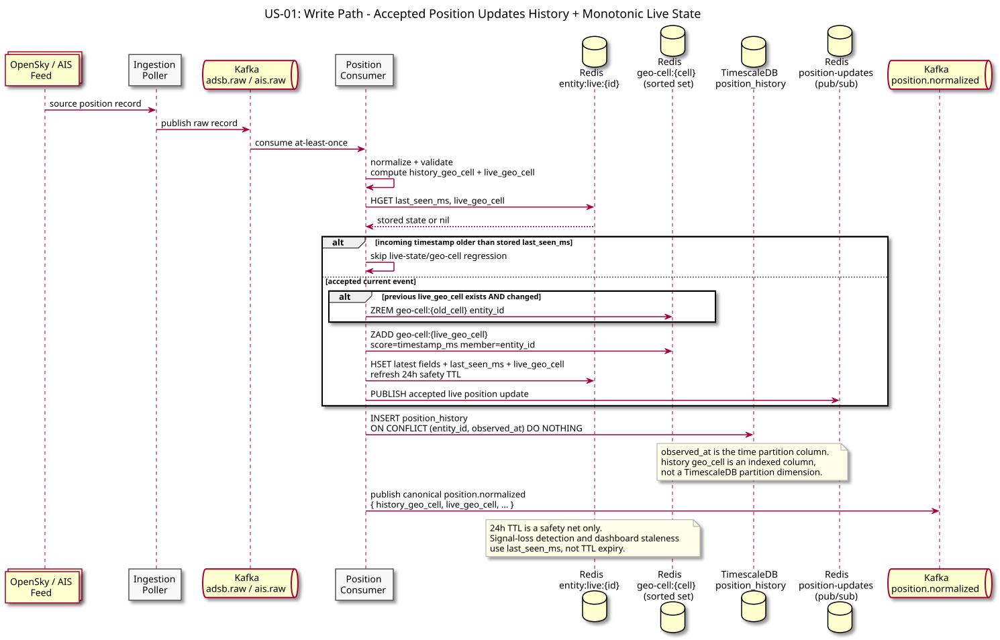
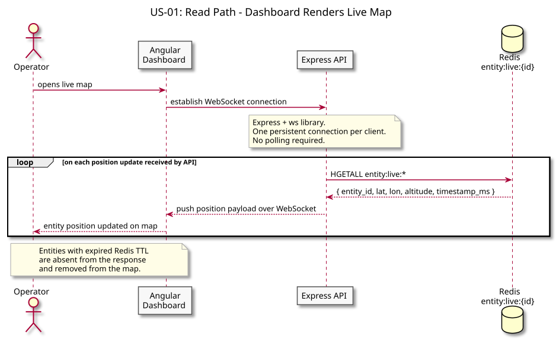
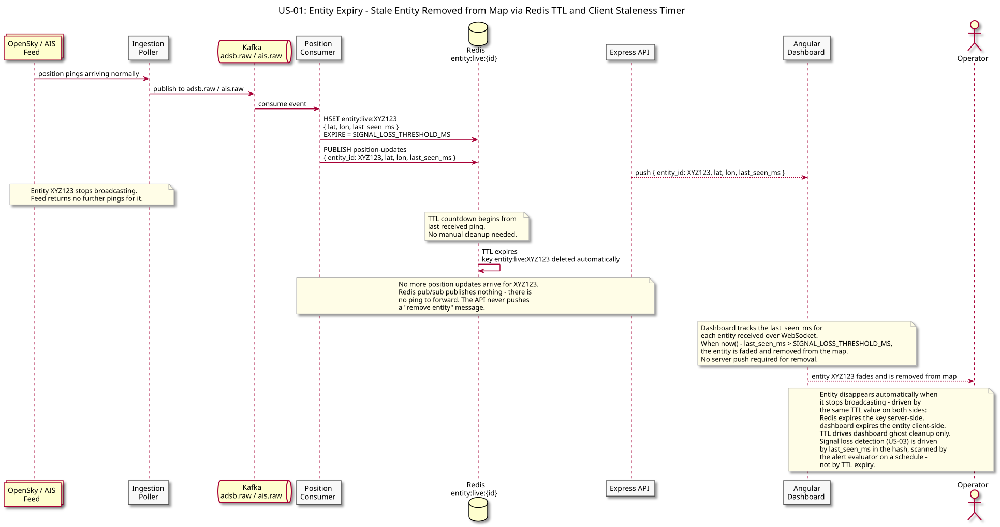

# US-01: Live Entity Tracking on Map

**Actor:** Operator
**Status:** Defined

---

## Story

As an operator, I want to see all currently tracked entities on a live map so that I can monitor their positions in real time.

---

## Acceptance Criteria

- All entities within the operator's saved scope (geo region + entity type) with a position update within the last configurable TTL window are visible on the map
- On initial load, the map is populated with the current positions of all in-scope live entities from a Redis scan
- Each entity is rendered at its most recently known position; ongoing updates arrive via WebSocket (US-02)
- Entities that stop broadcasting are removed from the map after their Redis TTL expires - no explicit delete required
- Entities outside the operator's scope bounds or of the wrong entity type are never sent to the dashboard
- The map handles at least hundreds of simultaneous entities without degrading render performance

---

## Flow Diagrams

### Write Path

Position ping travels from the feed through Kafka and the position consumer into Redis and TimescaleDB.

### Read Path

The dashboard receives live positions from Redis via the API WebSocket and renders them on the map.

### Entity Expiry

When an entity stops broadcasting, its Redis TTL expires automatically (no explicit delete). Because no further pub/sub updates arrive for it, the dashboard's client-side staleness timer removes it from the map when `now() - last_seen_ms` exceeds `SIGNAL_LOSS_THRESHOLD_MS`. The TTL drives dashboard ghost cleanup only — signal loss detection (US-03) is driven by the `last_seen_ms` field in the hash, read by the alert evaluator on a scheduled scan, not by TTL expiry.

---

## Architectural Justification

Justifies: [ADR-004 - Redis for Live Entity State](../../adr/ADR-004-redis-live-state.md), [ADR-012 - Workspace Scope and Server-Side Alert Filtering](../../adr/ADR-012-workspace-scope-alert-filtering.md)

The map refresh rate demands sub-millisecond reads for current entity positions. TimescaleDB stores the full position history but is optimised for range queries, not point lookups at high frequency. Redis holds only the latest position per entity (`entity:live:{entity_id}`) and expires stale entries automatically via TTL - matching this access pattern exactly.
