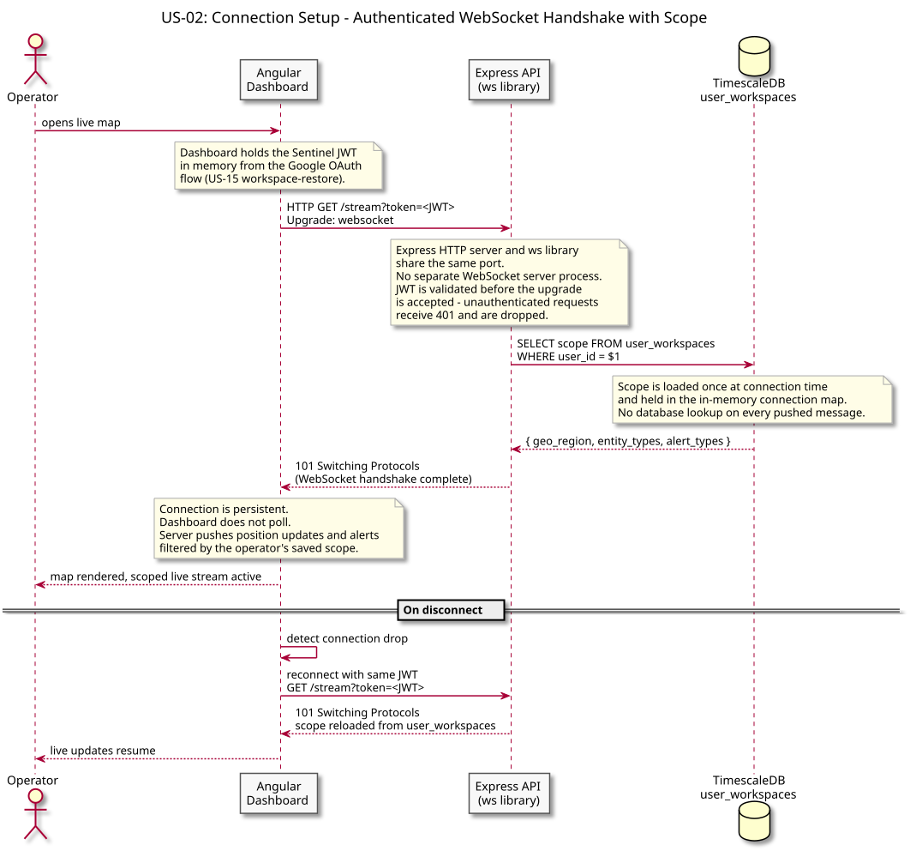
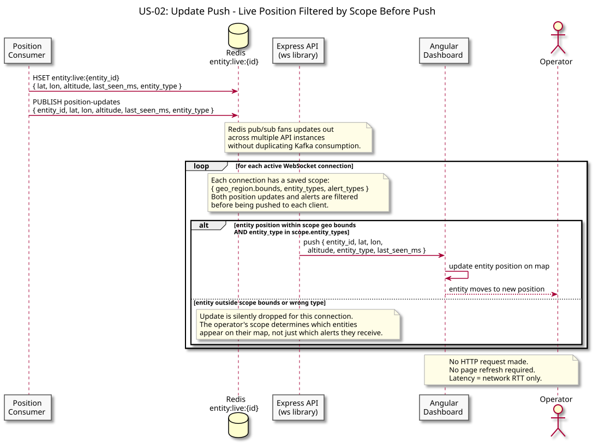

# US-02: Continuous Map Updates via WebSocket

**Actor:** Operator
**Status:** Defined

---

## Story

As an operator, I want the map to update continuously without requiring a page refresh, and only show entities and alerts within my configured scope, so that I see relevant position changes as they happen.

---

## Acceptance Criteria

- The dashboard maintains a persistent WebSocket connection to the API
- The WebSocket upgrade is authenticated - a valid JWT is required; unauthenticated requests are rejected with 401
- The operator's saved scope (geo region, entity types) is loaded at connection time and applied to all pushed messages
- Position updates are only pushed for entities whose current position falls within the scope's geographic bounds and whose type matches the scope's entity type filter
- Alert events are pushed per the scope rules defined in ADR-012
- Reconnection is handled automatically if the WebSocket connection drops; scope is reloaded on reconnect
- The operator does not need to manually refresh to see new data

---

## Flow Diagrams

### Connection Setup

How the dashboard establishes an authenticated, scoped WebSocket connection with the API, including JWT validation and scope loading from TimescaleDB.

### Update Push

How a position update flows from the position consumer through Redis pub/sub to the operator's map, with scope filtering applied per connection before any message is pushed.

---

## Architectural Justification

Justifies: [ADR-008 - Express API Layer](../../adr/ADR-008-express-api-layer.md), [ADR-012 - Workspace Scope and Server-Side Alert Filtering](../../adr/ADR-012-workspace-scope-alert-filtering.md)

REST polling at the required refresh rate would produce excessive request volume and add unnecessary latency. A persistent WebSocket connection, served via the `ws` library attached to the Express HTTP server, pushes updates as they arrive with minimal overhead. Node's event loop is a natural fit for holding many concurrent WebSocket connections open while fanning scoped updates to dashboard clients. Scope filtering on the server (rather than the client) ensures bandwidth cost is proportional to what the operator cares about, not the total system event rate.
