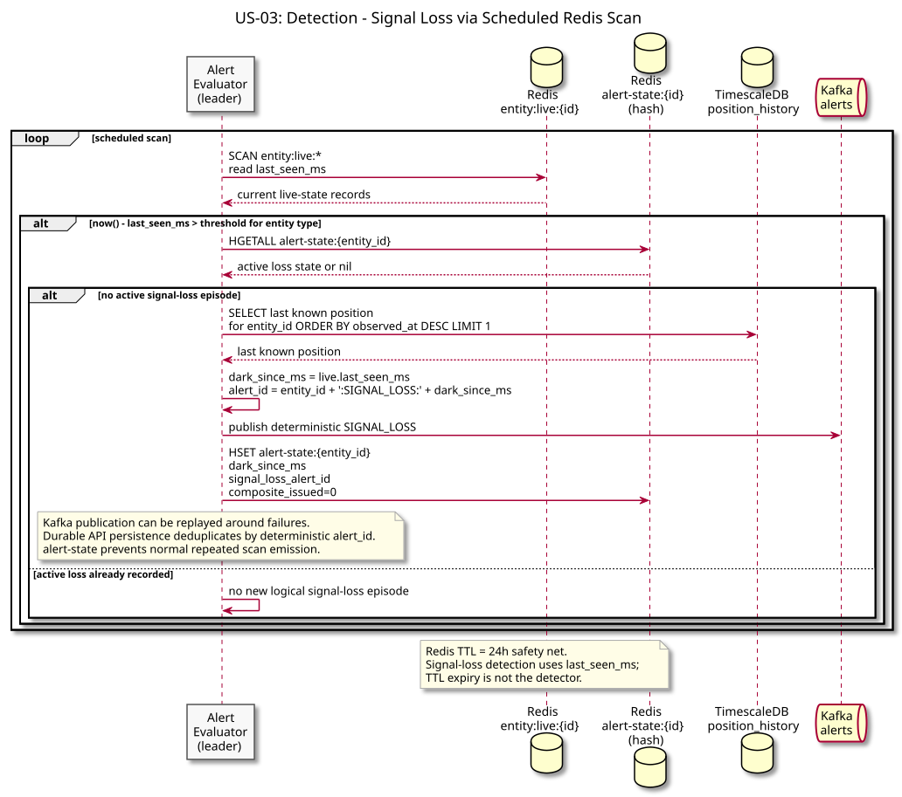
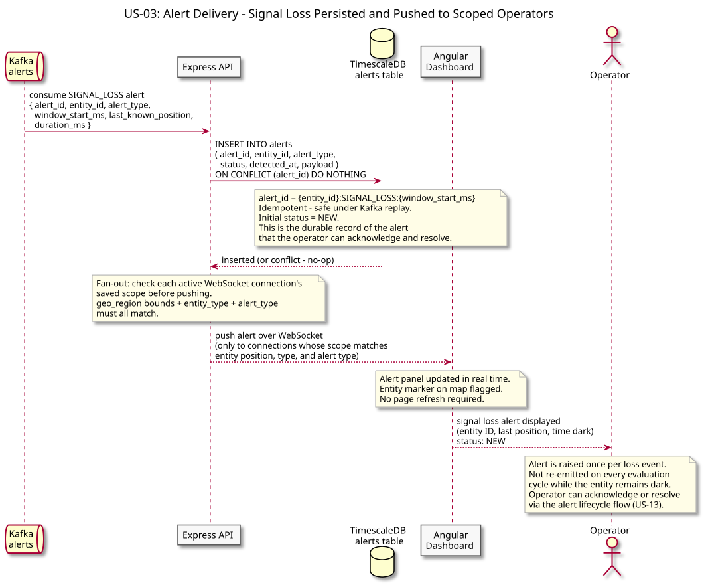
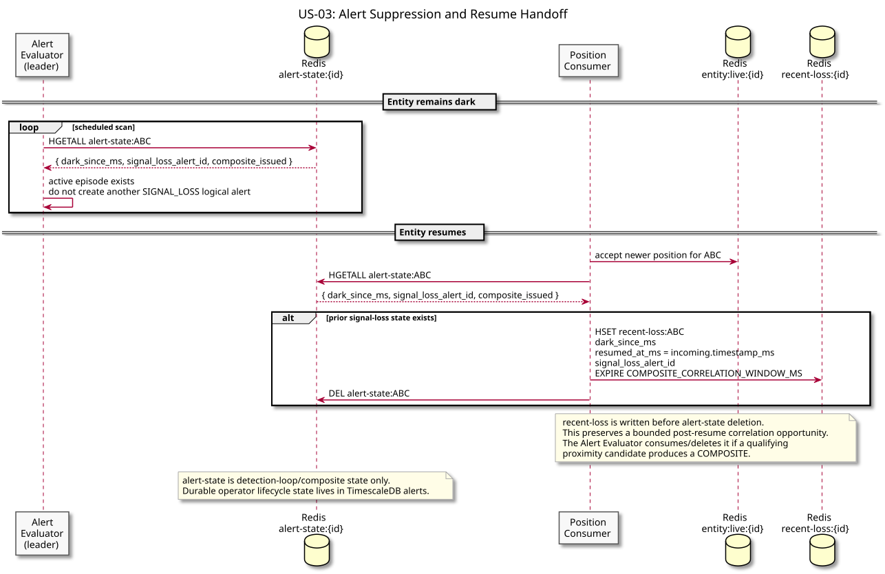

# US-03: Signal Loss Alert

**Actor:** Operator
**Status:** Defined

---

## Story

As an operator, I want to receive an alert when an entity's transponder goes dark beyond a configurable time threshold so that I can investigate a potential signal loss event.

---

## Acceptance Criteria

- The system detects when an entity has not broadcast a position update within `SIGNAL_LOSS_THRESHOLD_MS`
- An alert is emitted with the entity ID, last known position, and time since last update
- The threshold is configurable per entity type (ADS-B and AIS have different expected broadcast intervals)
- The alert is not re-emitted on every evaluation cycle once it has been raised - only once per loss event

---

## Flow Diagrams

### Detection

The alert evaluator checks Redis for entities whose TTL has expired, fetches last known position from TimescaleDB, and emits an alert to Kafka.

### Alert Delivery

The alert is consumed from Kafka, written to the `alerts` table in TimescaleDB with status `NEW` (idempotent on replay), then pushed over WebSocket only to operators whose saved scope matches the entity's position, type, and alert type.

### Alert Suppression

Once an alert is raised for an entity, subsequent evaluation cycles detect the active alert state and skip re-emission until the entity comes back online and the alert state is cleared.

---

## Architectural Justification

Justifies: [ADR-002 - TimescaleDB for Position History](../../adr/ADR-002-timescaledb-over-cassandra.md)

Signal loss detection requires comparing the latest known position timestamp against the current time across all tracked entities. This is a time-range query on historical position data - the exact access pattern TimescaleDB hypertables are optimised for. Redis holds the most recent position per entity (US-01), enabling the alert evaluator to check last-seen timestamps without hitting TimescaleDB on every evaluation cycle.
