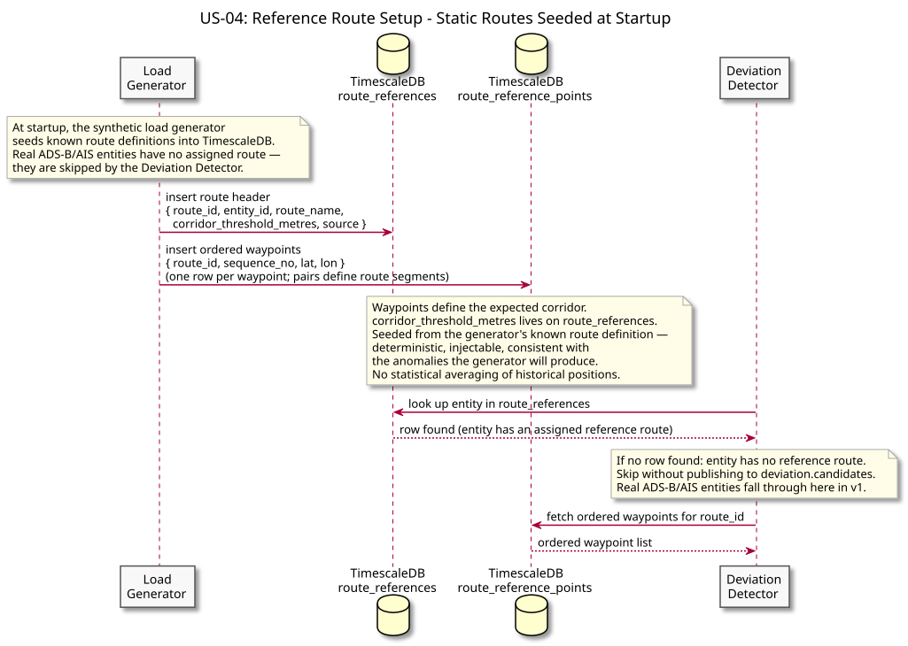
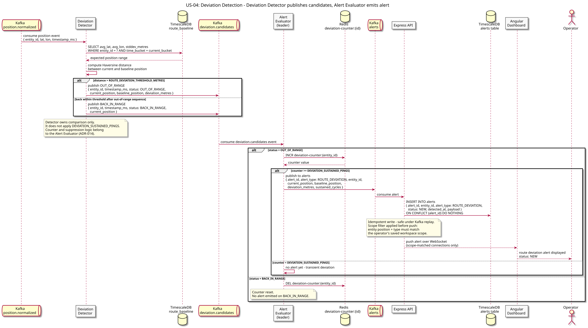
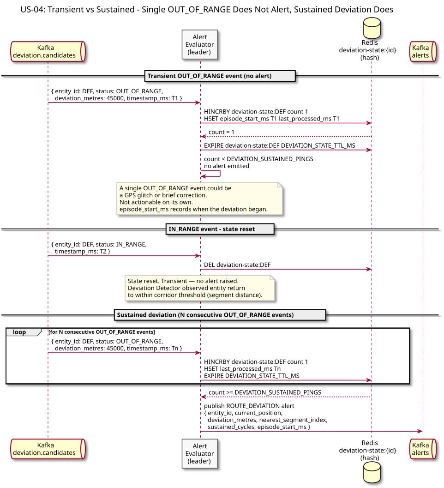

# US-04: Route Deviation Alert

**Actor:** Operator
**Status:** Defined

---

## Story

As an operator, I want to receive an alert when a synthetic entity's current track diverges significantly from its assigned reference route so that I can identify route deviations.

---

## Acceptance Criteria

- Route deviation applies to synthetic entities only in v1.
- Each eligible entity has one row in `route_references` and ordered waypoints in `route_reference_points`.
- The Deviation Detector computes minimum distance from the current position to the nearest route **segment**, not to a historical average point.
- It publishes `OUT_OF_RANGE` when distance exceeds `corridor_threshold_metres`, otherwise `IN_RANGE`.
- The detector is stateless and publishes one classification per eligible ping.
- The Alert Evaluator owns `deviation-state:{entity_id}` including sustained count, episode start, replay guard, and `alert_emitted`.
- One transient out-of-range ping does not alert; `DEVIATION_SUSTAINED_PINGS` consecutive out-of-range pings produce one ROUTE_DEVIATION per episode.
- An `IN_RANGE` event resets the episode state.

---

## Flow Diagrams

### Reference Route Setup

The historical filename `baseline-computation` is retained to avoid breaking generated diagram references, but the diagram and v1 design represent **static reference-route setup**, not statistical baseline computation.

At startup the synthetic load generator seeds `route_references` and `route_reference_points`. Real ADS-B/AIS entities have no v1 reference route and are skipped by the Deviation Detector.

### Deviation Detection

The detector compares each eligible position to the assigned route segments and emits `OUT_OF_RANGE` or `IN_RANGE` to `deviation.candidates`. The Alert Evaluator applies the sustained-event rule and emits the canonical alert through the existing alert delivery path.

### Transient vs Sustained

A single point outside the reference-route corridor does not alert. Only sustained consecutive out-of-range classifications cross the threshold.

---

## Architectural Justification

Justifies: [ADR-015 - v1 Reference Route Model](../../adr/ADR-015-v1-reference-route-model.md)

Historical lat/lon averaging does not define a meaningful route corridor across departure, cruise, and arrival phases. Deterministic reference routes provide a predictable and injectable v1 anomaly source while keeping the detector's behavior explainable and testable.
