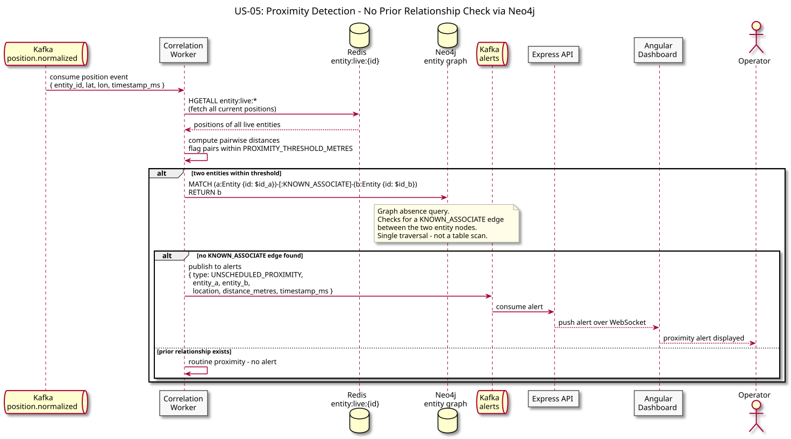
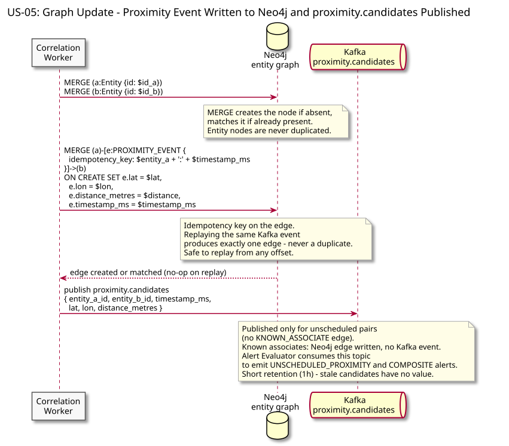

# US-05: Unscheduled Proximity Alert

**Actor:** Operator
**Status:** Defined

---

## Story

As an operator, I want to receive an alert when two entities with no prior relationship converge at an unexpected location so that I can identify unscheduled proximity events.

---

## Acceptance Criteria

- The system detects when two entities come within `PROXIMITY_THRESHOLD_METRES` of each other
- An alert is emitted only if the two entities have no prior recorded relationship (no `KNOWN_ASSOCIATE` edge in the graph)
- Sustained closeness does not repeatedly alert — one alert per continuous encounter, regardless of how long the encounter lasts
- If publication fails temporarily at the start of an encounter, the same encounter remains retryable; no duplicate alerts are produced on retry
- Expected proximity between known-associated entities is retained as graph evidence but does not produce an alert
- The alert includes both entity IDs, the encounter start location, and the distance at first detection

---

## Flow Diagrams

### Proximity Detection

The Correlation Worker reads a spatially scoped set of candidate entity positions from the Redis geo-cell index (maintained by the Position Consumer) and computes distances. For each pair within threshold: if no active episode exists, the worker checks Neo4j for a prior relationship. Known associates receive a Neo4j edge for evidence but no alert. Unscheduled pairs receive a Neo4j edge and a single `proximity.candidates` event for this encounter. Subsequent pings within the encounter refresh the episode without publishing again. See `DATA_MODEL.md` for the proximity-episode state model and the retry mechanism (`candidate_published` flag).

### Graph Update

All close pairs write a `PROXIMITY_EVENT` edge to Neo4j (idempotent under replay). Unscheduled pairs additionally publish one `proximity.candidates` event to Kafka per encounter. The Alert Evaluator consumes this event and emits the alert. See `ARCHITECTURE.md` for service responsibilities.

---

## Architectural Justification

Justifies: [ADR-003 - Neo4j for Entity Relationship Graph](../../adr/ADR-003-neo4j-entity-graph.md)

"No prior relationship" is a graph absence query — checking whether a `KNOWN_ASSOCIATE` edge exists between two entity nodes. In a relational model this requires a self-join on a proximity events table that grows expensive as entity count increases. In Neo4j it is a single Cypher traversal from an entity node. The graph also stores proximity evidence as `PROXIMITY_EVENT` edges with episode metadata, making relationship history directly queryable from the investigation panel.
