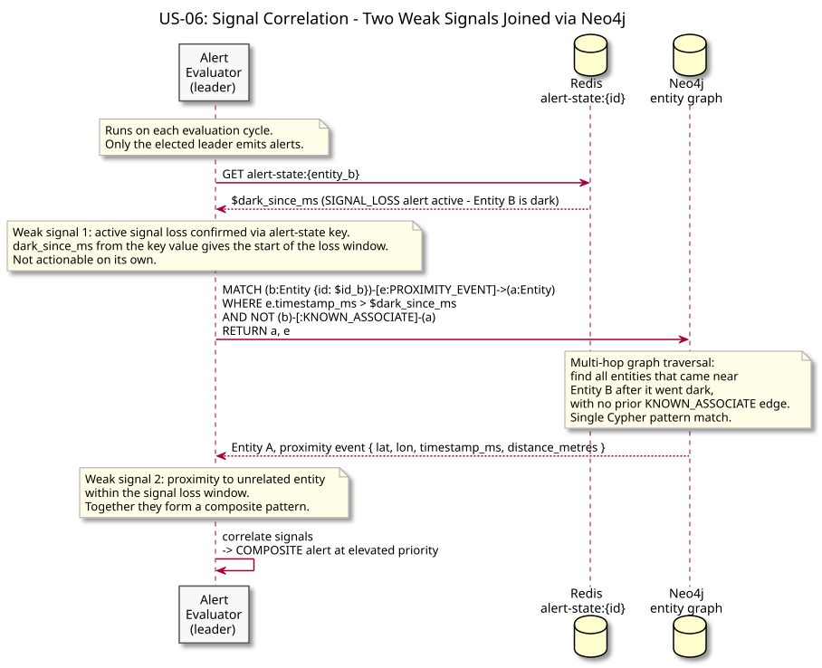
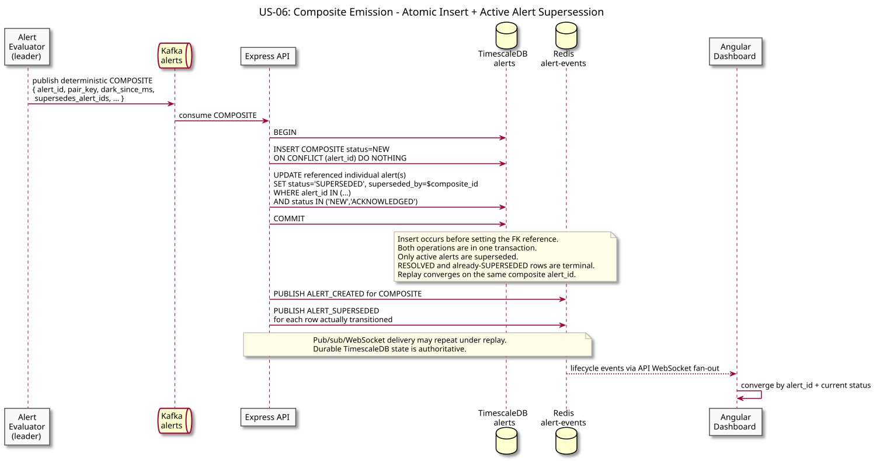
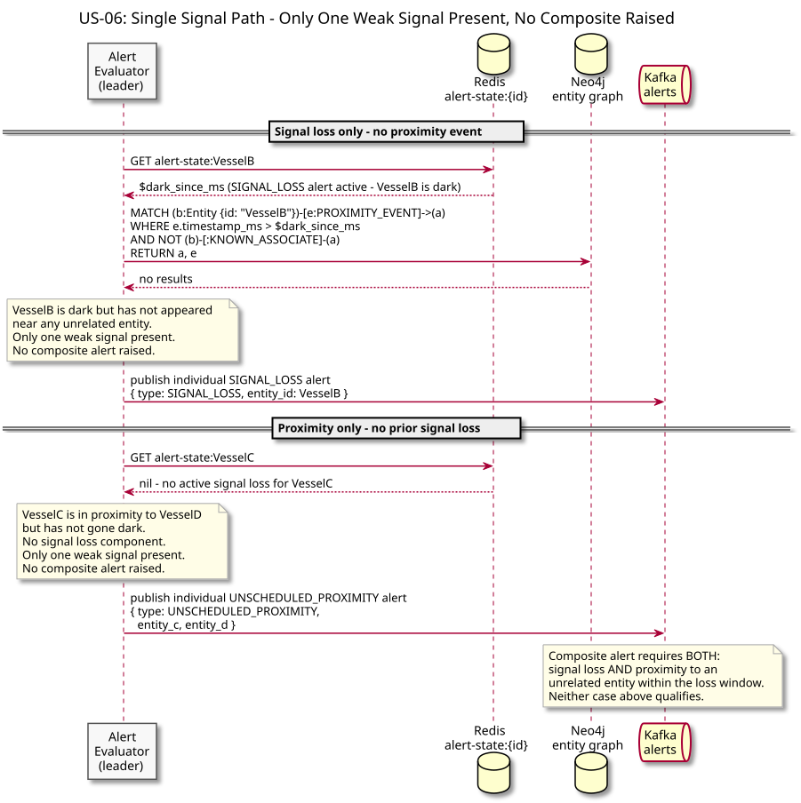

# US-06: Composite Correlated Alert

**Actor:** Operator
**Status:** Defined

---

## Story

As an operator, I want a signal loss event and a subsequent proximity event involving the same entity to be correlated into a single composite alert rather than two separate alerts so that I am not flooded with redundant notifications.

---

## Acceptance Criteria

- When an entity that has gone dark (US-03) subsequently appears in proximity to a previously unrelated entity (US-05), the two weak signals are merged into one composite alert
- The composite alert is elevated in priority above individual signal loss or proximity alerts
- The operator receives one notification, not two
- If only one of the two signals is present, no composite alert is raised - only the individual alert

---

## Example

```
Signal loss - Vessel B goes dark for 40 minutes
    +
Vessel B reappears in proximity to Vessel A (no prior relationship)
    =
One composite alert at elevated priority
```

---

## Flow Diagrams

### Signal Correlation



The alert evaluator detects a signal loss in Redis, then queries Neo4j to find proximity events involving the dark entity within the loss window, correlating the two weak signals into a single pattern.

### Composite Emission



One elevated composite alert is published to Kafka and pushed to the operator, suppressing the individual signal loss and proximity alerts.

### Single Signal Path



Shows what happens when only one weak signal is present: no composite is raised, only the individual alert is emitted.

---

## Architectural Justification

Justifies: [ADR-003 - Neo4j for Entity Relationship Graph](../../adr/ADR-003-neo4j-entity-graph.md)

Correlation across multiple weak signals requires traversing entity relationships across time - querying which entities were near which other entities, whether those entities have prior relationships, and whether the timing matches a signal loss window. This is a multi-hop graph traversal problem. A relational model would require multiple self-joins with time-window conditions, which grows expensive as relationship density increases. Neo4j expresses this as a Cypher pattern match directly on the graph structure.
