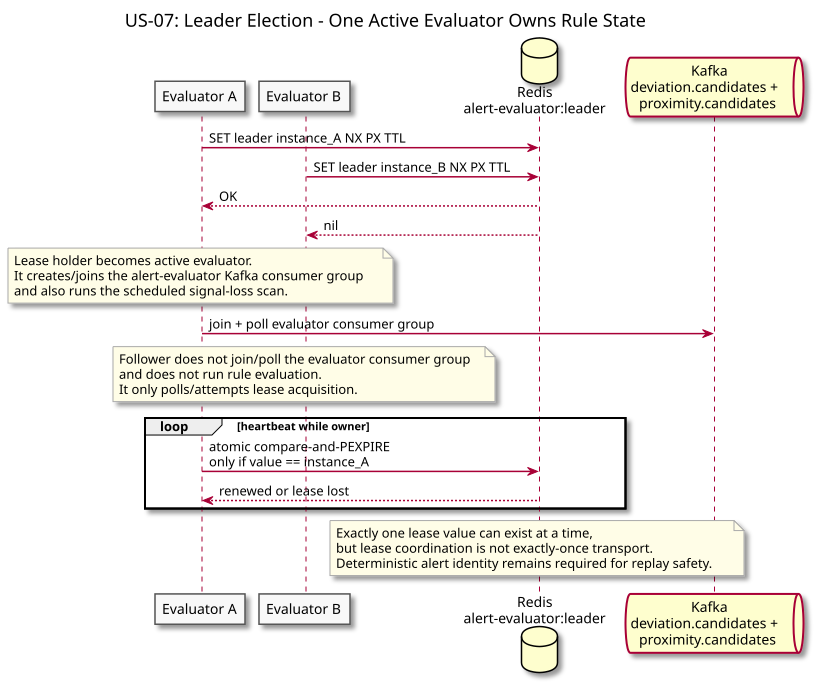
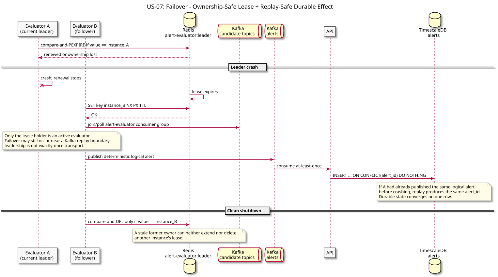
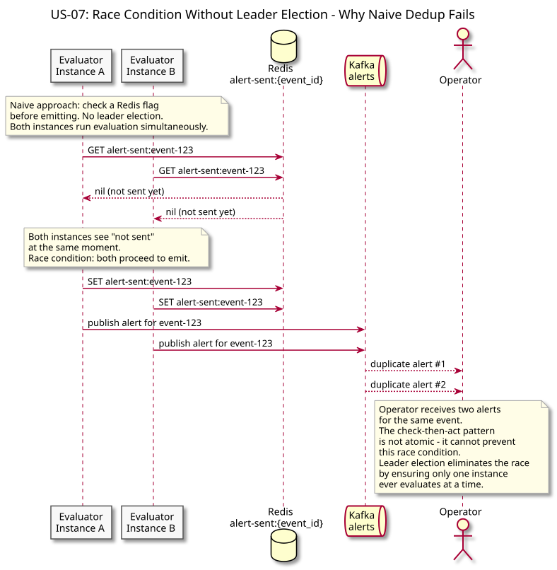

# US-07: Duplicate-Free Alert Emission

**Actor:** Operator
**Status:** Defined

---

## Story

As an operator, I want alerts to be free of duplicates even if the alert evaluator restarts or multiple instances are running so that I do not investigate the same event twice.

---

## Acceptance Criteria

- A single anomaly event produces exactly one alert, regardless of how many alert evaluator instances are running
- If the alert evaluator restarts mid-evaluation, the in-progress alert is not emitted twice
- The deduplication guarantee holds without requiring the operator or any downstream system to filter duplicates themselves

---

## Flow Diagrams

### Leader Election

Multiple evaluator instances compete for the Redis lease using SET NX PX; exactly one wins and becomes the sole alert emitter while followers wait on standby.

### Failover

When the leader crashes and stops renewing its lease, the TTL expires and a follower acquires the lease and resumes alert emission within one TTL window.

### Race Condition Without Election

Shows why a naive check-then-emit pattern fails: two instances checking simultaneously both see "not sent" and both emit, producing duplicate alerts for the operator.

---

## Architectural Justification

Justifies: [ADR-005 - Leader Election for Alert Evaluator](../../adr/ADR-005-leader-election-alert-evaluator.md)

Deduplication cannot be solved at the application level without coordination. A naive check-then-emit pattern introduces a check-then-act race condition: two instances checking simultaneously both see "not emitted" and both emit. Leader election removes the race by ensuring only one instance is ever the active writer at any time. Follower instances remain on standby and take over if the leader fails.

Lease release safety is critical: when the leader shuts down, it must compare ownership before deleting the lease key (compare-before-DEL) so it cannot accidentally delete a lease a new leader has already acquired during a concurrent failover. Lease renewal is ownership-safe: compare-and-renew (`SET XX PX`) extends only when the instance still holds the key.
