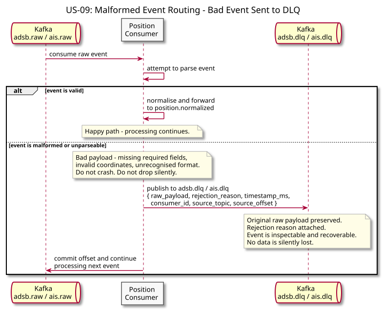
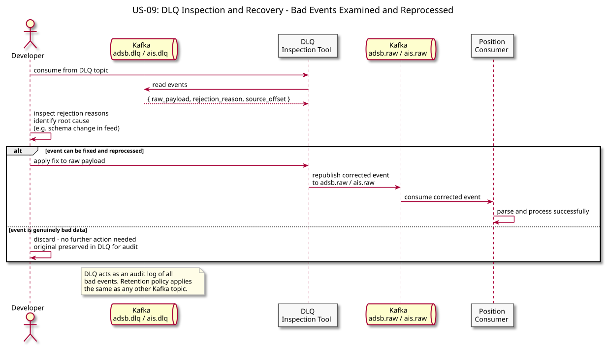

# US-09: Dead-Letter Queue for Malformed Events

**Actor:** System
**Status:** Defined

---

## Story

As the system, I want malformed or unparseable telemetry events to be routed to a dead-letter queue rather than dropped silently or crashing the consumer so that bad data is visible and recoverable.

---

## Acceptance Criteria

- A consumer that receives a malformed event routes it to a designated DLQ topic (`adsb.dlq` or `ais.dlq`) and continues processing
- The consumer does not crash or stall on a bad event
- Malformed events are never silently dropped - they must be inspectable in the DLQ
- The DLQ includes the original raw event payload and a reason for rejection

---

## Flow Diagrams

### Malformed Event Routing

The consumer catches a bad event, publishes it to the DLQ topic with the raw payload and rejection reason attached, commits the offset, and continues processing without crashing.

### DLQ Inspection and Recovery

A developer reads events from the DLQ, identifies the root cause, and either republishes a corrected event to the source topic or discards it as genuinely bad data.

---

## Architectural Justification

Justifies: [ADR-001 - Kafka over Direct HTTP Ingestion](../../adr/ADR-001-kafka-over-http-ingestion.md)

A dead-letter topic is a natural Kafka primitive - routing a bad event to a separate topic requires no additional infrastructure beyond what Kafka already provides. With direct HTTP ingestion, a malformed event either crashes the receiver or requires custom error routing logic. Kafka's topic model makes DLQ routing a first-class pattern at no additional operational cost.
