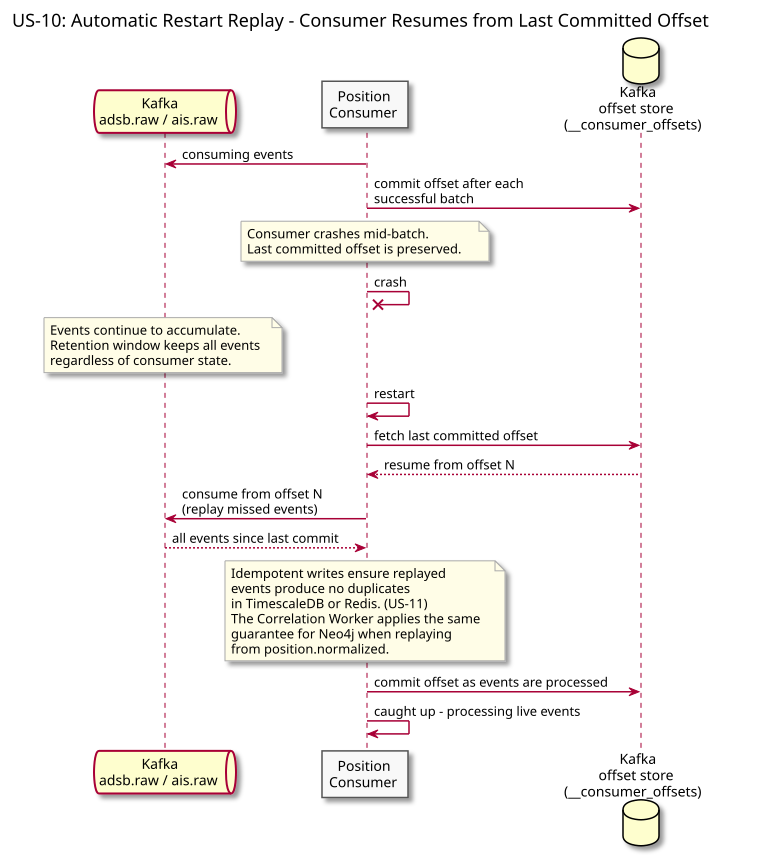
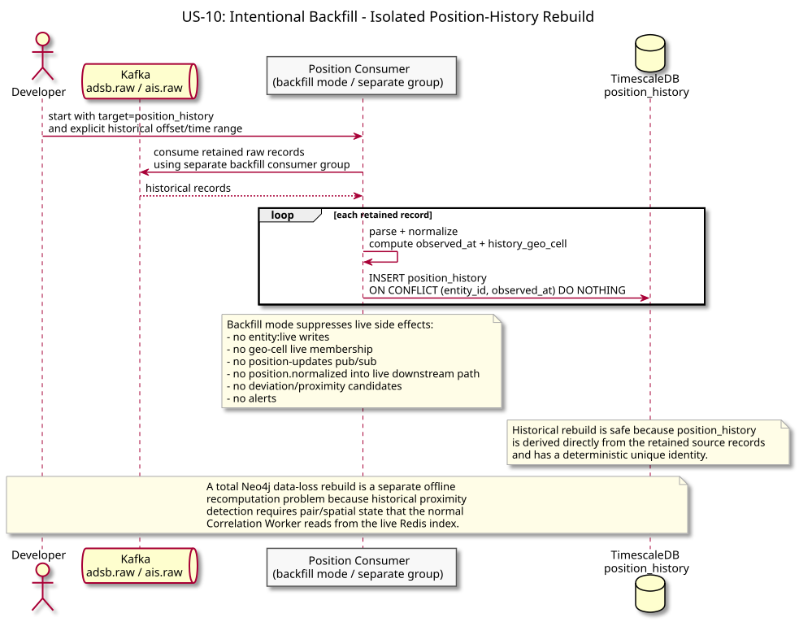

# US-10: Event Replay from Kafka Offset

**Actor:** System
**Status:** Defined

---

## Story

As the system, I want to replay events from a past Kafka offset so that a consumer that was down or restarted can backfill its state without data loss.

---

## Acceptance Criteria

- A consumer that restarts picks up from its last committed offset and processes all missed events
- A consumer can be intentionally rewound to an earlier offset for backfill (e.g. after a Neo4j restart or a corrected anomaly rule)
- Replayed events are safe to process - all writes are idempotent by construction (US-11)
- No manual intervention is required to recover a consumer that missed events during a restart

---

## Flow Diagrams

### Automatic Restart Replay

A consumer that crashes resumes from its last committed offset on restart, replaying all missed events safely via idempotent writes.

### Intentional Backfill

A developer resets a consumer group offset to an earlier point to rebuild store state (e.g. Neo4j after a restart or after a corrected anomaly rule) without re-querying the source feeds.

---

## Architectural Justification

Justifies: [ADR-001 - Kafka over Direct HTTP Ingestion](../../adr/ADR-001-kafka-over-http-ingestion.md)

Kafka's log-based storage retains events for a configurable retention window regardless of whether any consumer has read them. Consumers track their own offset per partition - a restart simply resumes from the last committed offset. Direct HTTP push has no equivalent: once a downstream service misses an HTTP call, the event is gone unless the producer has its own buffer. Replay is also the mechanism by which Neo4j state can be rebuilt after a restart without re-querying the source feeds.
