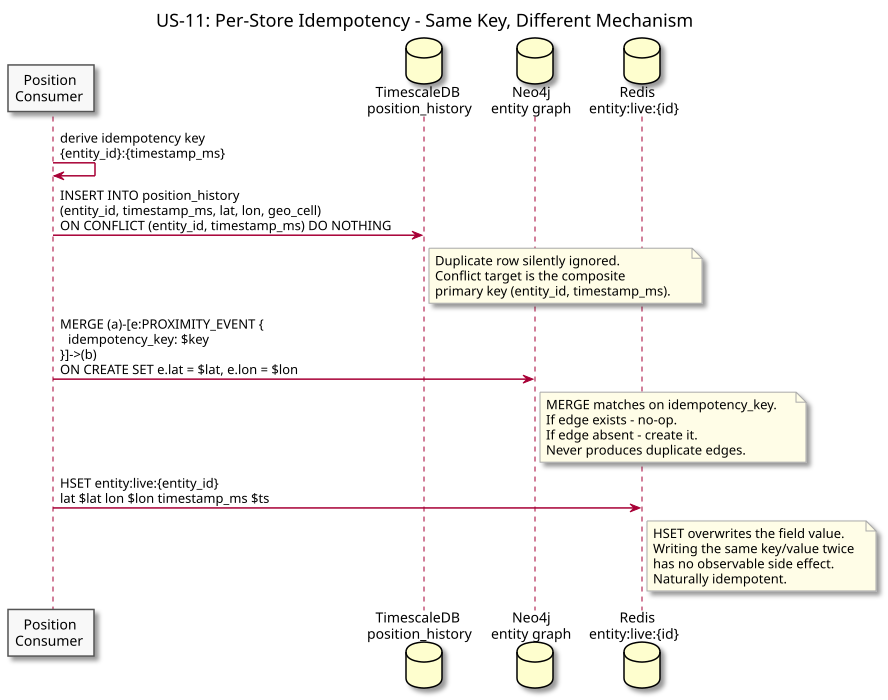
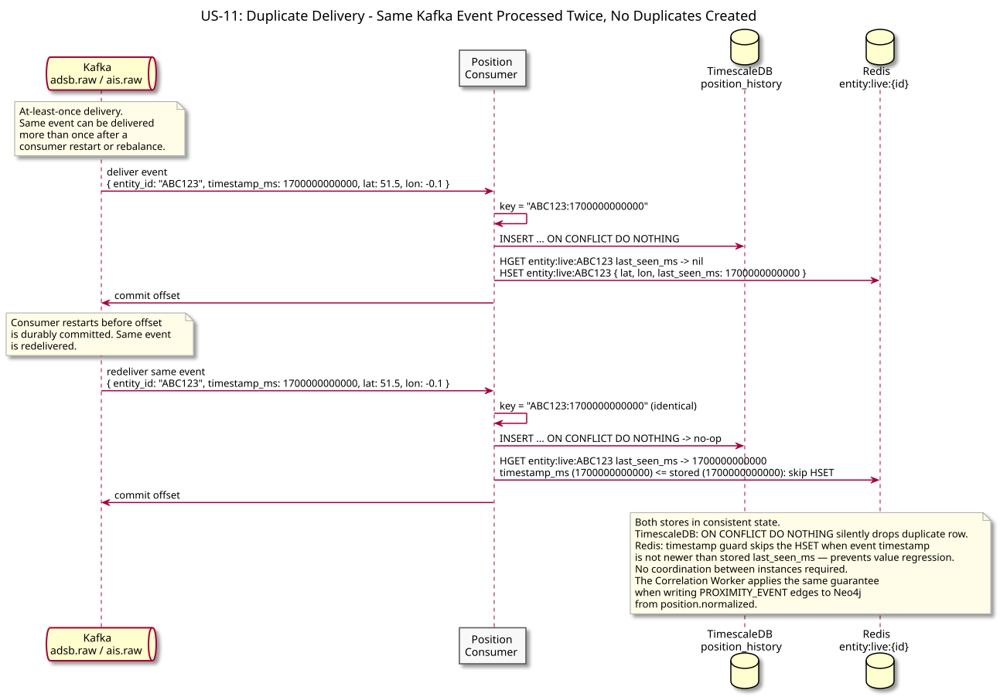

# US-11: Idempotent Writes Under Replay

**Actor:** System
**Status:** Defined

---

## Story

As the system, I want repeated processing of the same logical fact to converge on one durable result and never regress newer live state, so Kafka's at-least-once behavior remains safe.

---

## Acceptance Criteria

- Reprocessing one position fact produces one durable `position_history` row.
- Reprocessing one proximity episode produces one Neo4j `PROXIMITY_EVENT` edge.
- Reprocessing one logical alert produces one durable alert row.
- Pair-based facts use canonical pair identity; they do not reuse a single-entity key shape.
- Redis live state cannot be regressed by older source-event timestamps.
- Equal-timestamp duplicate live writes are harmless.
- Historical backfill does not accidentally republish old live side effects or alerts.
- No claim is made that Kafka itself delivers exactly once.

---

## Canonical Identities

| Logical fact | Identity / protection |
| --- | --- |
| Position history | `(entity_id, observed_at)` derived from source `timestamp_ms` |
| Redis live state | `entity_id` + monotonic `last_seen_ms` guard |
| Proximity episode | `{pair_key}:{episode_start_ms}` |
| SIGNAL_LOSS | `{entity_id}:SIGNAL_LOSS:{dark_since_ms}` |
| ROUTE_DEVIATION | `{entity_id}:ROUTE_DEVIATION:{episode_start_ms}` |
| UNSCHEDULED_PROXIMITY | `{pair_key}:UNSCHEDULED_PROXIMITY:{episode_start_ms}` |
| COMPOSITE | `{pair_key}:COMPOSITE:{dark_since_ms}` |

`pair_key = min(a,b):max(a,b)`.

---

## Flow Diagrams

### Per-Store Idempotency

Each store uses the mechanism appropriate to the logical fact: SQL uniqueness/`ON CONFLICT`, Neo4j `MERGE`, or monotonic Redis source-time state.

### Duplicate Delivery

Kafka may redeliver an event after a crash or rebalance. The repeated processing is safe because durable writes converge and live state refuses source-time regression.

---

## Architectural Justification

Justifies: [ADR-007 - Deterministic Idempotency Identity](../../adr/ADR-007-idempotency-key-schema.md)

Idempotency is defined per logical fact, not by forcing every store to use one universal `{entity_id}:{timestamp_ms}` string. This matters for pair episodes and pair-based alerts, where the counterparty is part of the incident identity.
