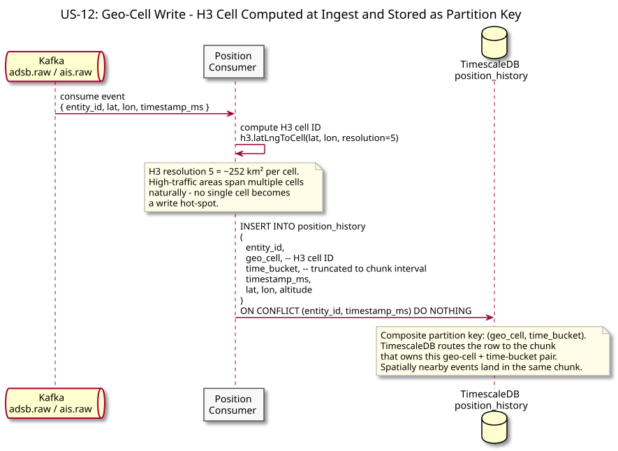
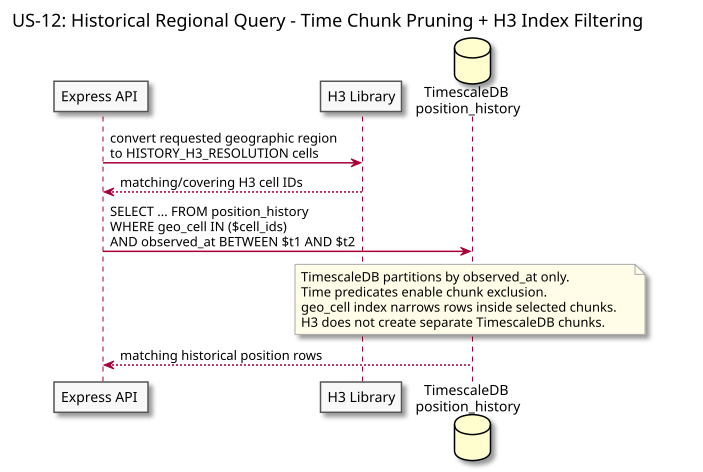
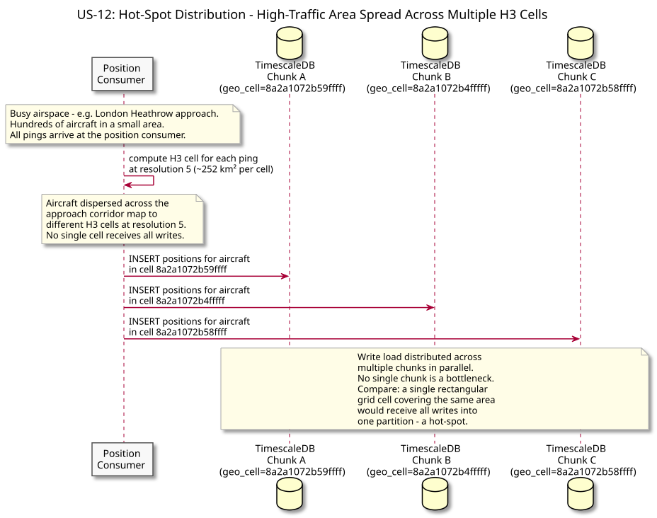

# US-12: Efficient Regional Position Queries and Live Spatial Scoping

**Actor:** System
**Status:** Defined

---

## Story

As the system, I want historical regional queries and live proximity candidate lookup to avoid scanning irrelevant entities so that both investigation queries and proximity detection remain efficient as entity count grows.

---

## Acceptance Criteria

- `position_history` remains partitioned by `observed_at` only.
- Historical regional queries translate geographic bounds to H3 cells at `HISTORY_H3_RESOLUTION` and filter using `(geo_cell, observed_at)`.
- Query plans demonstrate time-chunk exclusion plus indexed geo-cell filtering within selected chunks.
- Redis maintains a separate live H3 index using sorted sets `geo-cell:{live_geo_cell}` with score=`last_seen_ms`.
- When an entity crosses a live H3 boundary, the Position Consumer removes it from the previous cell and adds it to the new cell.
- Correlation Worker scans only the incoming cell plus the computed neighboring k-ring, filters stale members by score, then calculates exact distance.
- `HISTORY_H3_RESOLUTION` and `LIVE_H3_RESOLUTION` can be tuned independently.

---

## Flow Diagrams

### Geo-Cell Write

The Position Consumer computes `history_geo_cell` for TimescaleDB and `live_geo_cell` for Redis. The historical cell is an indexed column, while the live cell controls membership in the Redis sorted-set spatial index. Movement across a live cell boundary performs `ZREM` from the old set before `ZADD` to the current set.

### Regional Query

The API translates the requested geographic region into H3 cells, then queries `position_history` using both cell IDs and an `observed_at` range. TimescaleDB prunes time chunks; the geo-cell index narrows rows inside those chunks.

### Live Candidate Distribution

The live Redis index distributes currently tracked entities across H3 sorted sets. This is where geo-cell distribution reduces proximity candidate density. It does **not** create separate TimescaleDB chunks per H3 cell.

---

## Architectural Justification

Justifies: [ADR-006 - H3 Geo-Cell Indexing Strategy](../../adr/ADR-006-geo-cell-sharding-key.md)

H3 serves two distinct purposes:

- historical query filtering inside TimescaleDB time chunks;
- live proximity candidate reduction in Redis.

Keeping these responsibilities explicit prevents a common modeling error: treating `geo_cell` as though it were a TimescaleDB sharding dimension. Sentinel's hypertable is time-partitioned only.
