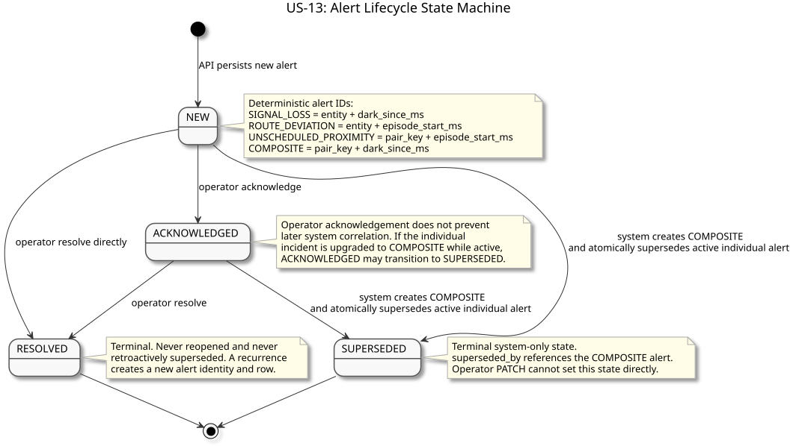
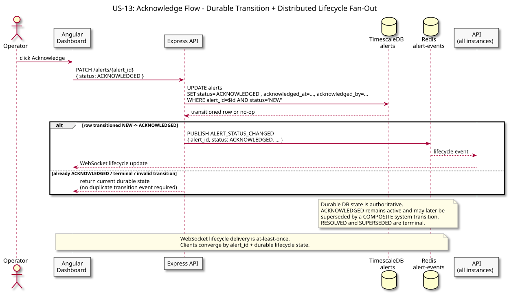
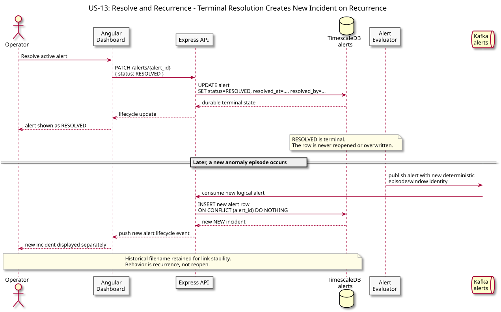

# US-13: Alert Lifecycle Management

**Actor:** Operator
**Status:** Defined

---

## Story

As an operator, I want to acknowledge and resolve alerts so that my team can track which anomalies are being actively investigated, which have been closed, and which are still waiting for attention.

---

## Acceptance Criteria

- An alert starts in `NEW` state when it is first emitted by the alert evaluator
- An operator can transition an alert from `NEW` to `ACKNOWLEDGED` to signal it is being investigated
- An operator can transition an alert from `ACKNOWLEDGED` to `RESOLVED` to close it
- If the same anomaly recurs after resolution, a new alert is created with a new `alert_id` - the resolved record is not overwritten
- All state transitions are idempotent - acknowledging an already-acknowledged alert has no side effect
- Alert state survives system restarts - it is not held in memory or in Redis alone

---

## Flow Diagrams

### State Transitions

The full alert state machine: NEW on creation, ACKNOWLEDGED when an operator takes ownership, RESOLVED when closed. A recurring anomaly produces a new alert rather than reopening the resolved one.

### Acknowledge Flow

Operator acknowledges an alert via the dashboard; the API updates the alerts table in TimescaleDB and the dashboard reflects the new state in real time.

### Resolve and Reopen

Shows what happens when an operator resolves an alert but the anomaly recurs: the alert evaluator emits a new alert event with a new window, creating a fresh record rather than overwriting history.

---

## Architectural Justification

Justifies: [ADR-010 - Alert State Store](../../adr/ADR-010-alert-state-store.md)

Alert lifecycle state must survive restarts and be queryable by status, entity, and time range. Redis (already in the stack for live entity state) is volatile and lacks native secondary indexes - it is the right tool for high-frequency ephemeral reads but the wrong tool for durable, mutable, queryable records. A regular PostgreSQL table on the existing TimescaleDB instance provides durability, queryability, and idempotent writes via `ON CONFLICT DO NOTHING` on the deterministic `alert_id`, without adding any new infrastructure.
