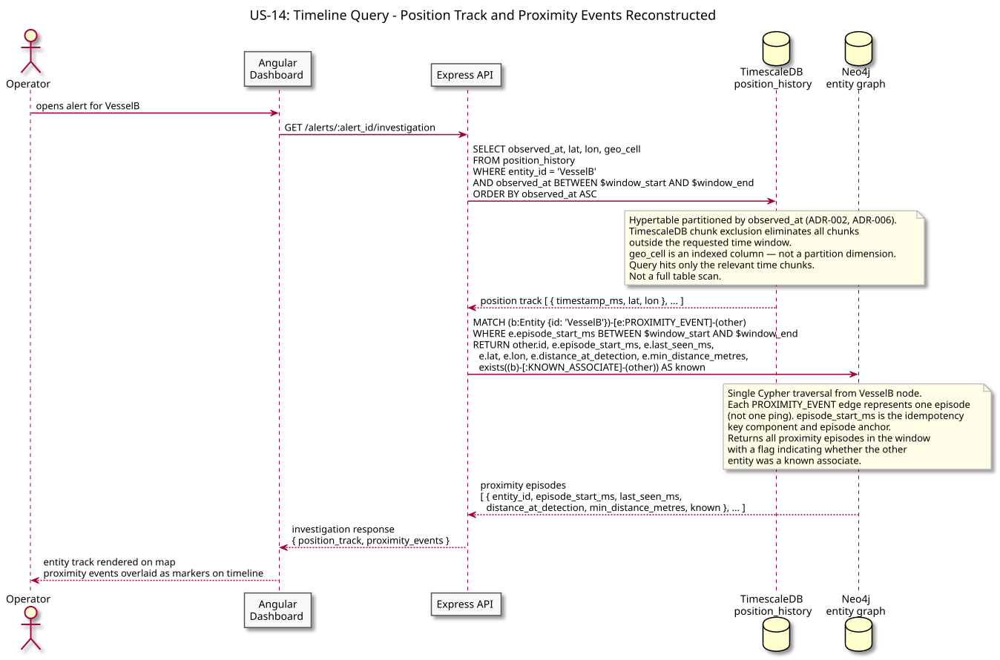
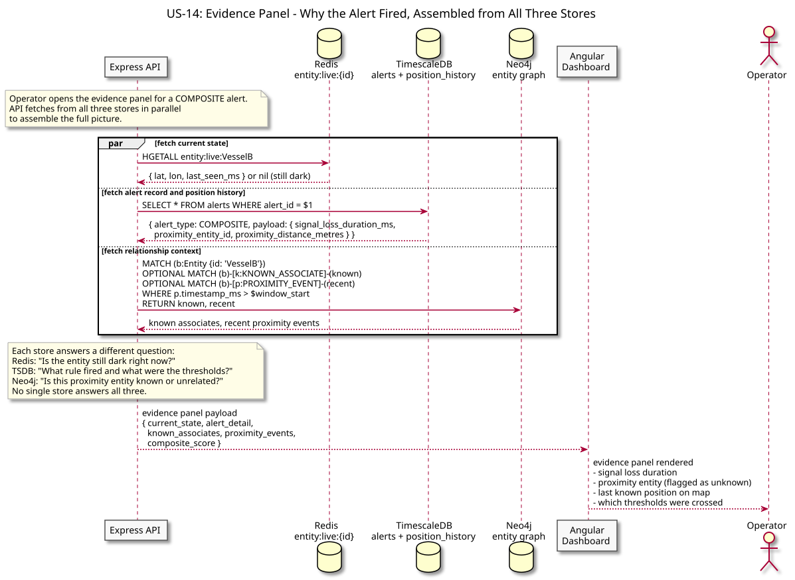
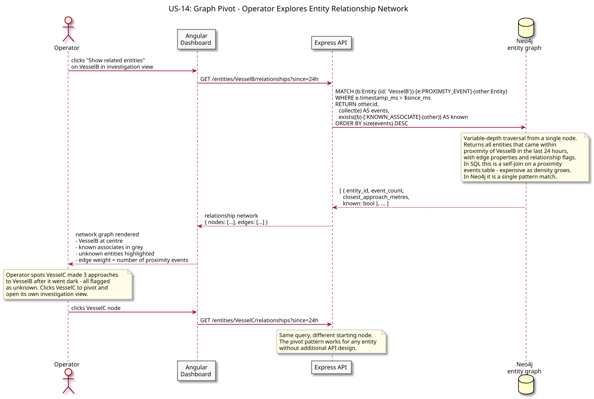

# US-14: Entity Investigation Timeline

**Actor:** Operator
**Status:** Defined

---

## Story

As an operator, I want to open an alert and see the full evidence trail - the entity's position history, every proximity event in the window, the related entities from the graph, and which rules fired and why - so that I can assess whether the anomaly is genuine and decide on a response.

---

## Acceptance Criteria

- Opening an alert shows the entity's position track on the map for the alert time window
- The timeline shows all PROXIMITY_EVENT edges involving the entity within the window, with distance and timestamp
- The evidence panel shows which rule(s) fired, what threshold was crossed, and the composite score if applicable
- An operator can pivot from any related entity to its own investigation view
- The investigation query returns results within an acceptable latency threshold - it does not require a full table scan

---

## Flow Diagrams

### Timeline Query

The API reconstructs the entity's position track from TimescaleDB and fetches proximity events from Neo4j for the alert time window, composing them into a chronological timeline.

### Evidence Panel

The API assembles the full alert evidence from all three stores: current state from Redis, position history from TimescaleDB, and relationship context from Neo4j. This is the strongest demonstration of why all three stores are necessary - each answers a different question about the same entity.

### Graph Pivot

An operator pivots from the alert to a related entity - "show me everything this vessel interacted with in the last 24 hours." The API executes a multi-hop Neo4j traversal and returns the entity network, which the dashboard renders as a relationship graph.

---

## Architectural Justification

Justifies: [ADR-003 - Neo4j for Entity Relationship Graph](../../adr/ADR-003-neo4j-entity-graph.md), [ADR-002 - TimescaleDB for Position History](../../adr/ADR-002-timescaledb-over-cassandra.md), [ADR-004 - Redis for Live Entity State](../../adr/ADR-004-redis-live-state.md)

The investigation view is the clearest demonstration of why the polyglot persistence model exists. Each store answers a different question: TimescaleDB answers "where was this entity and when?" (time-range query on position history), Neo4j answers "who did it interact with and is that relationship known?" (graph traversal), and Redis answers "where is it right now?" (point lookup). No single store answers all three questions efficiently. A relational model could answer the first and a join could approximate the second, but variable-depth traversal ("find all entities two hops away from a flagged vessel") is a native graph operation that degrades severely in SQL as relationship density increases.
