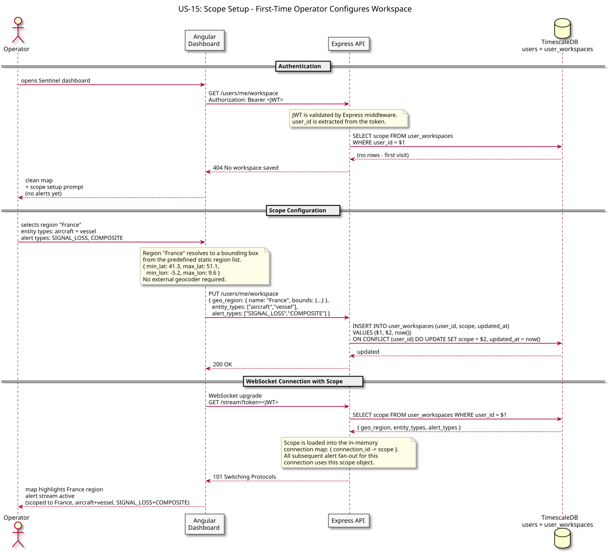
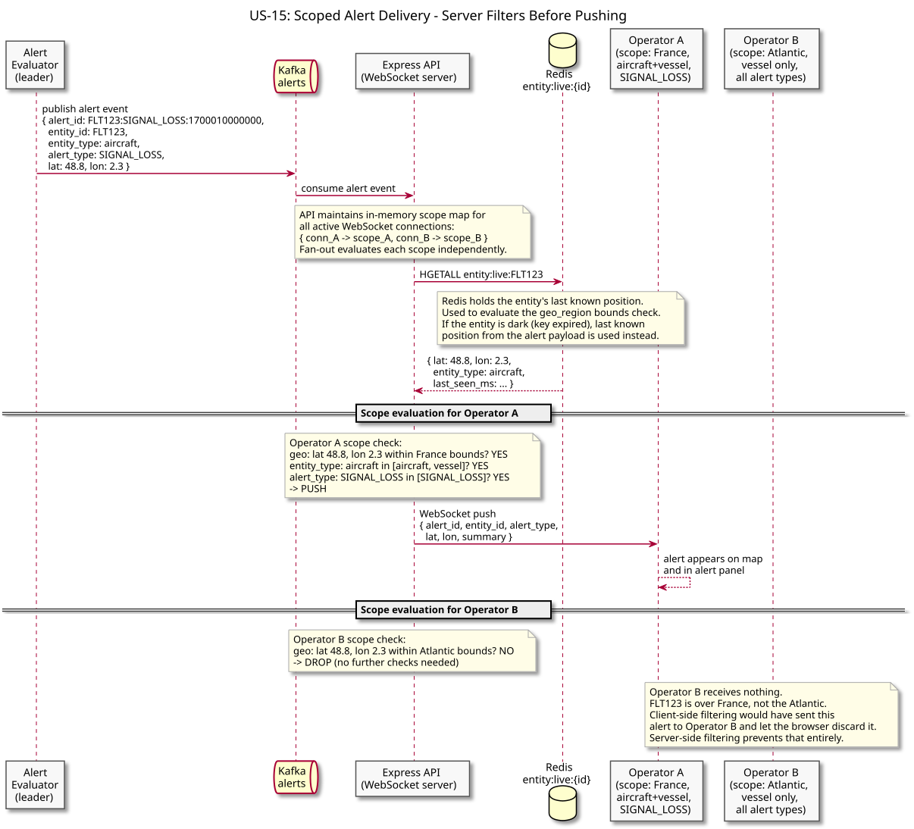
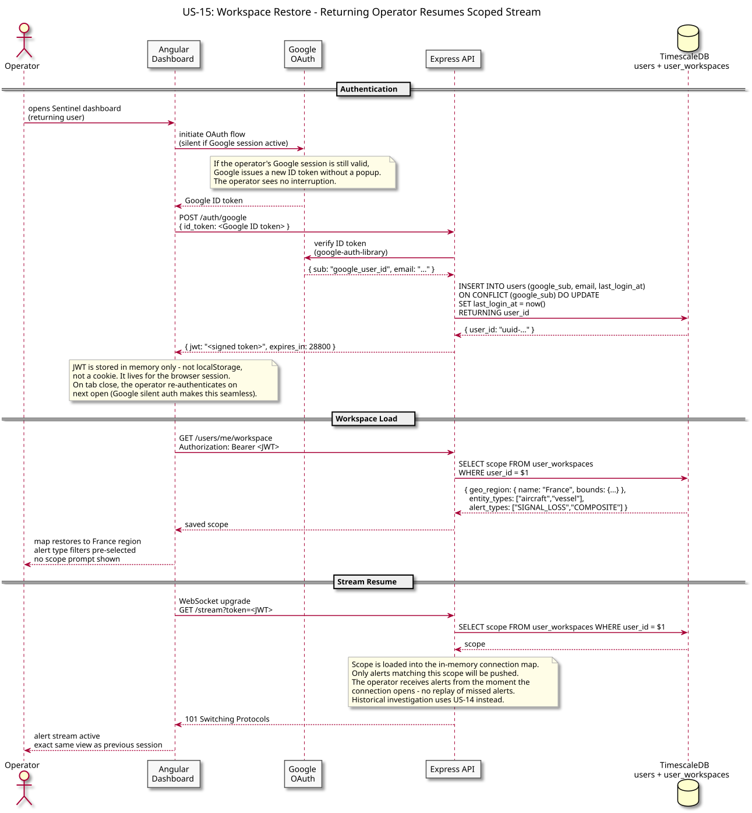

# US-15: Scoped Alert Subscription and Workspace

**Actor:** Operator
**Status:** Defined

---

## Story

As an operator, I want to configure a geographic region, entity type, and alert rule filter before alerts are streamed to me, so that I only see anomalies relevant to my area of interest - and so that my configuration is restored when I return to the dashboard.

---

## Acceptance Criteria

- A new operator sees a clean map with a scope setup prompt - no alerts are shown until a scope is saved
- The scope has three dimensions: geographic region (bounding box), entity types (aircraft, vessel, or both), and alert rule types (signal loss, route deviation, proximity, composite)
- Once saved, the scope is stored server-side and persists across sessions - the operator does not re-configure on every visit
- Only alerts whose entity falls within the scope's geographic bounds AND matches the entity type AND matches an alert rule type are pushed to the operator's WebSocket connection
- Filtering happens on the server before alerts reach the client - the client never receives alerts it would discard
- An operator can update their scope while the dashboard is open without reconnecting
- On return visits, the dashboard restores the saved scope and begins streaming immediately

---

## Flow Diagrams

### Scope Setup

First-time operator logs in, is prompted to configure scope, and saves it. The WebSocket connection opens with the scope applied immediately.

### Scoped Alert Delivery

Alert arrives from Kafka. Server evaluates it against every active WebSocket connection's scope. Matching connections receive the alert; non-matching connections receive nothing.

### Workspace Restore

Returning operator is authenticated via Google OAuth, workspace is loaded from TimescaleDB, and the scoped WebSocket stream resumes - no scope re-entry required.

---

## Architectural Justification

Justifies: [ADR-011 - Google OAuth for Operator Authentication](../../adr/ADR-011-google-oauth-operator-auth.md), [ADR-012 - Workspace Scope and Server-Side Alert Filtering](../../adr/ADR-012-workspace-scope-alert-filtering.md)

Workspace persistence requires identity - preferences keyed to a browser session cannot follow an operator across devices. Google OAuth provides that identity without Sentinel managing credentials. Server-side filtering is required because client-side filtering scales with total alert volume, not with what the operator cares about. Storing the scope in TimescaleDB (where the `users` table already lives) avoids adding new infrastructure for a low-frequency read.
